# Reminder: Week 1

 - **Revision**
   - Hypothesis testing
   - Confidence intervals
   
   
 - **Type I and II errors**
 
 
 
 - **Power and Sample Size **

---

# Revision: Type I and Type II errors

There are two types of errors that can be made... and we assign probabilities.

```{r tbl2, echo = FALSE}
tbl2 <- tibble::tribble(
~` `, ~`True`, ~`Situation`,
" ","$H_0$ True","$H_0$ False",
"$H_0$ Rejected","Type I Error","Correct Decision",
" "," "," ",
"$H_0$ Not Rejected","Correct Decision","Type II error",
" "," "," "
)

kableExtra::kable_styling(knitr::kable(tbl2), font_size = 18)
```

Type I error is when we: *Incorrectly Reject $H_0$*

Type II error is when we: *Incorrectly NOT Reject $H_0$*

(Power = 1 – $\alpha$)

Power is about your ability to:

Correctly Reject $H_0$

---

# Revision: Power of a Hypothesis test

**High Power is Desirable. But it depends on four aspects:**

|   |    |
|---|----|
| Size of difference to detect | Distance between value of parameter under null hypothesis and the true value of the parameter. Greater difference = Greater power. |
| Population standard deviation | Smaller population standard deviation leads to greater power of the test |
| Sample size | Larger sample sizes leads to greater power of the test. |
| Significance level | a larger level of significance leads to greater power of the test (but also the greater the change of a type I error). |

---

# This week: Research Methods

 - ** The Research Process**
 
 - **Types of Studies**
 
 - **Sampling Methods**
 
 - **Study Design**
 
 - **Measurement**

---

# Research Methods: Overview of the Research Process

 - Identify problem and/or research question
 
 - Formulate hypothesis that can tested 
 
 - Design study: experiment, observational study, survey
 
 - Sample and collect data
 
 - Analyse data, draw conclusions about research  question/hypothesis
 
 - Communicate results
 
 - Act upon new knowledge

---

# The Research Process

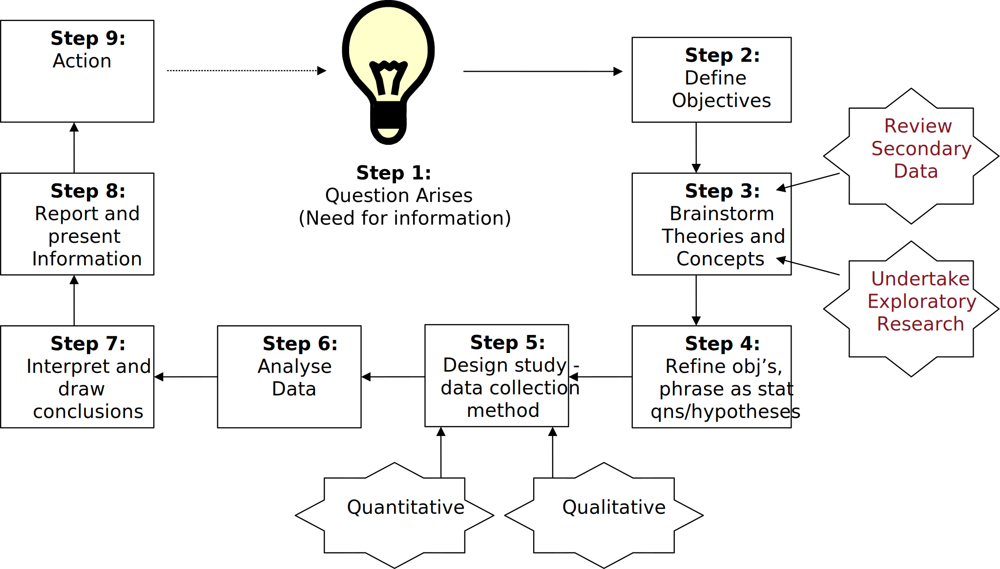

Adapted from Howley and Gerlach (2006)

---

# Gathering Preliminary Data

 - First 3 steps of Research Process can involve **preliminary** data gathering to help generate ideas/hypotheses to later test
 
 - This part of process **may involve getting ideas** or information from samples that are not necessarily representative of the whole population
 
 - Focus groups/samples who are ‘available’ or ‘accepting a general invitation to participate’ may be considered part of preliminary data gathering
 - Such groups **not necessarily representative** of whole population -> *decisions* based on such samples may be misleading
May provide some ideas – hypotheses to test


---

# Example: preliminary data gathering

 - A technique has been developed to help people quit smoking. 
 
 - You are interested in how successful the technique is and choose to investigate its merit.
 - As part of a focus group, a couple mention that they know a case where the technique was tried and it **failed - both male patients**. A third person said they knew of a **successful attempt with a female**.
 
 - Does this mean technique will always fail in males? 
 
 - Gender may affect the success of the technique? 
 - Perhaps are other factors to consider...

---

# Example: preliminary data gathering…ctd

 - Nothing can be reliably determined at this stage.
 
 - However, has given some ideas about what things to test. 
Hence some ideas on what information to gather.
  - May need to consider whether gender affects success of technique.
  
  - Further brainstorming can realise other factors to test (ex. longevity as a smoker, anxiety level, etc)
 - Considering a **representative sample** of all smokers will enable this to be tested and appropriate decisions made. 
 
 - Importantly, **variables** we need to test hypotheses (and ultimately address an objective) should be determined **before collecting data**.

---

# Example: Before study design and data collection

- Original broad objectives
  - E.g. To investigate the **success** from employing the *technique to have smokers cease smoking*.    
     - or perhaps to cease reliance on smoking or perhaps for a sustained period….need to be careful of how a success is defined/measured.
- Perhaps refine as:
    - Investigate **likely success** from employing….
    - And refine further due to brainstorming that perhaps there are certain factors that affect success.
      - Gender; Longevity as a smoker; anxiety levels.
    
-  Hence objectives refined (perhaps multiple times) to become:
    - To investigate whether gender affects the likely success from employing . . . .
- Generate the hypotheses to be tested:
    - Gender affects likely success, etc
    
- Variables required?
    - Gender; Outcome (success or not) – requiring definition!
---
#Stages before study design and data collection

 - Symptoms (signs that something is to be solved).
 
 - **Problem** (‘need for info’) identification.
 
 - Establish broad **objectives**.
 
 - Brainstorm and refine objectives / identify more specific objectives.
 - Define **hypotheses**.
 
 - **Variables** identified and how to measure defined.

- The above involves iteration and refinements which ultimately lead to:
     - clearly establishing the required **variables** upon which we need data in order to test our **hypotheses** and ultimately address our **objectives** and the **problem** at hand.

---

# Example: Stages to consider before study design

 - **Symptom**: Smokers who you’ve attempted to help cease smoking are ‘reoffending’ (existing methods failing).
 
 - **Problem**: Lack of appropriate technique that leads to success.
 
 - **Objective**: To establish the likely success of a new *technique for smoking cessation* and identify factors that affect the success.
 
 - **Hypothesis**:
  	e.g. Gender and longevity as a smoker affects likely success.
  	
 - **Variables**: Gender, longevity as a smoker, success... others?
 - ***Issues that need consideration include***: 
	- How to obtain a representative sample.
	- complete list of potential factors, 
	- how to define ‘success’.
	
---

# Example: preliminary data gathering – defining the problem and literature search

 - Research begins with a **question** concerning an issue.
 
 - Conduct a **literature search** to determine if someone else has conducted similar research, as well as alert you to methodologies, controls and pitfalls.  


> *"Only a fool learns from his own mistakes. The wise man learns from the mistakes of others."*
>
> -- Otto von Bismarck
> (Chancellor of the German Empire, 1871 – 1890)

> *"A wise man learns by the mistakes of others, a fool by his own."*
>
> -- Latin Proverb


---

# Types of Studies

 - *Surveys/questionnaires (subset of observational studies)*: 
   - study provides info about a population without explicit comparison groups; requires sampling and measurement.

 - *Observational studies*: 
   - observe individuals and measure variables of interest (outcome) but do not randomise subjects to groups that may influence outcomes/responses (view in existing state; **observation without intervention**).

 - *Experiments*: 
   - **randomisation of subjects** to treatment groups (or with respect to the predictor/s); researcher deliberately imposes some **treatment** on individuals which may influence outcomes/responses. 


---
# Questionnaire

>*A questionnaire is a pre-formulated written set of questions to which respondents record their answers* 

#### Advantages of Questionnaires 

+ Helps researcher obtain data relatively easily (time, cost, effort).
+ Information easily coded (analyses determined *a priori* ).
+ Benefits scientific community if measures are valid and reliable
	+ Ambiguity and poor measurement practices thwart this.
	
#### When to Use a Questionnaire

+ When large numbers of people are to be reached in different geographical regions.
+ When groups of people can be assembled in a convenient location to whom questionnaires can be administered, and collected immediately.

---
#  Principles of questionaire Design

 - Principles of **wording**
 - Principles of **measurement**
 - General **appearance**
 - Questionnaire administration and testing 

> *"... poorly designed and executed ... surveys are a form of censorship of the respondents' views"*
>
> -- (Draper and Hill, 1996).


Statistical analyses cannot be better than the quality of the data. Important to have **valid** and **reliable** measurement procedures ... else the study only suitable for an autopsy.

Poor quality data from poor designs and collection techniques will lead to poor experimental outcomes and useless conclusions for the objectives of the study.
+ Principles of Questionnaire design
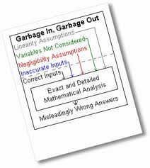


---
# Valid and Reliable questions

A measure is: 
 - ***valid*** if it successfully *measures* the *phenomenon it is intended to measure*
 
  - e.g. if measure/inquiry is supposed ot reveal presence of a particular disease (clinical depression), yet it fails to identiy such in someone who does suffer from this ... then measure/inquiry is not valid
  
- **reliabile** if it yields the same results in *repeated* applications of the same phenomena
  - e.g., if measure/inquiry repreated upon people with presence of disease yet fails to consistently identify such when present then not reliable.
  
    If questions are ambiguous then they are likely to be unreliable


---
# Aspects of valid and reliable questions

- *to be **valid**, the questions need to be understood by the respondents*: 

 - wording is important
  - avoid bias or leading questions (don't ask questions that may encourage an answer in one directions (unless testing for such effects));
  
- *to maximise the **reliability** of the questions here are some recommendations*
  - write the question in full,avoid abbrev;
  - use words that are widely understood across a widely range of educational and cultural backgrounds
  - avoid words or terms that have an ambiguous meaning;
  - use concise questions and avoid too much detail;
  - do not make presumptions or assumptions;
  - avoid confusion by not using "double-barrelled" questions (questions with two or more parts);
  - avoid using double negative expressions.
  
 
 >*Pre-testing and piolt testing are used to highlight 
questions which may lead to probems with validity 
and reliability*

---
#Reliability

- **Test-retest reliability** (repeated testing of same inidividual yields same results; ambiguity in questions would reduce theis reliability).

- **parallel-form reliability** (two forms/instruments with varying wording or structure but with a common measurement intention should yield highly correlated results)

- **Inter-iten consistencey reliability**
  - does the same respondent answer ' similar' questions same way?[Cronbach's alpha]
  
  
  

See [http://www.socialresearchmethods.net/kb/reltypes.php](http://www.socialresearchmethods.net/kb/reltypes.php)

---

#Questionannarie layout and order

- typed, clear and uncluttered.
- spacing - more appealing to read.
- short as possible.
- if some respondents need to skip some questions, clearly provide arrows and boxes that indicate skips(kept to minimum).
- shoule be self-explanatory without deatialed instructions.
- **the order of questions can influence response**.
- opening questinons should be interesting and easy - should arouse the respondent's interest andgive them confidence.
- *sequence of questions should be from general to specific -allows respondent see link of questions to the overall purpose of the study.*
- sensitive issues should be discussed in section most relevant and towards end of the questionnaire...why might that be?

---
# Closed and open-ended questions

- A *closed question* **restricts** the respondent to a limited set of reponse categories ( e.g., a yes/no response or rating scale 1-5 or select one of following categories)

- *A open-ended question* **permits repondent to answer in their  own way**, by providing space for the respondent to write an answer

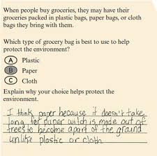

---
# Advantages and disadvantages: open and closed
**Closed Questions**
- *Advantages*:
 - easier to answer, easier to code, and easier to analyse.
 - shorten the time required to complete the question. 
 - easier for the respondent to answer questions dealing with sensitive issues
- *Disadvantages*: 
 - provide the respondents with fewer opportunities for self-expression.
 - can bias respondents towards certain responses by providing answers that they may not have thought of.  
  - respondents who are unwilling to reveal their ignorance or disinterest in an issue can chose random responses from the list of provided answers.
  
**Open Questions**
- *Advantages*:
 - the respondents have a greater opportunity for self-expression.  
 - they produce more detailed response
- *Disadvantages*:
 - in order to compare responses, they must be coded and this procedure may be subject to bias and/or error.  
 - the coding time and the analysis of text data is greater than that for closed questions.
 - the response rates for open questions are likely to be lower.
---


---
# Inferenence: sampling

###Statistics is about making inference about a population without needing to collect data from all elements of the population 
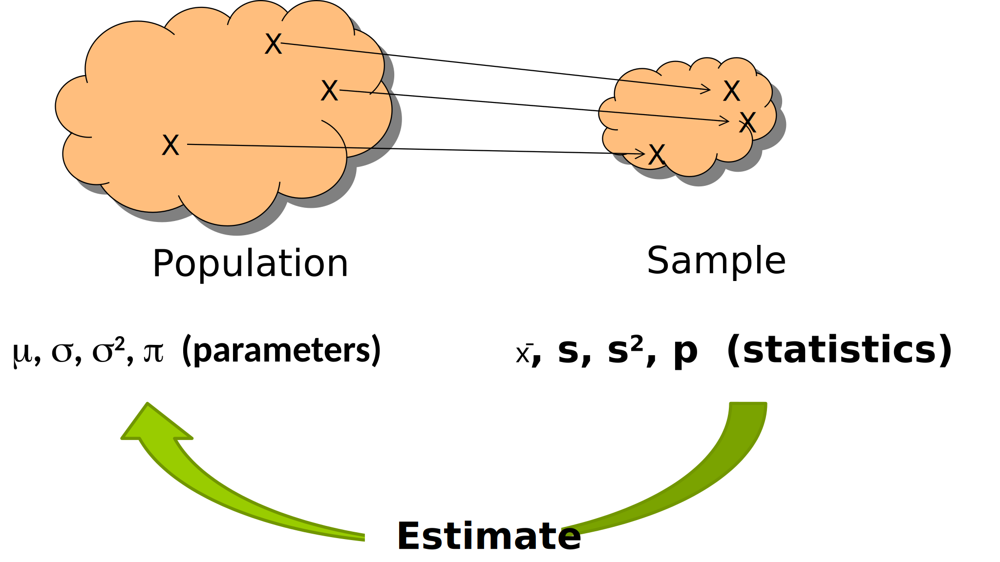

---
#Sampling
- Need to select the **unit of analysis** (individuals, groups, etc).
- Respondent sample must provide information **representative** of the target **population**.

- **Critically assess** how the sample was selected.
- Methods of analyses rely on **‘random sampling’**.

- ***Advantages*** of sampling over census:
 - Less costs - cheaper than studying whole population.
 - Less errors due to less fatigue - better results.
 - Less time - quicker.
 - Less destruction of elements - less impact on subjects/animals.


---
#Population, element, sampling frame, sample and subject
- **Population** (or target population)
 - *entire group* of people, events or things of interest that the researcher wishes to investigate. 
- **Element**
 - a *single member* of the population. 

- **Sampling Frame**
 - a *listing of all the elements* in the population from which the sample is drawn (ideally a list of all in the population but not always possible).
- **Sample**
 - a subset of the population. 
 
- **Subject**
 - a single member of the sample.

---
#Representativeness of samples: Bias
-  **representative sample** (of the population) enables findings of the research to be generalisable.
 - if sample only represents a particular subset of the population then the statistics (from the sample) will not be good estimates of the parameters (in the population); they will be biased.

- **Bias**: measurement error due to biased (non-random) sample or measurement procedure


---
#Uncertainty in estimate (precision)
- **Precision**: 
 - error due to random variation / sampling variation
 
 - measured via SE 
     - measures ‘uncertainty in the estimator’ 
     - ‘variation about the mean’; 
     - reduced by increasing sample size
     
 - Increased precision results in decreased SE


---
#Bias and precision: consider visually
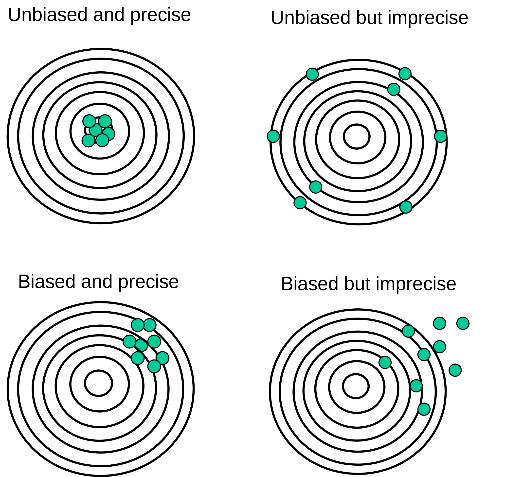
(Figure 2.2: Howley & Gerlach 2006)
---
#Bias and precision
SURVEY:  ***Are you in favor of stem cell research?***

*We want to estimate the **proportion of the population** (π) who answer positively by obtaining a sample.*

- Unbiased sample
  - some form of **random sample** from the population
  
- Biased sample
  - asking the STAT2000 class (unlikely to be representative of population e.g., f/t workers, f/t home-makers, retirees, …)

- Precise estimate
  - asking a **large number** of people rather than 15 or so
  
- Not precise estimate
  - asking a **small number** of people

---
#  Simple Random Sampling 

+ Ensures every element in the sampling frame has an **equal chance** of being selected.
+ Is the most **representative** of the population for most purposes.
+ Probability Sampling
+ **Systematic Sampling**
+ E very n th element in the population starting with a randomly chosen element.
+ Don’t need to specify total sampling frame or number all items.
+ Example :
	+ (Consumer behaviour) Supermarket studying purchasing preferences of customers, they can choose every 5 th customer entering the supermarket and conduct the survey.
.pull-left[]

.pull-right[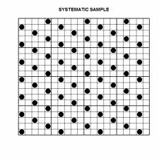]


---
#  Probability Sampling 
***Stratified Random Sampling***
+ Sampling from **mutually exclusive sub-populations** , or strata, from the population
	+ attitudes towards Blackboard: students divided into 1 st , 2 nd , 3 rd years.
	+ employee morale: employees stratified into clerks, supervisors, managers, etc.
	+ clinical trials: patients stratified by gender.
+ ***Homogeneity*** ** within each strata ** and **heterogeneity** 
between strata.
 - Eg. Managers act similarly to other managers, but different to tradesman.
+ **Simple random sampling** used on each strata.

***Cluster Sampling***
+ Dividing the population into non-overlapping areas or clusters where there is *heterogeneity within clusters.*
	+ E.g., test effects of information programme on school children: test in certain schools.
+ Entire cluster used. Clusters selected using **simple random sampling** .
.pull-left[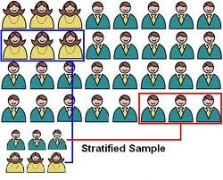]

.pull-right[]


---
#Non-probability sampling
Sampling where each unit in the population does **NOT have the same probability** of being selected into a sample. The sample is *NOT selected randomly!*
- *Convenience sampling*
 - Survey whoever is most readily available.
 - Simple, cheap.
 - least reliable, unable to infer about population.
 
- *Purposive sampling*
 - Judgement sampling: chosen according to some subjective/expert criteria/opinion. E.g., doctor surveyed for disease causes.
 - Quota sampling: sample until predetermined fixed number of units are selected (a whole number or %). E.g., ‘Women in management’ survey: 70% to be surveyed must be women and 30% men.
     -  **Random sampling** not used.
     
Non-probability sampling are *not appropriate* techniques for gathering data to **infer on the population**.

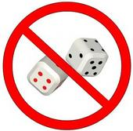


---
#  Choice Points in Sampling Design 
Non-Probability Sampling
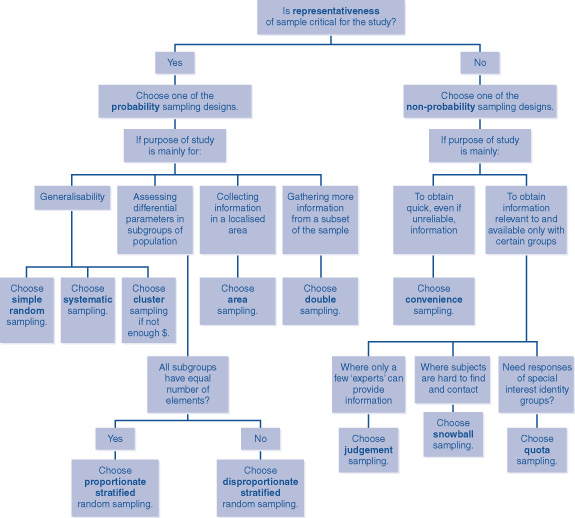


---
#Observational Studies
- Observe individuals and measure variables of interest (outcome) but **do not randomise subjects to groups** that may influence the outcomes /responses *(view in existing state; natural habitat unobtrusively; observation without intervention)*.
- Gathers information not in controlled environment -> **can’t assign causality**.
- Used where experimental research is** unrealistic/unethical**, cost prohibitive or would unduly affect the subject's behavior; uncover unknown phenomena and behaviors.

*Examples*: 
- **(health)** reduction in recurrence of stroke for those prescribed warfarin versus prescribed aspirin (not randomly allocated).
- **(psychology of consumer behaviour)** changes in frequency of males and females attending refurbished petrol station.
- **(politics)** is gender related to political preference? 
- **(mental health)** relationship between radon gas exposure / smoking on mental health (cannot randomise people to be exposed ethically).
- **(education and psychology)** child-parent interactions.


---
#Observational Studies
**Participant observation**: researcher *participates* with those whom they’re studying: **sociological research** 
- Researcher *immerses* them self in the social setting under study, becoming familiar with key individuals in situation: *covert and/or overt*.
- Aim to experience events in the manner in which the subjects under study experiences them, by understanding the perception of others in the environment and the interpretations within that social world/environment. 
- Must simultaneously retain objectivity to understand, analyse and explain the social world under study.
- **Anthropologists** adopt the lifestyle of a 
particular group of people. 
E.g. live amongst a tribe and studies the 
groups behaviours/interactions.

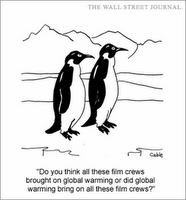


---
#Observational Studies
- **Advantages**
 - Likely reduced response bias (compared to surveys).
 - Can note effects of environment (additional observations).
 - Can observe and record info on otherwise ‘hard to interview’ groups (shy, inarticulate, disinterested).

- **Disadvantages**
 - May have to be physically present.
 - Slow, tedious, expensive… observer fatigue.
 - Assuming expressions reveal actual thoughts/feelings.
 - Requires training.
 - Observer bias: memory lapse, recording error, missing 
 -    info whilst recording, interpretation.

---
##Observational Studies:*cross-sectional and longitudinal*
- Attempt to assess effect of some action/changes over time.
 - *Cross-sectional studies* seek to observe information of **various groups** (representing various stages) **once only, simultaneously**. 
 
 - *Longitudinal studies* follow the development of the **same group over
a period of time**.

- E.g. Studying developmental changes
 - *Cross-sectional*: study multiple groups of people (or animal species), aged 0 - 1, 1 - 3, 3 - 5 years old all at one time point. 
 
 - *Longitudinal*: study changes in same 500 people (or animals) over time
     - **Australian Longitudinal Study on Women’s Health** examining the health and wellbeing of Australian women since 1996. Surveyed over 58,000 Australian women who were aged 18-23, 45-50, and 70-75 when the study began and followed up (surveys) each 3 years.
     - [https://www.alswh.org.au/about](https://www.alswh.org.au/about)


---
#Experimental Design: The Three R's 
>(Not  “Reading, wRiting and aRithmetic , but … )
+ *Replication*
+ *Blocking* 
+ *Randomisation*

>***Source: Howley (JSE, 2003)***

- *Randomisation*:	
  - randomly assigning subjects to **treatment groups**.		  
   - randomly assigning the order.  


- *Replication* :	      
 - repeating the experiment over **many subjects** .
 - provides better estimates; reduces SE of estimate (mean).

- *Blocking* : 
 - If a factor is of ***no interest*** to the prediction of the outcome 			variable, *but is* ***known to influence*** **** the values of the outcome 		variable, *Y* , then it is better to randomise within blocks ( eg , gender 		on drug effectiveness).

**Why?** It controls for a source of variation in *Y* , thus SE of the 			estimated means will be reduced.

---
#Some options include:
- **Completely Randomised Design** with 2 or more groups for a single factor (such as in randomised control trials)
 - Level 1, Level 2, Control group
 - Drug 1, Drug 2, Drug 3, Placebo

- **Randomised Complete Block Design**: where there is one factor and one blocking variable.
 - Drug type (A, B, C), gender blocks (M, F) 

- **Factorial Designs**: An experiment that consists of two or more factors that are of interest (and no blocking variable).

- **Fractional Factorial Designs**: a fraction of all combinations of levels for all factors.
 - Drug type, gender, age category – But do not have data for each cell

---
#Aspects of good experimental design:
- **Internal validity**:
	
	- ability to provide findings that have only **one interpretation** due to the appropriate use of controls (able to make strong inferences that one variable has causal effect on another). 
 
- **External validity**: 
	- ability to *generalise your findings* to other populations (selection of individuals on which to test).

- **Design to minimise effect of *confounding variables*** 
 -  variables not controlled for systematic changes of the explanatory variable.
    
     - *Confounding (lurking) variable*: a variable that influences 
both the dependent variable and independent 
variable, causing a spurious association.
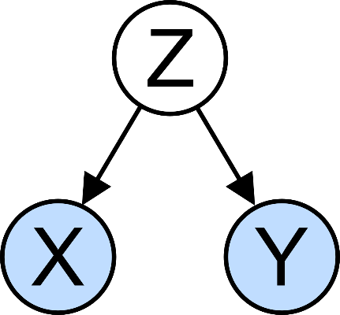


---
#Aspects of good experimental design:
- *Operational definitions*: 
 - How to measure the variables needs to be clearly defined to ensure consistent measurements. 

- Define exactly what is to be measured and how is to be measured.

- Consider something as simple as: 
  - *measure the width of your hand*.
  - in mm, cm, inches?
  - from where to where?
  - think ‘reliability’ (repeated measures by many give same value?)


---
#Measurement Scales / Variables
-  **Categorical** (nominal or ordinal) and 

- **Numerical** (discrete or continuous).

 *Numerical measurements may be classified further as*:  
  - ***Interval scales*** measured against arbitrary zero: consistently measure diffs
     - E.g., Difference between 10 and 20°C same as between 30 and 40°C.
     - However, doubling one measurement on one scale is not the same as doubling the measurement on another scale. e.g., 10°C = 50°F while 20°C = 68°F.
    
 - ***Ratio scales*** are measured against an absolute zero: 
    measure diffs and ratios. 
     - E.g. difference between 5kg and 1 kg is the same as the 
     difference between 10kg and 6kg. Further 4kg is twice 2kg.

*Example*: 
Measuring Anxiety Level
 - Nominal: Anxious or Not.
 - Ordinal: None, Low, Medium, High.
 - Interval: Score 0 to 60 (if 40-50 same as 10-20).
 - Ratio? Probably not possible (40 twice anxiety of 20?).
 *Example*: Income
  - Nominal: Yes or No.
 - Ordinal: None, Low, Medium, High.
 - Ratio: $40,000 is double $20,000, and zero represents absence of income.
.pull-left[]

.pull-right[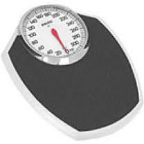]


---
#Ethics
- The organisation that carries out the study must have an **institutional review board** that reviews all planned studies in advance in order to protect the subjects from possible harm.
- Full design, survey instruments, methods – all established and assessed by independent body.
- Individuals who are subjects in a study must give their **informed consent** before data are collected.
- Individual data must be kept **confidential**.  Statistical summaries of groups of subjects (aggregate, non-identifying information) may be made public.
- https://en.wikipedia.org/wiki/Unethical_human_experimentation

#Report Writing & Publishing
- Consider the style of the discipline/area of research.


[https://en.wikipedia.org/wiki/Unethical_human_experimentation](https://en.wikipedia.org/wiki/Unethical_human_experimentation)


---
# Next Week....
- **STAT2000 Lecture 3**

  - One Way ANOVA including: Assumptions, Diagnostics, Remedial Measures, and Post-hoc tests. (Module 4)


