# Reminder: Week 2

- The Research Process

- Types of Studies

- Sampling Methods

- Study Design

- Measurement

---

# This week: ANOVA

- One Way ANOVA

 - Assumptions
 
 - Diagnostics
 
 - Remedial measures
 
 - Post hoc testing

---

# Analysis of Variance (ANOVA) – Module 2    

***Concepts***

+ Useful to test for differences in **means** among *2 or more* *different treatments (or groups, levels).*

+ Used when we have a ***continuous response*** *variable* and a ***categorical explanatory*** *variable.*

+ Why is it called **analysis of variance** if we are testing for differences in ***means*** ?

---

# Analysis of Variance (ANOVA) – Module 2    


### **Before that, a refresh on variance:** 


**Variance** can be thought of as a measure of the **average (** ***squared*** **) distance** the data points are from the **mean** .

Var ( ) = 

This is the degrees of freedom

= 

---

# ANOVA

Consider 3 groups’ means to be compared . . . 

**Example situation: Toluene and the Brain:**

- Abuse of substances containing toluene (e.g. glue) can produce various neurological symptoms.

- Measure concentrations (ng/g) of chemicals (noradrenaline) in the brains of rats exposed to toluene-laden environments (Toxin1, Toxin2, None).

- Is there a difference in mean concentration of noradrenaline due to Toxin?

*Hypotheses*:

# $H_o$ : $\mu_{Toxin1}$ = $\mu_{Toxin2}$ = $\mu_{None}$

---

# Treatment Deviations – between group variation


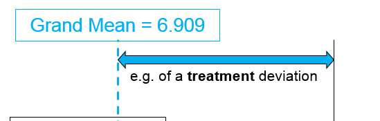


Response- ** noradrenaline ng/g **

---

## Definition – Treatment Deviation / between group variation

**Treatment Deviation**: 

. . . deviation of a group’s sample mean from the grand mean (so we have three treatment deviations in our example)

> Treatment Deviation 	= Treatment Mean – Grand Mean

> = $Y_i$ - $Y^-$,i = 1, 2 , ....3

> deviation of each group sample mean

> around the overall sample mean


---

# Error Deviations – within group variation

---

# Definitions – Error Deviation / within group variation

*Error Deviation**: 
difference between a data point and its group’s sample mean (so we have eleven error deviations in our example)

> Error Deviation of jth observation in group i=

> Data Value – Sample Mean

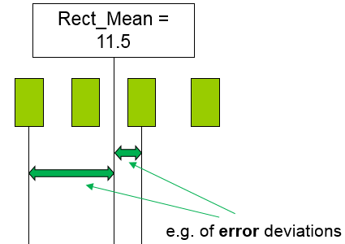

---

# ANOVA

- Null hypothesis in ANOVA: 

## $H_o$ : $\mu_{Toxin1}$ = $\mu_{Toxin2}$ = $\mu_{None}$ 

.... group(population) means 

(= $\mu$)(The grand popn mean)

OR

## $H_0$: all treatment deviations are zero

**ANOVA principle**

*If the population means are different* (i.e., at least two differ), then the average **error deviation** is relatively **small**, compared to the average **treatment deviation**

---

## Comparing Average Treatment and Average Error Deviation

**Treatment** deviations appear large on average compared to the error deviations, which appear small on average. 

This indicates a **difference** in population means.

**Error** deviations appear small on average

---

## Different Data: Comparing Treatment and Error Deviation

**Treatment** deviations appear similar on average compared to the **error** deviations. 

A **difference** is now harder to detect. 

**Error** deviations are larger now. 

---

## Total Deviation

Consider **TOTAL deviation** as ***Sum of Treatment*** and ***Error Deviations***

---

#  TOTAL deviation = 

# Treatment Deviation +  Error Deviation 


=>

> $\Sigma ( TOTAL deviation )^2$ =

>  $\Sigma ( Treatment Deviation )^2 + \Sigma( Error Deviation )^2$

>   or, simply
  
>   SSTO  =  SSTR  +  SSE

Sum of the squared **total** deviations=

  Sum of the squared **treatment** deviations +
 Sum of the squared **error** deviations

---

# TOTAL deviation = Treatment Deviation +  Error Deviation


To determine if there is a treatment effect:

+ consider relative size of errors compared with treatment deviations

+ consider ‘average’ **squared treatment deviation** and ‘average’ **squared error deviation**
 + much like a sample variance divides by (n-1) due to df
 
 + divide **SSTO** , **SSTR** and **SSE** by respective df to obtain ‘ *average* ’ squared deviation
 

>**SSTO** : use ALL ‘ n t ’ data points, use information from 1 quantity computed from data (grand mean)-> 1 restriction ->  **df** **(** **SSTO** **) =** ** $n_t$ ** **– 1**

>** MSTO= $STTO \over {n_t}-1$ **

>**SSTR** : use deviations of ‘a’ sample means from grand mean so ->1 restriction -> **df** **(** **SSTR** **) = a – 1**

>** MSTR= $SSTR \over {a-1}$**

>**SSE** : use deviations of ‘ n t ’ data points about respective means -> **df** **(** **SSE** **) = ** $n_t$ - a**

>** MSE= $SSE \over {{n_t}-a}$**

+ In our case,
 + a = 3 (number of treatments)          ,      ,       and
 + $n_t$ = 11 (number of observations), 

---

# TOTAL deviation = Treatment Deviation + Error Deviation

$H_0$ : Treatment (population) means are equal

$h_a$ : At least one population mean differs

>The quantity

>>**F= ${MSTR}\over{MSE}$**

>under $H_0$ ~ *F* distribution with (a – 1) and  ( $n_t$ – a ) df

**Generally**  ( . . . but need to consider df )

-> F-ratio  >> 1 -->likely reject $H_0$ (at least two population means differ)

-> F-ratio < or ≈ 1 --> likely NOT reject $H_0$

F ratio is looking at the Treatment group variation compared to the Error variation.

(‘ **Between group** **’** variation compared to ‘ **within group** **’** variation)

---

# Treatment Variation approx equal to error variation 

F  ≈ 1

---

# Small Treatment Variation compared with error variation 

##F <<1

---

# Large Treatment Variation compared with error variation 

##F >> 1

---

# Notation

- Any data value can be decomposed into:
 - **treatment** component (model); and
 - **error** component

- Consider 

 - $Y_{ij}$  the variate (value of response variable): $j^{th}$ observation within group I 
 
   eg. The second data point in the third group would be denoted $Y_{32}$
   
 - population mean for group i
 
  - as the error component due to observation j in group i

>>> $Y_{ij}$ =  + 

**Another representation of the model**:
  - population grand mean across all treatment groups
  
  - contribution of group i, mean deviation of ith popn from 

>>> $Y_{ij}$ = ( +  ) + 

---

#  ANOVA 

Any single variate (reading) in the model can be decomposed:

> ## $Y_{ij}$ = $\mu+\alpha_i+\epsilon_{ij}$
i = 1, …, a ,    j = 1, ..., $n_i$


+ $Y_{ij}$ is observation j of group i ,

+ $\mu$  is the population mean,

+ $α_i$is the contribution of group (or treatment)i , 

+ $\epsilon_{ij}$ is the error term of that observation; $\epsilon_{ij}$ ~ N(0, $σ^2$ )

---

#  ANOVA 

Any single data point is modelled as follows:

>>## $Y_{ij}$ = $\mu+\alpha_i+\epsilon_{ij}$

>>i = 1, ..., a ,    j = 1, …, n i

So the hypotheses (in terms of comparing population means)

>$H_0$ :

>$H_a$ : at least one pair

**reduces to **(in terms of comparing population *treatment effects* )

>$H_0$  :_   (all treatments have the same effect)

>$H_a$: At least one (at least one treatment is different)

---

# Example: Rats

18 rats were randomly selected and then randomly assigned to three groups. Each group was exposed to one of three toxin environments.

The toxin groups (T1, T2, C) were Toxin1, Toxin2 and a Control group.

Concentrations (ng/g) of noradrenaline(NE) in the brains of rats post exposure are measured.		

***Question***:

Is there a difference in mean concentration of noradrenaline in the brain of rats due to 
exposure to these specific toxins?

```{r tbl23, echo = FALSE}
tbl23 <- tibble::tribble(
~`Toxin1`, ~`Toxin2`, ~`Control`,
"558.0","414.4","419.5",
"601.3","562.5","452.0",
"541.6","544.0","480.5",
"544.9","485.9","506.5",
"531.4","603.2","444.0",
"474.2","499.0","418.4"
)

kableExtra::kable_styling(knitr::kable(tbl23), font_size = 18)
```
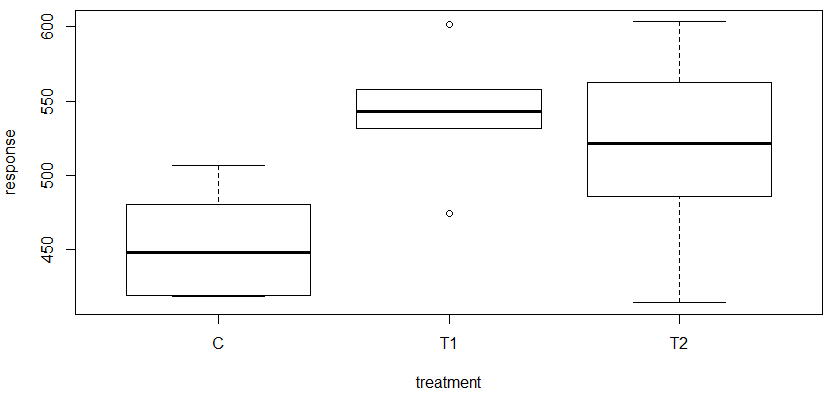

---

To test hypothesis that is no significant difference in ***population*** mean concentrations of noradrenaline in brains despite exposure to varying environments . . . .

**Hypothesis (based on the model)**

## $Y_{ij}$ = $\mu+\alpha_i+\epsilon_{ij}$

>$H_0$ : $\alpha_1=\alpha_2 = \alpha_3 = 0$

>$H_a$ : At least one not equal to zero

or, equivalently

>$H_0$:  $\alpha_i$= 0 for all *i*

>H a :  $\alpha_i$ ≠ 0 for at least one *i*

**Note:** 

$H_0$ states that added effect due to different treatments (toxins) is zero

---

- Degrees of Freedom (df)

	->df (model) = a - 1 = 3 - 1 = 2 
	
	->df (error) = $n_t$ – a = 18 - 3 = 15

- Test Statistic

	 -> F = $MS_{model} \over MS_{error}$
	 
 has a F distribution with (a - 1) = 2 and ( $n_t$ – a) = 15 df.


- Under assumption that H0 is true, $MS_{model}$ will be approximately equal to $MS_{error}$  and hence 

  F = $MS_{model} \over MS_{error}$ should be close enough to one 

- To conclude, find p-value, based on calculated test statistic and make a decision re the strength of evidence against null hypothesis.

---

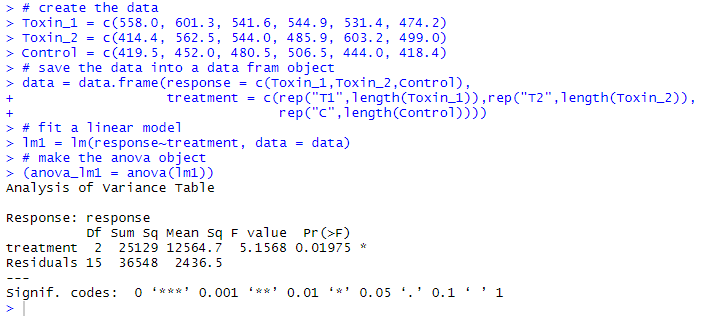

>F= $MS_{model} \over MS_{error}$

>= 12564.7 / 2436.5

>  = 5.1568
   
- p-value = 0.01975

- Strong evidence against the null hypothesis

**Conclusion**
Since p < 0.05, reject the null at the 5% sig level and conclude at least two of the   population mean concentrations of noradrenaline differ

---

# ANOVA Assumptions

- **Randomness (Course notes - 4.1.1)**
 - samples being randomly selected from the population of interest.

- **Independence (4.1.2)**
 - samples arise from populations which are independent of one another (unrelated).
 
- **Equality of Error Variances (4.1.3)**
 - population error variances equal across all treatment groups.

- **Normality  (4.1.4)**
 - observations in each group correspond to a random sample from a normal distribution such that residuals normally distributed with mean zero.
 
- **Outliers  (4.1.5)**
 - no extreme values (outliers) in the observations.

---

# ANOVA Assumptions – Randomness (4.1.1)

- Samples ***randomly*** selected from **population of interest**.

- Reasons for a lack of randomness:
Could be due to not taking random sampling approach, OR 
not randomly allocating to treatments.

- Consequences of non-random sample: 
sample not representative of target population: poor external validity (lack of generalisability to population).
statistical calculations incorrect.

- Are the results of our experiment on rats **generalisable** to all rats… to humans even?

---

# ANOVA Assumptions – Randomness (4.1.1) - *Diagnostics*

Testing for lack of randomness:

- Could be due to **not using random sampling** or **not randomly allocating** to treatments.

- Largely a question of methodology in the study design.

- Lack of randomness *may* present in lack of independence of measurements, unequal variances, or non-normal distributions…
	   - These are other tests that are performed though.

---

# ANOVA Assumptions – Residuals!

We use **residuals** to test some of the **assumptions**. 
A refresher on residuals:

- Remember the form of the ANOVA model:   
	

- We define our residuals to be the difference between the **observed values** (the data, ) and our **predicted values** (). 

- Therefore our **residuals** are:
	 
**But what is  ?**

---

# Residuals

is the predicted value for group i.


Response (usually on the y axis)

---

# ANOVA Assumptions – Independence (4.1.2)

- **Each of the samples arise from populations which are *independent* of one another.**

- Lack of Independence (e.g. spatial- or time-dependence)
 - E.g., Agricultural Experiment: adjacent plots likely give similar results, so not want group all plots containing same treatment into adjacent series of plots, else dependence due to ‘space’. 
     - instead randomise the allocation of treatments within adjacent series
 - E.g., Correlated data due to time of experiment/study.

- In the model, the ***residuals ***(error terms) should be independent.

- Consequences of lack of independence: 
 - Validity of ANOVA F-test impaired.

---

# ANOVA Assumptions – Independence (4.1.2) - *Diagnostics*

- Testing for **independence** – design. E.g., Are family members added to one treatment group. 

- Testing for independence – when time order known:

 - Plot the **residuals** in order collected: should show **no pattern**, random scatter about zero

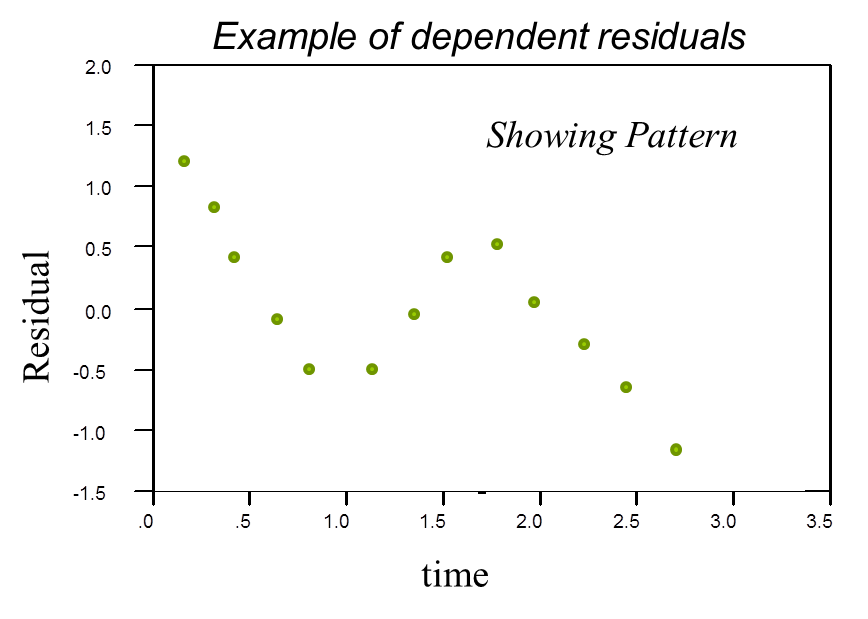

---

# ANOVA example: Rats

**No time order of data collection is known:**
-  assess **design of the experiment** to determine no evidence against assumption of independence.

Information in the question: 

“18 rats were **randomly selected** and then **randomly assigned** to three groups. Each group was exposed to one of three toxin environments.”  

- Randomly allocated and selected, should be able to assume **independence**. 

- Are the results **generalisable** to all rats though? 

---

# ANOVA Assumptions – *Remedial Action*

- Issues of random sampling and independence of observations can really only be addressed as part of the **experimental design** - before the data is collected. 

- Having someone with a strong **background in statistics** involved at the beginning of a research project is very important. 

- There are methods for addressing problems with the other assumptions though:
 - non-constancy of error variance; and
 - non-normality of the distribution of the error terms; as part of the analysis.

---

# ANOVA Assumptions – Equality of Variances, *Diagnostics*

- We are interested in testing whether the population **variances** of all the groups are **equal**. This can be tested by considering the following hypotheses:

	$H_0$: Population error variances equal across all groups.
	
	$H_a$: Not all population error variances are equal.
	
- Or, equivalently: 

	at least two  not equal. 
	
- Some common tests used to test the homogeneity of the variances include:

 - O’Brien’s test.
 - **Levene’s test**.
 - Brown-Forsythe test.
 - Bartlett’s test.
 
- Rule of thumb: Can use ANOVA if the largest standard deviation is less than twice the smallest standard deviation. – Better to use *Levene’s* test though.

---

# ANOVA Assumptions – Equality of Variances, *Diagnostics*

- ***Levene’s test:***

 - Considers the absolute value of the difference/deviation between each observation and its group **mean**, i.e., the absolute value of the residuals.
 
 - For a group that has a **larger variance**, these deviations from the group mean will also be larger, on average.
 
 - One advantage of the test is that it does not require that the data being analysed follow a normal distribution.
 
- ***O’Brien’s test***
 - Useful when: residuals are not normal, or small unequal samples 
 
- ***Brown-Forsythe test***  

 - like Levene’s but compares with median. Useful when: data is skewed. **Default test in R using leveneTest().**
 
- ***Bartlett’s test***

 - also sensitive to normality assumption; less affected by sample sizes

---

# ANOVA Assumptions – Equality of Variances, *Diagnostics* - Rats

# $H_o$ : $\sigma^2_1 = \sigma^2_2 = \sigma^2_3$

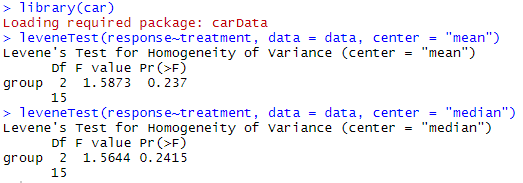

>Do **not reject** $H_0$ and conclude that there is insufficient evidence to suggest that the three population variances are not equal.

Therefore this assumption is satisfied

---

# ANOVA Assumptions – Equality of Variances, *Remedial Action*

- **IF** we feel that the assumption of population variances are all equal is violated, we can still test for **equality of the population means** using **Welch’s tes**.

- Welch ANOVA test is analogous to the version of the two sample t-test which allows unequal variances. 

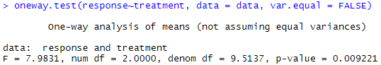

- The p-value of 0.009 suggests that even allowing for heterogeneity of variances, the data provide enough evidence to reject $H_0$

- Why not always use this? 	

**Reduced Power!**

---

# ANOVA Assumptions – Equality of Variances, *Remedial Action*

- Other alternatives when unequal variances:

 - **Transformation of the response variable** may help reduce the problem of unequal variances in some cases.
 
 - Alternatively, a **non-parametric** approach may be appropriate - introduced later in this course.
 
---

# ANOVA Assumptions – Normality, *Diagnostics*

- ANOVA model assumes observations **in each group** correspond to a random sample from a normal distribution. Residuals normally distributed with mean zero.

- For **large sample sizes**, ANOVA reasonably **robust** against non-normal distributions.

- Normal **quantile plot** can be used to assess normality – or the **Shapiro-Wilk test**, both testing the residuals.

- When the sample sizes are **small**, can test them all together. When **large** test them separately. 

---

# ANOVA Assumptions – Normality, *Diagnostics*

$H_0$: residuals for group i are normally distributed; i=1,2,3.

$H_a$: not normally distributed.

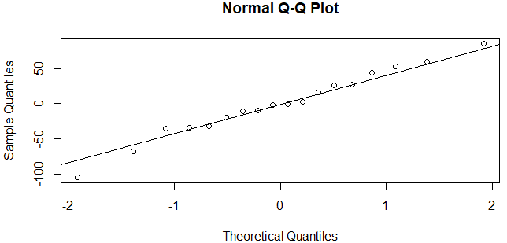

>Points roughly follow the straight line, therefore do **not reject** the null hypothesis and conclude that there is insufficient evidence to suggest the residuals aren’t normally distributed.

---

# ANOVA Assumptions – Normality, *Diagnostics*

$H_0$: residuals for group i are normally distributed; i=1,2,3.

$H_a$: not normally distributed.

>Since the p-value is greater than 0.05, we do **not reject** the null hypothesis and conclude that there is insufficient evidence to suggest the residuals aren’t normally distributed.

---

# ANOVA Assumptions – Normality, *Diagnostics*

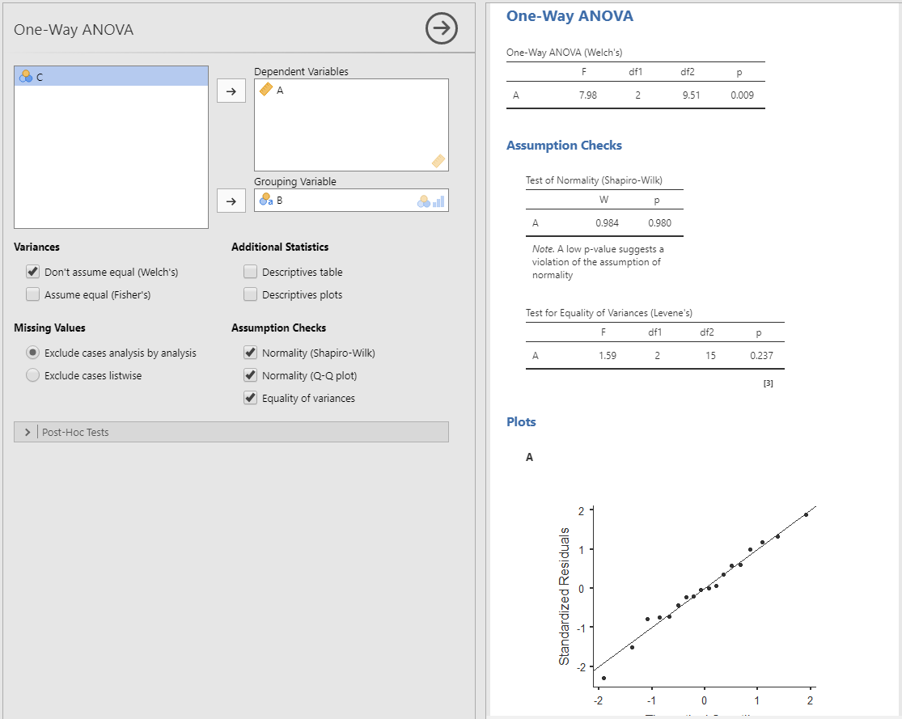

---

# ANOVA Assumptions, Normality – *Remedial Action*

- When there is evidence the residuals don’t follow a normal distribution, the problem may be overcome in two ways:

 - Employing a **transformation** of the **response variable**, or
 
 - Using **non-parametric tests** (which we shall discuss later in the course).
 
- Transformation of the response variable, Y, may help overcome the problem of the residuals not being normally distributed, and reduce the problem of unequal variances in some cases.

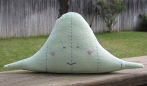

---

# ANOVA Assumptions, Normality – *Remedial Action: Transformations *

- If the residuals are **not normally distributed or do not have equal variance**

 - may correct by transforming the observations using ***logarithms*** or ***square root*** or ***inverse*** transformations (or even a Box-Cox transformation – this is an optional strategy).

- When a transformation is applied to data;

 - hypothesis tests are carried out on transformed data. 
 
 - discuss results in terms of the transformed variables.
 
      - Eg – “the log of the means are not equal”
      
 - take the reverse transformation (antilog (exponential) or squared) to obtain means, confidence intervals to be reported in the **original measurements**.
 
 - the transformed variable is often denoted as Y’

---

# ANOVA Assumptions, Normality – *Remedial Action: Transformations* 

- Common transformation is to take the ***logarithm*** of the response variable: 

 **Y’ = ln(Y)**, where Y is the response variable.

- By doing so, you are modelling the ***ln(Y)*** against the factors.

- Particularly useful in models with **numerical predictor** variable and where the **variance in Y increases with X**.

- Transformation likely to make the populations variances “more equal”

- Another common transformation is to take the square root of the response variable: **√Y** (useful if Y is discrete (counts), skewed distribution, extreme large values)

---

# ANOVA Assumptions – Outliers, *Diagnostics*

- There should be no extreme values **(outliers)** in the observations.
- Check to ensure that the outliers are not due to errors in measurement, recording, etc.

- If valid, do not simply ignore the observation/s

- Outliers influence:

 - ANOVA results
 - Assumptions of equal variance
 - Assumption of normality of residuals
 
- Noted whilst undertaking other tests on residuals.

---

# ANOVA Assumptions, Outliers – 

##*Remedial Action*

- May arise due to an error: 

 - correct or delete as appropriate
 ***ONLY IF IT IS AN ERROR***
 
- May reveal additional factors: 

 - review the study.
 
- Weighted least squares or **non-parametric methods** (later in the course) can reduce the influence of single extreme values on the analysis.

- Possibly use **transformations**.

.pull-left[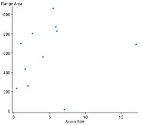]

.pull-right[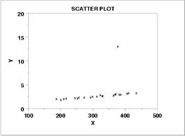]


---

# Comparison of Means in ANOVA (Module 5)

- **Unplanned (Post-hoc) Comparisons** (5.1)

 - When ANOVA shows **significant differences** exist amongst groups (treatment levels), interested to determine which means differ.
 
 - The comparisons are made **after** the experiment has been carried out and the results obtained.
 
 Approaches:
  ->Student’s t      Tukey’s HSD     Dunnett’s test 

- **Planned Comparisons **(5.2)  ***Week 4***

 - Comparisons planned before the experiment has been carried out.
 
 - Chosen **independently** of results.  
 
- One needs to make the distinction between planned and unplanned comparisons because the results of the tests often differ.

---

# Unplanned comparisons: Student’s t-test 

- A pair-wise comparison of the sample means and is based on the **two-sample t-test** (assuming equal population variances, and equal samples)


- When there are **a** groups (**a** sample means), can be **a(a -1)/2** possible comparisons between all possible pairs of means. 

- If we make **many** comparisons at $\alpha$ = 0.05, eventually we will reject the null when we shouldn’t, **a type I error**. 

- **Usually NO adjustment made for type I error rate when using multiple t-tests**.

---

# Unplanned comparisons: Problem with multiple comparisons

- If we do pair-wise comparisons of the sample means using the two-sample t-test, there will be **a(a -1)/2** comparisons. 

- If we have a = 3 groups, then there will be a total of 3 pair wise comparisons. 

- **Significance level** is set to $\alpha$=5%. This should be the same as the **Type I error** rate. 
Therefore:

  -> 95% of the time we will **not reject** the null 
when the null is true.

- The probability of making an **overall Type I error** is the overall risk of incorrectly rejecting a null. 

- This is equal to 1 – P(overall not rejecting | null is true)

- With 3 comparisons, **overall risk of Type 1 error** is 

	1 – (0.95)* (0.95) * (0.95) = 1 – 0.953 = 0.143 ***(not 5%!)***
	
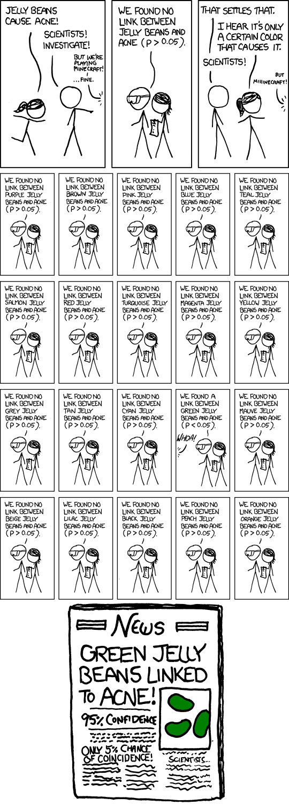

---

# Unplanned comparisons: adjusted/overall Type I error

**Tukey’s HSD**
- the recommended multiple comparison test if **all pairwise comparisons are to be made.**

- overall comparisons performed at an overall Type I error rate of  (e.g., 5%)

**Dunnett’s test** 

- Not interested in all possible comparisons of pairs of group means, but only in **comparisons with a single group** (perhaps “a control group”). 

- overall comparisons performed at an overall Type I error rate of  (e.g., 5%)

- *a* groups, undertaking **a – 1** comparisons (each including comparison with the control group’s mean), rather than **a(a – 1)/2** comparisons

---

# Unplanned comparisons: Example

.pull-left[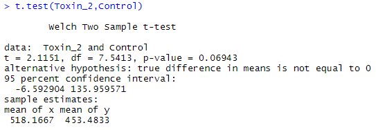]

.pull-right[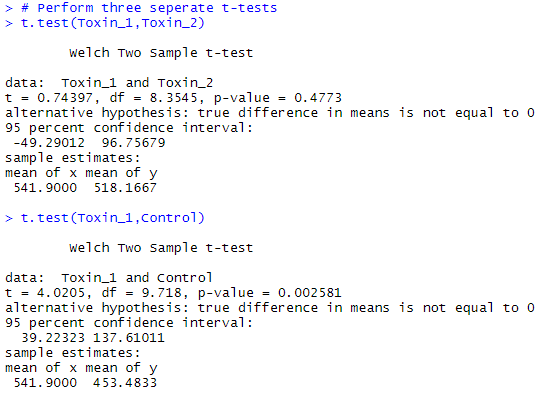]

Therefore, would conclude that:


Would **almost** conclude:


---

# Unplanned comparisons: Tukey’s HSD

- For Tukey’s HSD, calculations are made so that the overall type I error rate will be equal to our significance level, α. 

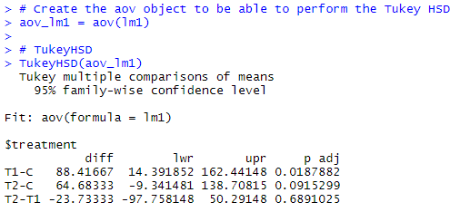

Therefore, would conclude that:


Would **almost** conclude:

---

# Unplanned comparisons: Dunnett’s test

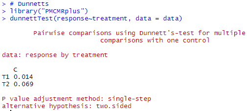

Only comparisons made are each of Toxin1 and Toxin2 with Control.
Would conclude that: 	

***Almost conclude***		

---

# Coming up next week…

- **STAT2000 Lecture 4**

 - Comparing Means: *Planned comparisons* - orthogonal contrasts
	
	 **(Mod 5, Sect 5.2)**


