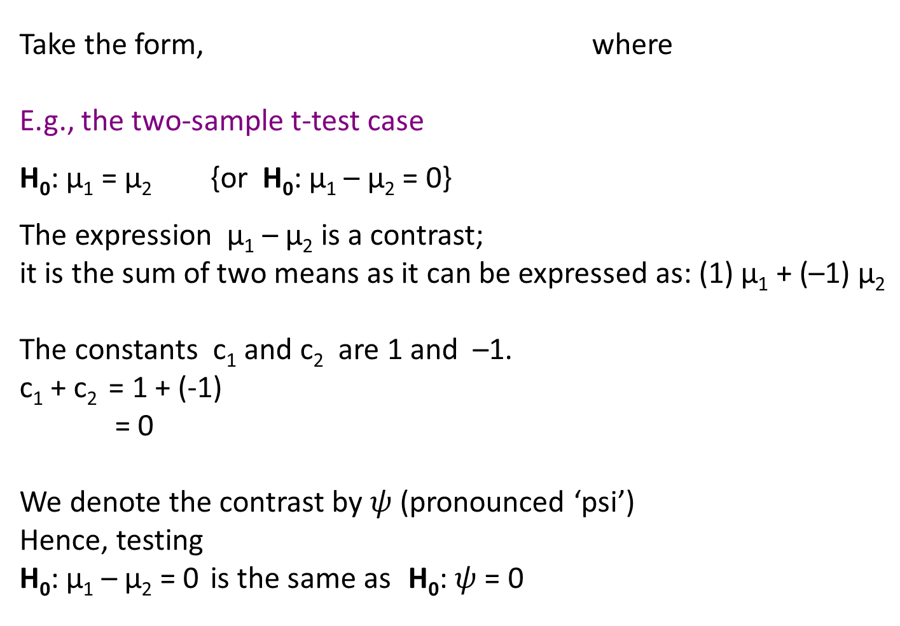
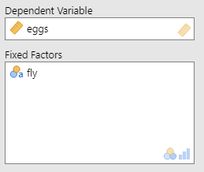

#  Revision: Caffeine’s Effect on Anxiety Level 

- **Independent** variable: Caffeine Dosage
- **Dependent** variable: Anxiety level recorded 1 hr after treatment

- Three groups of participants (blinded):

    **Group 1** : 0mg caffeine

    **Group 2** : 5mg caffeine (per 5kg)

    **Group 3** : 10mg caffeine (per 5kg)

- ** $H_0$ **: (No effect of caffeine)  $\mu_1$ = $\mu_2$ = $\mu_3$ 

  ** $H_A$ ** : At least one **population mean** differs
+ One-Way ANOVA:

**Between** Samples: based on variability of sample means about the grand mean

**Within** Samples: based on variability of each data value about its own group’s mean

F = Mean Between Sum of Squares / Mean Within Sum of Squares
+ Veleber , D. M. & Templer , D. I. (1984), Effects of caffeine on anxiety and depression,

 *Journal of Abnormal Psychology* , 93, 120 – 122
+ Lee et al (2006) Anxiogenic effects of caffeine on panic and depressed patients, *The American Journal of Psychiatry* , 145 (5), 632-655
+ ANOVA Example  -- REVISION

```{r tbl1, echo = FALSE}
tbl1 <- tibble::tribble(
~`X1 0mg Caffeine`, ~`X2 5mg Caffeine`, ~`X3  10mg Caffeine`,
"4","10","9",
"5","6","10",
"7","10","11",
"3","9","7",
"6","7","10",
"M = 5.00","M = 8.40","M = 9.40",
"SD = 1.58","SD = 1.82","SD = 1.52"
)

kableExtra::kable_styling(knitr::kable(tbl1), font_size = 18)
```


---

## ANOVA Example

.pull-left[]

.pull-right[]


** $$ F = {MS_{model} \over MS_{error}} $$** 

** $$ = {26.7 \over 2.7} $$ **
** $$ = 9.85 $$ **
** p-value ** = 0.003 

 **Conclusion**: 
There is very strong evidence against null hypotheis (p=0.003). Population mean anxiety levels for the three caffeine doses are not all the same.

***Where are the differences?***
                       
---

#ANOVA Example-

**Randomness and Independence**: We are not told about the sampling scheme. 

**Common variance**: By Levene’s test we have no reason to reject the assumption of equal population variances (p=0.702). 


**Normality**: The Shapiro Wilk test of normality (p = 0.1432) and QQ plot do not indicate a departure from normality.


**Outliers**: Using Cook’s distance, there are none.

---

## Post-hoc Comparison Tests- *REVISION*

- Since we found a **statistically significant difference** between at least two of the population means, 

    -> can perform **multiple comparison tests** to determine which / how many means differ.

- Review parallel boxplot to check consistent with result and then where you may expect differences to occur.
 - You are making multiple comparisons in your mind.
 
 - Any choice, at this stage, to compare a particular pair has been based upon what you have seen (and hence you have already made multiple comparisons) 

### *Common Post-hoc Comparison Tests**

 - ** Tukey's "HSD" Test**
 - **Dunnett's Test**
 
---

## Post-hoc Comparison Tests- *REVISION*

### Tukey's "HSD" test

- Tukey's “Honestly Significant Difference” method
- recommended test if ***all pairwise comparisons are to be made***


### Dunnett's test

 - Not interested in all possible comparisons of pairs of group means, but ***only in comparisons with the “control” group***.
 
---

## Post-hoc Comparison Tests- *REVISION*

**Such tests are referred to as**:

 - Unplanned comparisons, 
 - a posteriori,
 - Post Hoc comparisons,
 - Multiple Comparisons. 

They are comparisons that were **NOT formulated in advance of the ANOVA**;  instead, undertook ANOVA and then if significant result, further test to see where differences lie.

---

#  Planned Comparisons

***Post-hoc*** *OR* ***Planned comparisons*** *?*

If you plan to make **ALL pairwise comparisons** then you can make post-hoc tests.

However, if your study is interested in a **particular** comparison, or in a **select few** , then we can use **a priori comparisons** .

***A priori*** **comparisons -**

+ Set of comparisons created **before** results known
- No longer need to use the ANOVA test first.
	-  ANOVA test is a general test of a relationship.
	- As we have specific comparisons, we can jump directly to these.*

*(Moore, McCabe & Craig, *Introduction to the Practice of Statistics* , 7 th ed.)

---

### Psychology Example

# Behavioural Psychology Example 

A measure indicative of animal learning behaviour is recorded for animals subject to 5 different experimental treatments.

+ Treatments 1 and 2 represent control conditions in which the animal received food and water (1); or, food and water twice per day (2).
+ Treatment 3, animals were food-deprived;
+ Treatment 4, animals were water-deprived;
+ Treatment 5, animals were deprived of **both** food and water.

Response variable: number trials taken for the animal to reach a predetermined learning benchmark. Thus a smaller number represents quicker learning.

---

### Psychology Example

##Behavioural Psychology Example (continued)

- **Before** experiment, researchers decided appropriate to compare:
 
 1. the combined *control groups* (treatments 1 & 2) with the combined
*experimental groups* ( trs 3, 4 & 5);
 2. the *control groups* with *each other* (1 v 2);
 3.  the *singly-deprived* treatments with the *doubly-deprived* treatment (3 & 4 v 5); and
 4. the *singly-deprived* treatments with *each other* (3 v 4).

- There are 5 treatment groups, meaning all pairwise comparisons would amount to 10 comparisons ( $a(a-1) \over 2$ ).

- The above involves only the key (4) comparisons of interest.

- No protection of making a type I error like in Tukey HSD though. Can use Bonferonni correction though.

- This is a lab exercise…


---

### Pesticide Example

#Environmental Science Example 

- Testing the **effect of pesticide on fruit-fly**
**daily reproduction rate** (no. eggs laid per day)

    + Resistant Strain (RS)
	+ Susceptible Strain (SS)
	+ Non-selected CONTROL Strain (NS)
	
- Two specific questions to be answered:

 1. Did reproduction of selected lines (RS & SS) differ from non-selected lines (NS)?
 
 2. Did reproduction of line selected for resistance (RS) differ from that of line selected for its susceptibility (SS)?
 
 These involve testing hypotheses relating to two specific comparisons:
 1.	NS vs RS + SS
 2. RS vs SS
 
Deal with such comparisons using **contrasts.**


---

### Orthogonal Contrasts*

# Contrasts



---

### Orthogonal Contrasts

## Contrasts: the two-sample case

**(note: introducing the notation here and will extend)**


---

### Orthogonal Contrasts

## Recall, test statistic when population variances assumed unknown and equal

When testing $H_0$ : $\mu_1 - \mu_2 = 0$

Can express as:

More generally, for *‘a’* treatment groups,

$H_0$: = 0
has a test statistic ...

Orthogonal Contrasts


---

### Orthogonal Contrasts

When comparing multiple populations using **planned comparisons**, must stipulate **ALL desired comparisons** (and hence null hypotheses) **prior to study** (at least prior to looking at the data)

- List series of hypotheses (and hence series of contrasts) to test.

- Thus we will need a subscript on to indicate which hypothesis (sum of population means) it refers to.

- Then we can check for the orthogonality of the contrasts

---

### Pesticide Example

# Fruit-fly example (...revisited) 

Two specific questions to be answered

1. Did reproduction of selected lines (RS and SS), differ
from non-selected lines (NS)?

2. Did reproduction of line selected for resistance (RS) differ from that of line selected for its susceptibility (SS)?

These involve tests/hypotheses relating to two specific comparisons (of population means):

1.	RS and SS	v	NS

2.  RS      	v	SS

**How can we structure the required tests (of population means) in order to ensure we are using orthogonal contrasts?**

**Why are orthogonal contrasts important?**


---

### Rules for assigning weights

# Orthogonal Contrasts: three criteria 

**Rules for assigning weights to each treatment group**: 

1. Treatment groups not participating in the contrast are given a weight of zero.

2. The contrast, , must be balanced 				     i.e., 
     e.g., $\mu_1$ $\mu_2$ = 0 -> 1 + -1 = 0.

For a set of contrasts to be mutually orthogonal, for any pair of contrasts,
$\psi_m$ and $\psi_n$, the **sum of the multiplication of the like coefficients equals zero**,    i.e., Dot product is zero.

Consider

$\psi_m$ = 

$\psi_n$ =  

Hence requires 

---

```{r tbl18, echo = FALSE}
tbl18 <- tibble::tribble(
~`RS`, ~`SS`, ~`NS`,
"12.8","38.4","35.4",
"21.6","32.9","27.4",
"14.8","48.5","19.3",
"23.1","20.9","41.8",
"34.6","11.6","20.3",
"19.7","22.3","37.6",
"22.6","30.2","36.9",
"29.6","33.4","37.3",
"16.4","26.7","28.2",
"20.3","39.0","23.4",
"29.3","12.8","33.7",
"14.9","14.6","29.2",
"27.3","12.2","41.7",
"22.4","23.1","22.6",
"27.5","29.4","40.4",
"20.3","16.0","34.4",
"38.7","20.1","30.4",
"26.4","23.3","14.9",
"23.7","22.9","51.8",
"26.1","22.5","33.8",
"29.5","15.1","37.9",
"38.6","31.0","29.5",
"44.4","16.9","42.4",
"23.2","16.1","36.6",
"23.6","10.8","47.4"
)

kableExtra::kable_styling(knitr::kable(tbl18), font_size = 18)
```


---

# Question 2

The null hypothesis

$H_{02}$ : $\mu_{RS} = \mu_{SS}$

can be expressed in terms of $\psi$

$\psi = \mu_{RS} - \mu_{SS} = 0$

or

$\psi = (0)\mu_{NS} + (1)\mu_{RS} + (-1)\mu_{SS} = 0$

so

$c_{12} = 0, c_{22}, c_{32} = -1$


```{r tbl19, echo = FALSE}
tbl19 <- tibble::tribble(
~`RS`, ~`SS`, ~`NS`,
"12.8","38.4","35.4",
"21.6","32.9","27.4",
"14.8","48.5","19.3",
"23.1","20.9","41.8",
"34.6","11.6","20.3",
"19.7","22.3","37.6",
"22.6","30.2","36.9",
"29.6","33.4","37.3",
"16.4","26.7","28.2",
"20.3","39.0","23.4",
"29.3","12.8","33.7",
"14.9","14.6","29.2",
"27.3","12.2","41.7",
"22.4","23.1","22.6",
"27.5","29.4","40.4",
"20.3","16.0","34.4",
"38.7","20.1","30.4",
"26.4","23.3","14.9",
"23.7","22.9","51.8",
"26.1","22.5","33.8",
"29.5","15.1","37.9",
"38.6","31.0","29.5",
"44.4","16.9","42.4",
"23.2","16.1","36.6",
"23.6","10.8","47.4"
)

kableExtra::kable_styling(knitr::kable(tbl19), font_size = 18)
```

---

### Pesticide Example

#  Fruit-fly example: Contrasts  

We can deal with these types of comparisons using *contrasts* by considering the two hypotheses (using weighted averages where needed)

1. SS + RS  v  NS

$H_{01}$: $\mu_{NS} = {u_{RS} + \mu_{SS} \over 2}$

*or*

$\psi = \mu_{NS} - {u_{RS} + \mu_{SS} \over 2} = 0$

2. RS v SS

$H_{02}$ : $\mu_{RS} + \mu_{SS}$

*or*

$\psi = \mu_{RS} - \mu_{SS} = 0$

---

### Pesticide Example

## Test of Orthogonality

Needs the c's constrained such that

$$ \sum^a_{i=1} c_{i_1} $$
$$ \sum^a_{i=1} c_{i_2} $$

$$ \sum^a_{i=1} c_{i_1}c_{i_2} $$

Since

$$ c_{11} = 1, c_{21} = 1, c_{31} = (1) + (-{1 \over 2}) + ({1 \over 2}) $$

$$ c_{12} = 0, c_{22} = 1, c_{32} = -1 $$

$$ \sum^3_{i=1}c_{i1} c_{11} + c_{21} + c_{31} = (1) + (-{1 \over 2}) + ({1 \over 2}) = 0 $$

$$ \sum^3_{i=1}c_{i2} = c_{12} + c_{22} + c_{32} = (0) + (1) + (-1) = 0 $$

$$ \sum^3_{i=1}c_{i1}c_{i2} = c_{11}c_{12} + c_{21}c_{22} + c_{31}c_{32} = (1)(0) + (-{1 \over 2})(1) + (-{1 \over 2})(-1) = 0 $$

---

### Pesticide Example & Software

#  Contrasts in R 

$$ t = { { (-0.5)(25.256)+(-0.5)(23.628) + 1(33.372) } \over { 8.8655 \sqrt { { { (-0.5)^2 } \over 25 } + { { (-0.5)^2 } \over 25 } + { { 1^2 } \over 25 } } } } = 4.1122 $$


---

### Pesticide Example & Software


With a p-value of 0.0001, there is a statistically significant difference between NS and the average of the population means of RS and SS (at the 5% level of significance).
---

### Pesticide Example & Software

#  Contrasts in R


With a p-value of 0.52, there is no statistically significant difference between the population means of RS and SS (at the 5% level of significance)

---

### Pesticide Example & Software

#  Contrasts in Jamovi 

- Pesticide Example & Software
- No custom contrasts in Jamovi .
-  Several common types to choose from though.
- Sometimes need to redefine the reference level of the categorical variable to get the contrasts you want.


---

### Why Orthogonl Contrasts

#Example with non-orthogonal contrasts


---

# Contrasts with Unequal Sample Sizes 

## Unbalanced contrasts

+ When we have unequal sample sizes there is a slight modification to the test for orthogonality that takes into account the group’s sample size:


---

# Comparison: Contrasts  V Tukey HSD

.pull-left[]

.pull-right[]

**Results fairly consistent at the 5% significance level**.

**P-values smaller for the contrasts**.

---

# Ordinal Contrasts

Where our factor is **ordinal**, we can test for a relationship taking into account the ordinal nature of the variable. 

We test if there is a linear, quadratic, cubic… relationship depending on how many levels there are. 

If we have 3 levels, we can only properly test 2 contrasts, so we can only look for a linear and a quadratic relationship. 

The contrasts for these can be difficult to work out, fortunately R and Jamovi can do this for us

---

# Ordinal Contrasts - R


If our factor was **ordinal**, we would find that there is a *negative* linear relationship at the 5% significance level. 

Not enough evidence for a quadratic relationship.

---

# Ordinal Contrasts - Jamovi




Same result as R. 

In **both** R and Jamovi, we need to make sure that the levels of the variable are setup in the correct order. 

In R this may mean using the relevel() function. 

---

# Ordinal Contrasts


---

#Ordinal Contrasts


---

# Next week ...

## STAT2000  Lecture 5

- **Two way ANOVA**

- **Factorial ANOVA**
