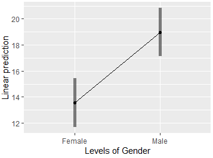

---

#What have we looked at so far?

 - **Week 1**: Revision of hypothesis testing, power and sample size, type I and  type II errors.
 
- **Week 2**: Research Methods, type of studies etc. 

- **Week 3**: One-way ANOVA, assumptions, diagnostics and remedial measures, post hoc testing. 

- **Week 4**: Planned comparisons (a priori tests), contrasts, ordinal contrasts.

---

### Reminder

## One-way fixed effects ANOVA revision: 

1. factor, multiple levels, quantitative outcome, for example

- Effect of varying **levels of caffeine** on **measure of anxiety**
- Effect of pesticide on fruit-fly **daily reproduction rate** for **different species**
- Effect of **learning technique** on **words recalled**


Whilst **must state specifically** to the question, **generically** we have:

   $H_0$: All population means are equal 

   $H_A$: At least one population mean differs
   
- Test statistic is F = Mean Square Model / Mean Square Error. (ratio of between group variance and within group variance)

- **Assumptions**: Random sample, normality (check with normal quantile, Shapiro-Wilk test), independence, Equal population variances (Levene’s test), No Outliers.

- If assumptions not met: *Welch’s ANOVA* (if equality of variance fails), *Transformations* or *Non-parametric tests*.

---

## Wording of the alternative hypothesis

Which of the following three statements are true about the following set of shapes?

**A.** All the shapes are not triangles            | *No*

**B.** Not all the shapes are triangles            | *yes*

**C.** At least one shape is not a triangle        | *yes*

SO, the alternative hypotheses should be carefully worded.

E.g.  

 $H_A$:  Not all population means are the same                *-OR-*  
 
 $H_A$:  At least one population mean is not the same. 

These are **different** to saying ‘All of the population means 
are different’ or other similar wording.

---

# Unplanned and Planned Comparisons

***Unplanned (post-hoc)***: comparisons:  Student’s t, Tukey’s HSD, Dunnett’s

***Planned (a priori)*** : Orthogonal contrasts, polynomial contrasts. Say we are testing the effects of **learning approach **(single factor 5 levels) on **word recall** and we have the following planned comparisons:

 - **Do groups 1 and 2 differ?**

 - **Do groups 1 and 2 differ from groups 3, 4 and 5?**

In both cases we need to define and then test a hypothesis

$H_0$:  = 0   where (????) and is called a contrast.

There are two comparisons, therefore we have two hypothesis and two contrasts that relate to those hypothesis 

$H_{01}$: $_1$= 0  and   $H_{02}$:  = 0 

---

# Unplanned and Planned Comparisons 

We have two sets of contrasts, 1 and 2 that both have sets of constants or weights, 

The rules for setting the weights () are:

1. Treatment groups not participating in the contrast are given a weight of zero.

2. The contrast, , must be balanced i.e. 

3. For a set of contrasts to be mutually orthogonal, for any pair of contrasts, $\psi_m$ and $\psi_n$ ,  the **sum of the multiplication of the like coefficients equals zero, i.e**.,  .     i.e., Dot product is zero.

***Test 1***: **Do groups 1 and 2 differ?** 

***Test 2***: **Do groups 1 and 2 differ from groups 3, 4 and 5?**

||1|2|3|4|5|
|-|
| $H_{01}$ |+1|-1|0|0|0|
| $H_{02}$ | $+{1 \over 2}$ | $+{1 \over 2}$ | $-{1 \over 3}$ | $-{1 \over 3}$ | $-{1 \over 3}$ |

---
#  Two-way ANOVA 

*Does one’s **mood** influence how well **things are remembered*** ?

+ Consider effect of the two factors:

	+ '**Mood at Recall** ' (Happy, Sad); and
	+ **'Mood when Learning Words** ' (Happy, Sad)

 on the outcome of the **number of words recalled** where researcher creates an environment that makes an individual Happy or Sad at each of the times.
 
  - There are four 'treatment groups' or 'cells'
     - Happy/Happy,    Happy/Sad,    Sad/Happy,    Sad/Sad

*…considered in your lab 6.*
+ In one-way ANOVA, we have only **one** explanatory variable (factor) e.g., 'Mood at Recall' (Happy, Sad); Here there are two treatment groups.
+ Two-way ANOVA

---

#  Two-way ANOVA 

+ **More efficient** to study **two factors simultaneously**
+ Can reduce the **residual variation** in a model by including a second factor believed to *influence the response*
+ Can investigate interactions between factors
+ Reduces **confounding error** **** if there is an effect from both factors
+ Each factor has multiple ‘ **levels** ’.
+ Individual subjects grouped into ‘ **treatments’** , where each ‘treatment’ refers to a possible *combination of levels of the two factors* .
+ Each combination of factors (thus treatments) should be represented by a random sample of subjects.

---

### Moving to two-way ANOVA:

#  One-way ANOVA (Single Factor A: with ‘a’ levels) 

$SS_{TOTAL}$ = $SS _{BetweenGroups}$  (or $SS_{Model}$ )

*-OR-*

$SS_{WithinGroups}$ (or $SS_{Error}$ )

##Two-way ANOVA (Factors A, B and interaction)
$SS_{TOTAL}$=

$SS_{WithinGroups}$ (or $SS_{Error}$ )

$SS_A$

$SS_B$

$SS_{AB}$

Partitioned $SS_{WithinGroups}$ into SS due to A, SS due to B, and SS due to interactions

$SS_{WithinGroups}$ may reduce

---

### Moving to two-way ANOVA:

## One-way ANOVA (Single Factor A: with ‘a’ levels) 

- **SSTO** comprised of, or partitioned into 2 ‘sets of deviations’

- factor level (treatment) - means around the grand mean (between/model)

- individual data value around factor level (treatment) means (error/residual)

## Two-way ANOVA (Factors A, B and interaction)

- **SSTO** comprised of, or partitioned into 4 ‘sets of deviations’

- each factor level mean and interaction around grand mean (between/model)

- individual data value around treatment mean (error/residual)

---

### Moving to two-way ANOVA:

## One-way ANOVA (Single Factor A: with ‘a’ levels) 


SSTO   = **SSM** + **SSE**  (p.39 Course Notes)
  
## Two-way ANOVA (Factors A, B and interaction)


**Cell treatment variation** | 
**Within cell variation**

---


---

# The Two-way ANOVA Model

For two factors A and B, where A has ‘a’ levels and B has ‘b’ levels, the two-way ANOVA model is 
              
  
    (i = 1, …, a ;  j = 1, …, b;    k = 1, …, n)
 
 
- is $k^{th}$ observation in cell representing $i^{th}$ level of factor A and $j^{th}$ level of factor B  

- is the overall population mean of the response

- is the fixed effect of the $i^{th}$ level of factor A ,

- is the fixed effect of the $j^{th}$ level of factor B,

- is interaction effect in $i^{th}$ level Factor A and $j^{th}$ level of Factor B

- is the error term of the observation ~ N(0, $\sigma^2$)

---

#### The Two-way ANOVA

## Testing Hypotheses in 

 

1. **Interaction Effects**

2. **Individual Factor Effects (Main effects)**

	(Test interaction first as the interpretation of the main effect 	changes if interactions are significant.)

---

#### The Two-way ANOVA

## Testing Hypotheses: Whole Model Test

In some software you can test the whole model, effectively a one-way ANOVA with each cell as a treatment. Not really what we are interested in.

$H_0:\alpha_i=\beta_j= \alpha\beta_{ij} =0$

$H_A$: at least one effect is non-zero

The test statistic:

$F_{model} ={MS_{model} \over MS_{error}}$ 

follows an F distribution with 

- $df_{model}$ = ab – 1 (numerator df) and

- $df_{error}$ = n – ab (denominator df) under $H_0$.

For 2 Way ANOVA

| Source |    df    |   SS   |   MS   |   F   |
|--------|----------|--------|--------|-------|
| Model  | $ab - 1$ | $SS_M$ | $SS_{Model} \over (ab - 1)$ | $F_{Model}$ |
| Error  | $n - ab$ | $SS_E$ | $SS_E \over (n - ab)$ ||
| Total  | $n - 1$  | $SS_T$ | | | |

---

#### The Two-way ANOVA

## Testing Hypotheses: Interaction Effects

**Interaction Effects**

When testing the interaction between Factors A and B,

$H_0$: $\alpha\beta_{ij}$ = 0 for all i,j *** (no interaction)***

$H_A$: $\alpha\beta_{ij}$ ≠ 0 for at least one i,j pair ***(interaction)***

The test statistic:   $F_{AB}= {MS_{AB}\over MS_{error}}$

 follows an F distribution with 

- $df_{AB}$ = (a – 1)(b – 1)         (numerator df) 

 and

- $df_{Error}$ = n – ab              (denominator df). 

---

#### The Two-way ANOVA

## Testing Hypotheses: Individual Factor Effects (Main effects)

### Factor A Effects

 $H_0$: all  $\alpha_i$'s = 0
 
 $H_A$: at least one $\alpha_i$ ≠ 0
 
The test statistic for this test:
$F_A = {MS_A \over MS_{error}} ~ F (df_A = a – 1, df_{error})$

### Factor B Effects

$H_ 0$ : All $\beta_j$’s = 0

$H_A$: Not all $\beta_j$’s = 0

The test statistic for this test:

${F_B}= {MS_B \over MS_{error}}  ~ F(df_B = b – 1, df_{error})$

---

#### The Two-way ANOVA

# Table for Two-way ANOVA

| Source |    df    |   SS   |         MS        |       F     |
|--------|----------|--------|-------------------|-------------|
| Model  | $ab - 1$ | $SS_M$ | $SS_M \over DF_M$ | $F_{Model}$ |
| Error  | $n - ab$ | $SS_E$ | $SS_E \over DF_E$ |             |
| Total  | $n - 1$  | $SS_T$ |                   |             |

... becomes ...

| Source |    df             |     SS    |            MS           |    F   |
|--------|-------------------|-----------|-------------------------|--------|
|   A    | $a - 1$           | $SS_A$    | $SS_A \over DF_A$       | $F_A$  |
|   B    | $b - 1$           | $SS_B$    | $SS_B \over DF_B$       | $F_B$  |
|   AB   | $(a - 1)(b - 1)$  | $SS_{AB}$ | $SS_{AB} \over DF_{AB}$ | $F_AB$ |
| Error  | $n - ab$          | $SS_E$    | $SS_E \over DF_E$       |        |
| Total  | $n - 1$           | $SS_T$    |                         |        |

---

#### The Two-way ANOVA:

## Meaning of Interaction

The effect of one factor depends upon the level of the other factor.

- Interaction effect often significant. 
- Should test for this before Main effects.
- Simply stating interactions are significant tells us little
  - what is the form/type of the interaction?
- Examine **means plots** to assess and interpret 

    i.e., explore interaction effect: graphically plotting **means** of different subgroups. 

   If means approximately parallel, suggests no interaction effect

---

#### The Two-way ANOVA

# Example: Number of Words Remembered   

Interested in effects of **age** and **learning condition** on **words recalled**

+ 50 people 18-30 (young group) and 50 people 55-65 (older group)
+ Randomly assigned to one of 5 experimental groups (learning technique)

Each group provided (verbally) 27 words
+ **Counting group** : count no. letters in each word
+ **Rhyming group** : think of word that rhymed with each word
+ **Adjective group** : think of an adjective that could be used in conjunction
+ **Imagery group** : form an image of the word
+ **Intentional group** : memorise the words for later recall


Only Intentional group *informed* that later would be tested on recall.

All groups later tested.


---

#### The Two-way ANOVA:

## Number of words Rememebered

+ We will look at the effects of age and level of processing on word recall

+ How many treatments?                   ***2 x 5 = 10 combinations(or cells)***

	+ How many levels for each factor?
      - Factor: Age                      ***2 levels***
      
      - Factor: Level of Processing:     ***5 levels***
      
      
+ If instead performed one-way ANOVA to see effect of the level of processing on recall, could randomly assign people from all ages to 5 groups.

	+ However, if age really has an effect, variation due to age will contribute to **within group variation**

     i.e., increasing **error variation** , and reducing power or confounding results (if observed diffs in groups are due to diffs in distribution of ages within groups)

---

#### The Two-way ANOVA

## Number of words Rememebered....

+ If the **level (mode) of processing** is significant
	+ then find differences in average number of words recalled between the 5 learning groups.
	
+ If **age** has a significant effect
	+ then find differences in average number of words recalled between the two age groups.
+ If there is an **interaction effect**
	+ then differences in average numbers of words recalled between age groups will change for the different learning groups
	
	+ (or equivalently, differences in average numbers of words recalled between the learning groups will be different for the different age groups).
	+ easier to understand when seeing a plot
	
+ If neither variable has any effect
	+ then all of the cell means should be about the same with any differences just being due to sampling variation

---

#### The Two-way ANOVA

## Number of words Rememebered


- Likely effect due to **Age** as intervals not overlapping.
- Mean Words recalled by Older group less than Mean Words recalled by Young Group


- Likely effect due to **Learning Condition** as intervals not overlapping.

- Suggests Counting & Rhyming methods less helpful in recall

**MUST BE MINDFULL OF** **INTERACTIONS** **THOUGH!!!**

---

#### The Two-way ANOVA

## Number of words Rememebered.......***Interaction***

.pull-right[]

.pull-left[]

+ Only a small difference in performance between the two **age** groups for **Counting & Rhyming** methods …

+ … but differences between **age** groups in **other methods** . 
+ Hence likely **interaction** ( *the size of* ***difference*** *between* ***age*** *group* *depends upon* *which* ***learning group*** *you were in* ).

+ Adjective, Imagery and Intention learning groups performed much better on average, than Counting and Rhyming groups.

+ Furthermore, these groups’ performances were greater for the Young group (the effect of Age group depended upon Learning method; this identifies the **interaction** between *Age* and *Learning* ) *.*

---

#### The Two-way ANOVA

## Number of words Rememebered.......***Interaction***

+ Need to test using hypothesis test though.
.pull-right[]

.pull-left[]

+ Only a small difference in performance between the two **age** groups for **Counting & Rhyming** methods …
+ … but differences between **age** groups in **other methods** . 
+ Hence likely **interaction** ( *the size of* ***difference*** *between* ***age*** *group* *depends upon* *which* ***learning group*** *you were in* ).
+ Lines that are *parallel* or following the same shape with roughly equal distance between them indicate *no*  **interaction** .
+ Here the gap between the lines changes for different levels of **condition** .  Therefore likely and **interaction** .
- Need to tst using hypothesis test though

---

#### Two-way ANOVA

## Number of words Rememebered: ***Formal test***

+ Test for interaction between factors A and B,

 $H_0$ : $\alpha\beta_{ij}$ = 0 for all i,j
 
 $H_A$:  $\alpha\beta_{ij}$ ≠ 0 for at least one i,j pair

 p=0.0003
 
+ Test for main effect of **Age** - factor A

 $H_0$ : $\alpha_i$  = 0 for all i

 $H_A$: $\alpha_i$  ≠ 0 for at least one pair

 p ≈ 0.000

+ Test for main effect of **Condition** - factor B

 $H_0$: $\beta_j$= 0 for all j

 $H_A$ : $\beta_j$ ≠ 0 for at least one pair

+ p ≈ 0.000


*In conclusion-*

+ ** We have found a statistically significant:
+ interaction between the ***Age*** and ***Learning Condition*** levels (p = 0.0003)
+ variation between the ***Learning Condition*** levels (p = 0.000)
+ variation between the ***Age*** levels (p = 0.000)

Consistent with visual investigation!!

---
#### Two-way ANOVA:  
##Number of words Rememebered:***Tukey HSD***

+ Adjective(mean = 12.9)
- Intention(mean = 15.65)
+ Imagery(mean = 15.5)
+ Rhyming(mean = 7.25)
+ Counting (mean = 6.75)

+ **Popn mean recalls not statistically sig’ly different**
+ **Popn mean recalls not statistically*
sig’ly different**

.pull-left[]

.pull-right[]

---

#### Two-way ANOVA: 

##Number of words Rememebered:***Tukey HSD***

**We can also test for differences at the cell level**.


---

#### Two-way ANOVA

## Number of words Rememebered: ***Jamovi***


---

#### Two-way ANOVA

## Number of words Rememebered: ***Jamovi***


---

#### Two-way ANOVA

## Number of words Rememebered: ***Jamovi***


---

#### Two-way ANOVA

- Overall, experiment seems to provide very strong evidence in support of the theory that recall of verbal material is related to the conditions present when the material is presented. 

- Not only are there **statistically significant differences*8 in the **population mean number of words*8 remembered across the 5 **learning conditions** tested (p = 0.000 (3 dec pl))

- **The trend in recall matches the increase in level of processing within** the learning groups. 

- **Younger participants** also **recall more items on average** than **older** participants (p = 0.000)… 

- … although the age effect is dependent on the learning method (significant **age*condition** interaction, p = 0.000). 

---

#### Two-way ANOVA:

- Additional analysis may often be warranted such as Tukey HSD at the cell level if **interaction** present. 
 - E.g., it may be relevant to carry out multiple comparisons to determine which s**pecific groups are different*. 
 - Calculation of **confidence interval**s** for difference in these group means may also be a convenient way to quantify the size of the effects that have been detected.

- Assumptions: Same as One-way ANOVA 

 Same list of assumptions applying across treatment groups (however, the treatment groups are now the individual cells of the ‘a’ x ‘b’ combinations of factor levels (2 x 5 = 10 in our case))
 
 - Homogeneity of variances
 - Normality of residuals
 - Independence of samples
 - Each combination of factors (thus treatments) should be represented by a random sample
 - No outliers
---

#### Common Study Designs:

# Further Study Designs (Module 7)

1. **Factorial ANOVA**

2. **Nested ANOVA**

3. **Two-Way ANOVA without replication**

4. **Repeated Measures**

---

#### Factorial ANOVA:

## 1.Factorial (Multi-way) ANOVA

- Extension of two-way ANOVA to test the effects of **three or more factors** simultaneously.

- Assumptions the same as for the two-way ANOVA. 

- In three factor case model:     

    $Y_{ijkl}$ = $mu=\alpha_i$ + $\beta_j$ + $\gamma_k$ + $\alpha \beta_{ij}$ + $\alpha\gamma_{ik}$ + $\alpha\beta\gamma_{ijk}$ + $\epsilon_{ijkl}$ 
 
	   $\epsilon_{ijkl}$ ~ N (0, $σ^2$)

**Eg : Coffee mixing explained by hot/cold water, stirring yes/no, mug temp hot/cold**

- Can become complex :

	 - number experimental units 
	 - number possible **interactions**


---

#### Factorial ANOVA:

# Hypotheses to Test 

+ Interaction between three factors: A:B:C
+ Interaction between two factors: A:B, A:C, B:C
+ Difference between group means for factors: A, B, C
+ Therefore ANOVA table has 7 hypotheses tests. ****

*Your modelling methodology depends on context *- 

If involved in a research project, simply fit the factorial ANOVA and interpret the ANOVA table.

If modelling for prediction or exploratory data analysis:
+ First fit the full model with all interaction terms.
+ Remove highest level interactions term that is not statistically significant. Do this term by term.
+ If a high level interaction term is significant, include all lower level subset interaction terms.
+ Factorial ANOVA

---

#### Factorial ANOVA

# Example: Three-way ANOVA 

+ **Aim** : Determine the effects of gender, body fat, smoking history on **exercise tolerance** (fitness)

+ **Response Variable:**  **Time to Fatigue** - minutes until fatigue on exercise bike

+ (2 x 2 x 2 design) as each of the three factors has 2 levels
+ Factorial ANOVA


---

#### Factorial ANOVA

# Example: Three-way ANOVA 

+ **3-way interaction** is not statistically significant
+ One **2-way interaction** is statistically significant
+ All three **main effects** are significant, but interpret with care, because of the Fat:Smoking interaction


---

#### Factorial ANOVA

# Example: Three-way ANOVA 

+ **p-value = 0.292**
+ **p-value = 0.244**
+ **p-value = 0.013**
+ **p-value = 0.000**
+ **p-value = 0.014**
+ **p-value = 0.000**
+ **Statistically significantly higher Time to Fatigue: males; individuals with low body fat, light smokers**
+ **Interaction?**
**Size of difference in time between low and high body fat people depends upon whether heavy or light smoker**





---

#### Nested ANOVA

## 2. Nested ANOVA (Hierarchical ANOVA)
  
- An extension of the one-way ANOVA, where each group is divided into two or more **subgroups**. 

- Design: **nested ANOVA** because each level of a factor **nests** an ANOVA within it. Best seen with an example.  

---

#### Nested ANOVA
# Example

- To investigate effect of school (Factor A) and instructor (Factor B) on learning.
- Classes in each school randomly assigned to one of two instructors in each school
 - Two instructors were selected at a particular school and only tested at that school. The is repeated at each school with two different teachers at each school (instructors are nested within schools)
 
- Repeated for two training sessions
- At end of each session a summary measure of learning for each class determined.

   **Group**  	Each school (i = 3)

   **Subgroup**  Each instructor (j = 2)
 
   **Items**  Individual classes from each instructor (subgroup)

---

#### Nested ANOVA:

## How does this differ from a two-way ANOVA?

- If two-way then each ‘class’ exposed to any combination of instructor and school
- In this situation, however, classes allocated to School 1 can **only be** exposed to instructors 1 and 2 from School 1
- If we do not take this nesting into account we can never be certain whether the observed differences among classes in different schools are **due to different instruction *or* possible differences among the schools**

- Recognising the nested design allows for the separation and the test of these two effects.

- Nested ANOVAs not limited to two levels as in the example. 
- We can divide the subgroups themselves into further sub-subgroups 

---

#### Two-way ANOVA Without Replication:

## 3. Two-way ANOVA Without Replication:
  
 - **No replication** available for each combination of two factors.
 
 - Therefore each cell contains **a single reading**. 
 - May use due to:
 
  - Time and or cost limitations, material constraints **(scarce resources / destructive process so design critical)**
  - Measurements are not repeatable.
  
### Example: New Fertilizer

 Interest: Effectiveness of fertilizer recipe (Blend A, Blend B and Blend C) on different crops (Corn, Wheat, Rice) yields.
 
Due to limited space may only be able to apply one blend on each crop type.

- Only one measurement in each cell.
- Because only one measurement, unable to test for interaction, and therefore have to assume there is none if using this design. 

```{r tbl44, echo = FALSE}
tbl44 <- tibble::tribble(
~` `, ~`Corn`, ~`Wheat`, ~`Rice`,
"Blend A","123","138","110",
"Blend B","145","165","140",
"Blend C","156","176","185"
)

kableExtra::kable_styling(knitr::kable(tbl44), font_size = 18)
```

---

#### Repeated Measures:

## 4. Repeated Measures
  
- You have seen an example in STAT1070 and STAT2010: 
 - Paired comparisons or matched pairs samples t-test
 - Two measurements taken on a common subject
- In repeated measures, each subject is given all treatments so each subject considered to be a block.
- Can also involve a single treatment that is evaluated at several points in time.
- Longitudinal studies. 

---

#### Repeated Measures:

# Example:

The psychology of **product-rating/marketing** (effect of nutritional advice on taste-tests of cereals)

- **3 breakfast cereal** formulations identical except for three levels of sweetener (low, medium, high)

- **12 consumers**: each rate on 10-point hedonic (likeability) scale

Could do randomised experiment with 4 replicates:
 - However sensory perception varies with age
 - Could block on age but more effective to have each consumer rate all three products 
 - Each consumer is a block with experimental unit the separate evaluations conducted by each consumer

---

#### Repeated Measures

# POSSIBLE DESIGNS

**Randomised Design**

Each consumer is assigned a cereal with a randomly selected sweetener

**Repeated Measures**

Each consumer is assigned each one of the cereals with a different sweetener, but the allocation is randomly made

```{r tbl47, echo = FALSE}
tbl47 <- tibble::tribble(
~`Consumer`, ~`Formulation`, ~`NA`, ~`NA`,
"1","low",NA,NA,
"2","low",NA,NA,
"3","low",NA,NA,
"4","low",NA,NA,
"5","medium",NA,NA,
"6","medium",NA,NA,
"7","medium",NA,NA,
"8","medium",NA,NA,
"9","High",NA,NA,
"10","high",NA,NA,
"11","high",NA,NA,
"12","high",NA,NA,
"Consumer","Formulation"," "," ",
"1","low","medium","high",
"2","medium","high","low",
"3","high","low","medium",
"4","low","high","medium",
"5","high","medium","low",
"6","medium","high","low",
"7","medium","low","high",
"8","low","medium","high",
"9","high","medium","low",
"10","high","low","medium",
"11","low","high","medium",
"12","medium","low","high"
)

kableExtra::kable_styling(knitr::kable(tbl47), font_size = 18)
```

***Are these equivalent in terms of “cost” though?***

---

#### Repeated Measures

- Further, does perceived level of wholesomeness affect ratings?

 - **Group 1**: ***Informed*** the products are new ***breakfast cereals***
 
 - **Group 2**: ***Informed*** the products are new ***health cereals***

- Three levels of sweetener randomly allocated to three individual tastings by a given consumer
- Perceived wholesomeness randomly allocated to consumer

 - To compare sweetness individual tastings are experimental units
 
 - To compare wholesomeness consumers are the experimental units 
 
 - When the subject serves as an experimental unit for another treatment the repeated measures design may be referred to as a **split-plot** design.

---

#### Repeated Measures

### This is an example of a split-plot design ...

```{r tbl49, echo = FALSE}
tbl49 <- tibble::tribble(
~`Wholesomeness`, ~`Consumer`, ~` `, ~`Formulation`, ~` `,
"1","1","low","medium","high",
"1","2","medium","high","low",
"1","3","high","low","medium",
"1","4","low","high","medium",
"1","5","high","medium","low",
"1","6","medium","high","low",
"2","7","medium","low","high",
"2","8","low","medium","high",
"2","9","high","medium","low",
"2","10","high","low","medium",
"2","11","low","high","medium",
"2","12","medium","low","high"
)

kableExtra::kable_styling(knitr::kable(tbl49), font_size = 18)
```

***Wholesomeness* is treated as a blocking variable, BUT is also an experimental unit. Note that it is an example of a repeated measures design**.

---

# Next Week...

- **STAT2000 Lecture 6**
 - Random effects ANOVA
