# Administration 

### Reminders:

+ Assignment due on Sunday 5 April 2020, 11:59PM
	+ Don’t leave it to the last minute to ask for help!
+ Consultations
	+ Please use these if you need help with anything.
+ MASH
	+ Fran Baker is available to help with the course.


---

#  Next week… 

## Reminders:

+ Last week before a well deserved break…

+ Will cover some useful **non-parametric tests** .

---

# Random Effect ANOVA

---

#### ANOVA

# The One-way **FIXED** Effect ANOVA

Recall the form of the FIXED effect ANOVA model…

 - **Any single variate (reading) in the model can be decomposed:**

   i = 1, …, a, 	j = 1, ..., n i
   
  - $Y_{ij}$ is observation j of group i,
  - $\mu$ is the population mean,
  - $α_i$ is the contribution of group (or treatment) i,
  - $\epsilon_{ij}$ is the error term of that observation; $\epsilon_{ij}$ ~ N(0, $σ^2$ )

- We have sometimes referred to the ANOVA models we have looked at so far as **fixed effects** ANOVA.

- This is because the **effect** is considered an unknown constant that we estimate from the data.


---

#### Fixed Effects

# What are Fixed Effects? 

+ Fixed effects are where the levels of the factor were **fixed in advance** of the experiment and we are interested in differences in response among those specific levels.
+ The model is **fixed** because if another researcher were to repeat the experiment, they would use the exact same treatments again.
+ The data for the experiment has been gathered from **all levels** of the factor that are of **interest** to the researcher.
+ With fixed-effects factors, the effects of the different **levels** of the independent variable are treated as **fixed** constants to be **estimated** .

---

#### Fixed Effects

# What are Fixed Effects ? 


+ In this type of linear model, it is assumed that the experimenter has narrowed down the treatment choices to a specific set.
- **Examples** :
 + The purpose of an experiment is to compare the effects of three specific dosages of a drug on the response. **Dosage** is the factor; the three specific dosages in the experiment are the levels. If there is there is no intent to say anything about *other dosages* , the factor would be considered **fixed** .
 
 + Say we are interested in comparing the performance of three **teachers** . The teachers are the levels of the categorical variable and these are what we are interested in concluding about.

---

#### vRandom Effects

# What is a Random Effect? 

- For a **random effect,** the factor has many possible levels, and we are interested is in all possible levels, but only a random sample of levels is included in the data.

- The treatment effects for **random effect** factors are treated as random variables, or, equivalently, random samples from a population of possible treatment effects.
+ In some designs, the categorical variable is the **subject** .
	+ In repeated measures, where more than one (identical) measurement is taken on the same individual. The **group** effect can be considered random because we only **sample a subset** of the entire **population** of subjects .

---

#### Random Effects

# What is a Random Effect?

+ In some situations it is clear from the experiment whether an effect is **fixed** or **random** .

+ However there are also situations in which calling an effect **fixed** or **random** depends ***on your point of view*** , and on your interpretation and understanding.

+ So sometimes it is a personal choice. This should become more clear with some examples.

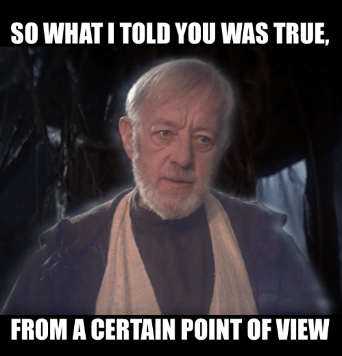

---

#### Random Effects

# Examples of Random Effects: 

**Energy content in beer** 

+ We are interested in energy (measured in kJ) content across brands of beer for a particular style in Australia.

+ There are hundreds of brands of beer sold in Australia, and can only test 12 brands. We select 12 brands randomly from a list of **all brands available** , and randomly test 6 bottles of beer for each brand.

+ The effect of the brand can be thought of as a **random variable** , since that brand was sampled from a larger set… **AND** we are actually interested in the **population** of brands.

+ If we were **only** interested in the 12 brands in our study, we could choose to regard the effect of each beer as a fixed constant.

+ But because we randomly **sampled the beer brands** from a larger population, we actually make a statement about the entire population, which is what we are interested in.


---

#### Random Effects

#  Examples of Random Effects: 

**Effect of Interviewers for Job Positions**

+ The response variable is the rating of a job applicant.

+ Five different Human Resources (HR) **interviewers**  are randomly selected to perform interviews.

+ Four different applicants were randomly chosen and interviewed by each of the HR **interviewers** .

+ The **interviewers** were selected at **random** from the pool of interviewers and had applicants randomly assigned to them.

+ We are not interested in the differences between the five interviewers that ***just so happened to be picked*** . What we care about is quantifying and accounting for the effect of **interviewer** in **general** .

+ There are other **interviewers** in the **population** and we want to make inference about them too.


---

#### Fixed or Random Effects

# Fixed and Random Effects 

+ Two **surgical procedures** are being compared. Patients are randomised to the two treatments. Five different **surgical teams** are used.
+ To prevent possible confounding of **treatment** and **surgical team** , each team is trained in both procedures, and each team performs equal numbers of surgery of each of the two types.
+ Since the purpose of the experiment is to compare the **procedures** , the intent is to generalise to other ***surgical teams*** .
+ Thus **surgical team** should be considered as a **random factor** , and **procedure** as a **fixed factor** .
+ **IF** **surgical team** was set as a fixed factor the conclusion may be that *there is a difference in the results of the two procedures for the teams used in the experiment.*
+ Using a **random factor** we are able to conclude that there is a difference in the results of the **two procedures** regardless of the **surgical team** .
+ **This is a stronger statement!**


---

#### Fixed or Random Effects

# Fixed and Random Effects 

+ The levels of the **random factor** (in this case, the **surgical** **teams** ) used in the experiment should be a random sample of all possible levels.
+ How does one get a list of all possible **surgical teams** ? Do **surgical teams** change over time?
+ Sometimes it is practically impossible to take a *random* *sample* of all possible levels.
+ If you believe that the teams used in the experiment could reasonably be seen as a random sample of all surgical teams who might perform the procedures, we can treat them as a **random factor** .
+ However, this assumption needs careful thought to avoid possible bias.
+ Potentially the conclusion would be more sound if it were limited to surgical teams which were trained in both procedures in the same manner and to the same extent, and who had the same surgical experiences, as the five teams actually studied.


---

#### Fixed or Random Effects

#  Fixed and Random Effects? 

In the following situations, should these **variables** be considered **random** or **fixed** ?
 1. Collecting data from randomly selected **medical centres** :
	
	**Centre** might be thought of as ***random.*** 
 2. Surveying students on different **campuses** :

 **Campus** may be a ***random effect.***
 3. Quality control of beer made on different **days** :
	
	**Day** may be considered a ***fixed effect.***
 4. Quality control of beer by testing different **batches** :
 
  **Batch** would be considered a ***random effect.***

With **fixed effects** we are primarily interested in the means of the factor levels (and differences between them).

With **random effects** , we are primarily interested in their **variances** .

A relatively **large variance** for the **random effect** indicates the factor has an effect on the outcome.

A **small variance** indicates the factor has no effect on the outcome.

---

#### Random Effect Model

# The One-way Random Effect Model 

The One-way random effect modle is expressed as:

 **i = 1, …, a, 	j = 1, ..., $n_i$**

- is observation j of group i , is the population mean,
+ However now:
	+ is the effect of group i , which is considered a random variable.
	
+ is the error term of that observation;

In the above we now have **two sources of variation** in the model. The variation from ???? and the variation from????? .

---

#### Random Effect Model

# The One-way Random Effect Model 

What effect does having **two sources of variation** in the model have?

One assumption in the model is that the distributions for and are **independent** . We can use this to work out the variance of the response…

 A measure known as the ***population intraclass correlation (ICC)*** ** is calculated as:
 
This measures the correlation of pairs of observations **within a group** . The correlation between pairs of observations not in the same group is zero.

We can also think about the proportion of total variation attributable to particular random factors.

---

#### Random Effect Model

#  The One-way Random Effect Model 

```{r tbl17, echo = FALSE}
tbl17 <- tibble::tribble(
~`Term`, ~`Fixed Effects`, ~`Random Effects`,
" ","Fixed and unknown constant"," ",
" "," ",", but ",
" "," "," ",
" "," "," ",
"Term","Fixed Effects","Random Effects",
" ","Fixed and unknown constant"," ",
" "," "," ",
" "," "," ",
" "," "," "
)

kableExtra::kable_styling(knitr::kable(tbl17), font_size = 18)
```

---

# Hypothesis testing with 

# Random Effects ANOVA

---

#### Random Effects

# Hypothesis testing 

To test if there is a *statistically significant effect* due to our **random**  **factor A** ; is asking if the variance of the distribution of is zero.

That is:

Recall the form of the model: , and that

If the null is true, we can think of the in the model collapsing to the mean, that is, zero.

The model then becomes: . This model indicates the factor has no effect on the response variable.

One may test this hypothesis using the test statistic:  with and df, where is the number of levels. *However in software we will use a more sophisticated method.* 

---

### Random Effects

# Example in R… and Jamovi 

*Does the* **sire** *of a horse effect their foal’s birthweight?*

We randomly sample 5 **sires** and measure eight of their **foal’s weights** .

As we are interested in a more general conclusion about all **sires** and we have a random sample from all sires, therefore we should treat the effect as a **random effect** .

This data is randomly generated in the R script, *Week_6_Random.R* with the following true parameters:

+ Remember:
*We should* ***reject*** *!!*

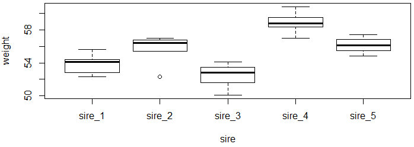

---

#### Random Effects

# Example in R… and Jamovi 

Defining **random effects** is a little different to **fixed effects** 

Output of the model differs as well.

The (1|sire) indicates the effect is random with respect to an intercept term.

A good source for information on R model formulas: http://conjugateprior.org/2013/01/formulae-in-r-anova/ 

We can estimate and perform inference using F statistics and ANOVA tables, however this often leads to **silly estimates** such as **negative estimates** of variance parameters.

Therefore we let R use the more sophisticated Restricted Maximum Likelihood (REML) estimation.

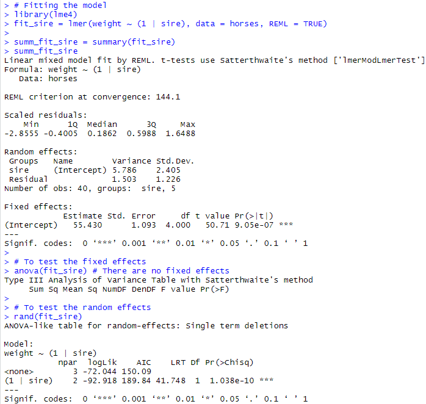
[http://conjugateprior.org/2013/01/formulae-in-r-anova/](http://conjugateprior.org/2013/01/formulae-in-r-anova/)

---

#### Random Effects

# Example in R… and Jamovi 

**Estimates of the Variance Components** 

True values: ,

Even though total sample size is 40, only have five groups to estimate .

ICC = 5.786/(1.503+5.786) = 0.794

Population ICC = 6/(2+6) = 0.80

The data suggests that 79.4% of the variation in the data is due to the **random effect** .

**Fixed effects**

No fixed effects.


---

#### Random Effects

# Example in R… and Jamovi 

**Random effects**

Here we use a likelihood ratio test with hypotheses:

The **p-value (1.04e-10)** is very low, therefore we reject the null hypothesis and conclude that the sire of a foal has a statistically significant effect on their foal’s birth weight.


---

#### Random Effects

# Example in R… and Jamovi 

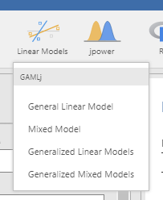

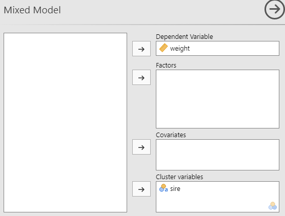

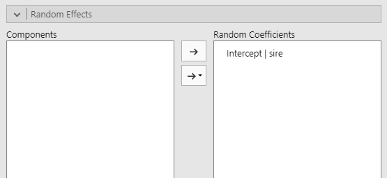

**Fixed effects go here**

**Same nomenclature as in R**

---

#### Random Effects

# Example in R… and Jamovi 

**Model**

Model shown using the same naming convention as in R

**Variance Components and ICC**

Same as calculated by R

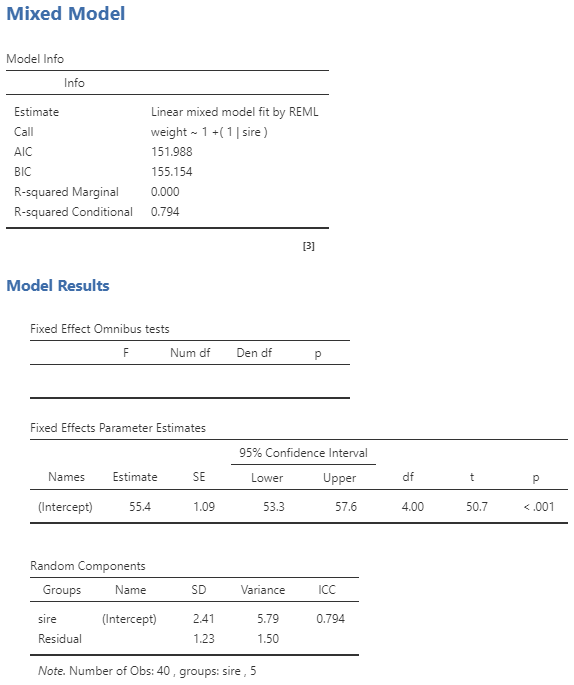

**Fixed effect** **results** **go here**

---

#### Random Effects

# Example in R... and Jamovi 

**Random Effects**

Calculated values the same as in R.

The **p-value (1.04e-10)** is very low, therefore we reject the null hypothesis and conclude that the sire of a foal has a statistically significant effect on their foal’s birth weight.

.pull-left[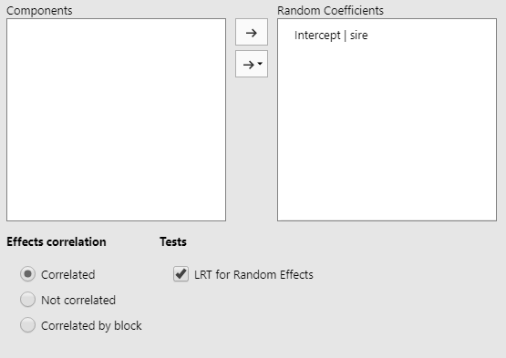]

.pull-right[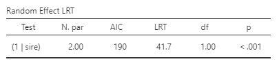]

---

#### Random VS Fixed Effects

# What if we treated the factor as fixed?  

**Hypotheses**

For fixed factors, the null and alternative are:
   
   *for all*
  
   *for at least one*
  
   The **p-value (<0.001)** is very low, therefore we reject the null hypothesis and conclude...

… *that there is a statistically significant difference between the population mean foal birthweights from the five sires* *.*

   - ***Statement about these specific sires***

Compare this with the conclusion from the random effects model…

*… *that the sire of a foal has a statistically significant effect on their foal’s birth weight* .

  - ***Statement about all sires in the population***
  
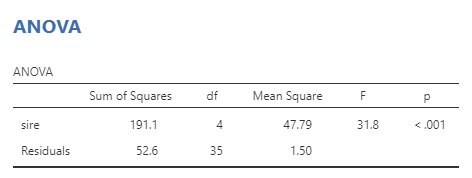

---

# Extensions with Random Effects

---

#### Two-way Random Effects

# Two-way Random Effect 

Similarly to the way we extended the one-way fixed effect ANOVA, we can extend the one-way random effect ANOVA as follows:

+ is observation of group, is the population mean,
+ is the random effect of group .
+ is the random effect of group .
+ is the random interaction effect of between factor A and B.
+ is the error term of that observation;

It is assumed that all the random elements of the model are independent.

---

#### Two-way Random Effects

# Two-way Random Effect 

**Example: Cars**

Suppose we have some data for **car mileage** broken down by **driver** and **car type** .

We are not particularly interested in these drivers or the cars we have chosen, but more in whether the **car** or **driver** in general has an affect on fuel efficiency. Therefore both are **random effects**.

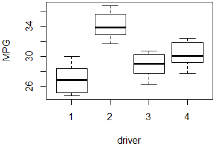
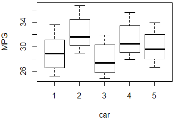
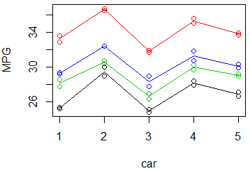

Looks as though possibly main effects significant, however interaction effect probably not…

---

#### Two-way Random Effects

# Two-way Random Effect 

**The Model**

Defining the **random** main effects and the **random** interaction effect.

**Fixed Effects**

There are no **fixed effects** .

**Random Effects**

P-values confirm what the plots suggested.

No statistically significant interaction effect (p=0.772) between driver and car on mileage.

However there is a statistically significant effect of the driver and type of car on the mileage a car will achieve.

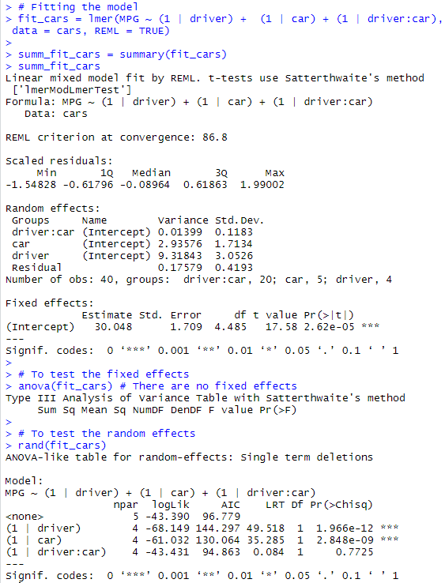

---

#### Two-way Random Effects

# Two-way Random Effect 

**Variance Components**

Total Variance = 0.014+2.936+9.318+0.1758 = 12.44

Proportion attributable to:
+ *Interaction:*
	+ 0.014/12.44 = 0.1%
+ *Car:*
	+ 2.94/12.44 = 23.6%
+ *Driver:*
	+ 9.32/12.44 = 74.9%
+ *Residual:*
	+ 0.16/12.44 = 1.4%
	
This indicates that the largest source of variation is the driver followed by the car type. *Government may see the source of variation due to car as being too great and introduce laws to make cars more economical.*


---

#### Two-way Random Effects

# Two-way Random Effect...

***Jamovi*** :
Unfortunately cannot add a random interaction effect… May be added in the future. Can use the Rj Editor.

**Fitting with no interaction effect:** 

.pull-right[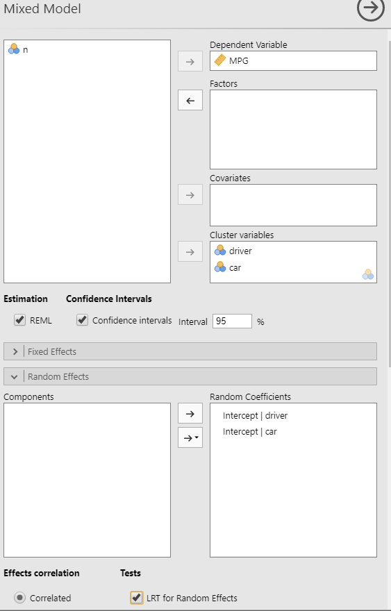]

.pull-left[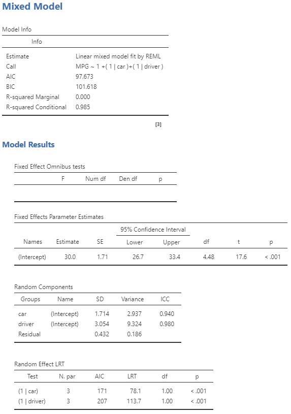]

---

#### Mixed Effects

# Mixed Random and Fixed Effect 

**Just a demonstration of how we can extend these models – Not assessable.** 

A slight modification to the model and how we enter it into software allows us to combine fixed and random effects into our models.
- is observation of group, is the population mean,
- is the random effect of group .
- are the population mean treatment effects for factor B.
- is the random interaction effect of between factor A and B.
- is the error term of that observation;

An interaction term involving both a fixed and a random factor should be considered a random factor.

Also factor that is nested in a random factor should be considered random.

---

#### Mixed Effects

# Mixed Random and Fixed Effect

**Example: Cars**

Using the same data set but now suppose we are interested in the particular **cars** that we have data for. We should treat this now as a **fixed** effect.

**Fixed Effects** Appears that there is not a statistically significant difference (p=0.76) in the population mean mileage for these cars.

**Random Effects** It appears that there is a statistically significant effect due to driver (p<0.001) and interaction (p<0.001).

**Interaction** This is saying that the population variance for the interaction term is greater than zero, meaning that there is significant variation due to the interaction between the fixed levels of car and a potential driver from the population… **or** …

… the difference in mileage across the different cars examined changes based on a drivers from the population of all drivers.

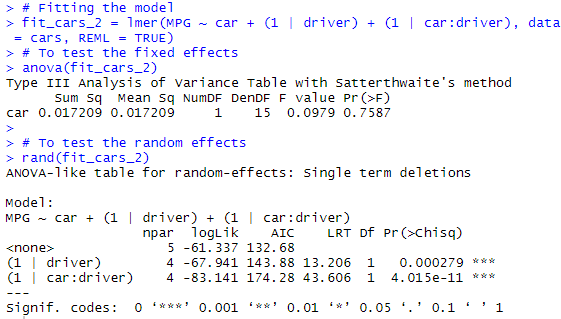

---

#### Mixed Effects

# Mixed Random and Fixed Effect

**Variance Components**

Total Variance = 0.014+2.936+9.318+0.1758 = 12.44

Proportion attributable to:
+ *Interaction:*
	+ 0.014/12.44 = 0.1%
+ *Car:*
	+ 2.94/12.44 = 23.6%
+ *Driver:*
	+ 9.32/12.44 = 74.9%
+ *Residual:*
	+ 0.16/12.44 = 1.4%
	
This indicates that the largest source of variation is the driver followed by the car type.


