#  Non-parametric tests(An overview)..... 

- **Non-parametric** refers to a method that ***does not depend upon a specific underlying distribution or model for the data*** (often referred to as ‘ **distribution-free** ’ tests)
 - ANOVA requires residuals follow **normal distribution** and we infer about the parameters based on this assumption – ANOVA is a **parametric** **test** **.**

- A non-parametric test still involves a **test statistic** and we can also consider the p-value associated with the test statistic (as we did for **parametric tests,** e.g., **t-test, F-test** ) 

 - However the test statistic involves sample-related values such as the **sign** , **rank** **** or **** **frequency** of observations rather than the value of the observations themselves. 

---

#  Non-parametric tests(An overview)..... 

+ Relatively easy and quick to perform

+ Especially useful when the sample size is small.

+ Permit freedom from worrying about the distributional assumptions that the corresponding parametric tests require.

***However*** … 

+ With increasing sample size, and where the **parametric** **** **test** assumptions hold, **nonparametric tests** are usually **less powerful**  than the corresponding **parametric tests** .

+ **Nonparametric** **tests** usually require a modification of the null hypothesis that is to be tested


So, use **parametric tests** when you can, use **nonparametric tests** when  | you cannot use **parametric tests**  (e.g., assumptions not holding)

---

#### Non-parametric Tests:

```{r tbl4, echo = FALSE}
tbl4 <- tibble::tribble(
~`Setting`, ~`Parametric test`, ~`Non-parametric test`,
"One sample","One-sample t-test","Sign Test or Wilcoxon Signed Rank Test",
"Matched Pairs","One-sample t-test (of differences) Paired Samples","Sign Test or Wilcoxon Signed Rank Test",
"Two independent samples","Two-sample t-test","Mann-Whitney U test (Wilcoxon Rank Sum)",
"Several independent samples","One-way ANOVA","Kruskal -Wallis test",
"Several Related samples","Repeated measures ANOVA","Friedman’s test",
"Correlation","Pearson’s correlation","Spearman’s or Kendall’s correlation coefficient"
)

kableExtra::kable_styling(knitr::kable(tbl4), font_size = 18)
```

*Parametric tests*- Should be familiar with these from STAT1070, or STAT2010 and the modules covered so far in STAT2000

---

# The Sign Test

# Wilcoxon Signed Rank Test

***Applicable in place of one-sample, or paired t-test***

---

# The Sign Test

An alternative to the one sample t-test *or* a paired t-test ( **parametric** )
+ Reduces data to  ‘ **+** ’and ‘ **-** ’ signs and counts how many of each appear.
	+ Considers whether there is an excessively low or high number of ‘ **+** ’ signs
	
+ So what can it assess?
	+ whether or not the data are consistent with a certain percentage being above (or below) some value.
	+ can test for a given centile.
	+ testing a **median** (50 th centile) is common.

While **parametric tests** consider the ***mean*** as a measure of centre…
 
 **Non-parametric tests** often consider the ***median*** as the measure of centre.

---

# The Sign Test 

Examples of applications (one-sample or matched pairs ):

+ Single sample:
	+ Population weight gain from supplements.
	
+ Paired Samples:
	+ Incidence of aggressive behaviour in dementia patients greater on moon days than on other days (Moore McCabe p.438)
	+ Additional recall by exposing to a learning method


---

#  The Sign Test

We have a random sample of 14 ‘weight gains observed in  rats given a particular supplement’. Let’s assume that the  assumptions for a **one sample t-test** are not met…

We can test whether or not that population has a specific  **median** :

where represents the **population median** weight gain in rats taking supplement .

If  true, roughly **half**  observations should be ***less*** than  150 and **half** ***greater*** ***than*** 150. So, we test for evidence of  excessive counts on one side of 150.

 - An observation is either greater or less than the hypothesised **median** , ***two possible outcomes*** .
 - The probability of being greater than the hypothesised **median** is ***constant***.
 - The trials should be ***independent*** ** due to random sampling.
 - There are a ***fixed number of trials*** .
 
Therefore the test reduces to a test based on the **binomial distribution** 

---

```{r tbl8, echo = FALSE}
tbl8 <- tibble::tribble(
~`Y`, ~`Y – 150`, ~`Sign`,
"175 132 218 151 200 219 234 149 187 123 248 206 179 206","25 -18 68 1 50 69 54 -1 37 -27 98 56 29 56","+ - + + + + + - + - + + + +"
)

kableExtra::kable_styling(knitr::kable(tbl8), font_size = 18)
```

||Y | Y-150 | Sign |
 | --| ----- | ---- |
 |175
 
---

# The Sign Test

- For each of the  trials, under  , , so we should expect 7 “ **+** ” and 7 “ **–** ”, under
- Let represent the count of “ **+** ” in our 14 independent trials. Therefore:

- So the question is, (as with all hypothesis tests)… 

 What* *is the probability of observing something as or more extreme* *than 11 “* ***+*** ” *signs from a sample where n*= 14,*assuming true?*
- We have a two tailed alternative ( ), so, we need to consider (observing 11 or more **OR** 3 or less)

- Recall the binomial formula:

***We observe 11 ‘ **+** ’ signs and 3 ‘ **–** ’ signs***.

```{r tbl9, echo = FALSE}
tbl9 <- tibble::tribble(
~`Y`, ~`Y – 150`, ~`Sign`,
"175 132 218 151 200 219 234 149 187 123 248 206 179 206","25 -18 68 1 50 69 54 -1 37 -27 98 56 29 56","+ - + + + + + - + - + + + +"
)

kableExtra::kable_styling(knitr::kable(tbl9), font_size = 18)
```

---

# The Sign Test

Therefore we can calculate the **p-value** as follows:

- p-value

   (if , distribution is symmetric)

    = **0.058**
    
So , if were true, there is a **5.8%** chance of observing something as, or more extreme than 3 ‘ **+** ’ or 11 ‘ **+** ’.

Therefore there is some, or weak evidence against .

Depending upon consequences of a type I error may consider this as statistically significant. If using a significance level of 5%, would not reject the null.

---

#  The Sign Test 

+ Sign test enables testing on random samples of **ordinal data** and from any population (very flexible).

+ Sign test ignores the ‘values’ in the data by reducing each value to a ‘ **sign of difference** ’ (above or below the median value being tested in the null hypothesis ).

+ If we **make an assumption** **** that the distribution (from which sampling) is **symmetric** we can make greater use of the data.
 + Here we are not assuming that the distribution of the data is a normal distribution. As there are many known symmetric distributions (and many unknown), we are simply assuming that the data comes from one of them.

---

#### Using Ranks for non-parametric tests

# We could use *ranks* rather than *signs*!

- Rather than using signs to perform **non-parametric tests**, we could consider the **rank** of each observation, and study the **ranks**.

- The following **non-parametric** tests are based on the **ranks** of observations.  
 - We care about the relative positions of data when ordered from the smallest to largest values.  
 - Tied observations receive the average of their 
ranks.

- Here is a simple example of ranking data (X),
this sample of n = 6 observations has no tied ranks.

```{r tbl12, echo = FALSE}
tbl12 <- tibble::tribble(
~`X`, ~`Rank`,
"8.7 3.2 4.3 1.3 2.9 -2.8","6 4 5 2 3 1"
)

kableExtra::kable_styling(knitr::kable(tbl12), font_size = 18)
```

---

#### Using Ranks for non-parametric tests

# We could use *ranks* rather than *signs*!

- When the **ranks** are tied:

  If there are ties due to equal values in our data, then we calculate the        **average**   of the ranks. For data X…

```{r tbl13, echo = FALSE}
tbl13 <- tibble::tribble(
~`Order`, ~`Rank Given`,
"5 6 6 8 10 13 13 13 15 15","1 (2+3)/2=2.5 2.5 4 5 (6+7+8)/3=7 7 7 9.5 9.5",
"X",NA,
"15 13 10 8 15 13 5 13 6 6",NA
)

kableExtra::kable_styling(knitr::kable(tbl13), font_size = 18)
```

---

#  Wilcoxon Signed Rank Test 

Similarly to the to the **Sign Test** , the **Wilcoxon** **Signed Rank Test** is  appropriate for inference about:
 - one population mean, and
 - for the difference in a matched pairs setting.

Like the sign test, the **Wilcoxon Signed Rank Test** is concerned  with testing the centre of the distribution using the ***median*** .

Assumption: population distribution is a symmetrical distribution (the **Sign Test** did not make this assumption).

Suppose we wish to again consider the null hypothesis:

  : population **median** weight gain = 150g

Since the population is assumed to be **symmetric** , this is the same as testing

  : population **mean** weight gain = 150g
 
+ *Walter Francis (Frank) Wilcoxon*(1892 – 1965)


---

#### Wilcoxon Signed Rank Test

#  Wilcoxon Signed Rank Test – Single Sample 

Since the population is assumed to be **symmetric** :

+ Departures (of any given **magnitude** ) from value are equally likely. That is, probability of being 5 below the **median** same as being 5 above.

To perform the test:
+ Find the deviations from the **hypothesised median** (like with the sign test) and find its **absolute value.**

+ Rank these absolute differences

+ Place a negative sign before ranks corresponding to original values below the hypothesised median.

+ If the null hypothesis is true (that is, the data are centred around a **median/mean** of 150g), then we would approximately expect that: 

###**Sum of  – ve  ranks = Sum of  + ve  ranks**

```{r tbl15, echo = FALSE}
tbl15 <- tibble::tribble(
~`X`, ~`X – 150`, ~`|X – 150|`,
"175 132 218 151 200 219 234 149 187 123 248 206 179 206","25 -18 68 1 50 69 54 -1 37 -27 98 56 29 56","25 18 68 1 50 69 54 1 37 27 98 56 29 56",
"Rank",NA,NA,
"4 3 11 1.5 8 12 13 1.5 7 5 14 9.5 6 9.5",NA,NA,
"Sum",NA,NA,
"+ Signed Rank","- Signed Rank",NA,
"4 11 1.5 8 12 13 7 14 9.5 6 9.5","-3 -1.5 -5",NA,
"95.5","9.5",NA
)

kableExtra::kable_styling(knitr::kable(tbl15), font_size = 18)
```

---

#### Wilcoxon Signed Rank Test

#  Wilcoxon Signed Rank Test – Single Sample 

For our sample, , the expected sum of positive **ranks** and sum of negative **ranks** is:

The **test statistic** , , is taken to be the smaller of the and (?)

Therefore:

The **null distribution** (that is the distribution that the test statistic follows assuming the null is true) is a known distribution with **no** **simple** **expression** .

**If is true then the expected sign rank for the ‘+’ and ‘–’ is , **


```{r tbl16, echo = FALSE}
tbl16 <- tibble::tribble(
~`X`, ~`X – 150`, ~`|X – 150|`,
"175 132 218 151 200 219 234 149 187 123 248 206 179 206","25 -18 68 1 50 69 54 -1 37 -27 98 56 29 56","25 18 68 1 50 69 54 1 37 27 98 56 29 56",
"Rank",NA,NA,
"4 3 11 1.5 8 12 13 1.5 7 5 14 9.5 6 9.5",NA,NA,
"Sum",NA,NA,
"+ Signed Rank","- Signed Rank",NA,
"4 11 1.5 8 12 13 7 14 9.5 6 9.5","-3 -1.5 -5",NA,
"95.5","9.5",NA
)

kableExtra::kable_styling(knitr::kable(tbl16), font_size = 18)
```

---

#### Wilcoxon Signed Rank Test

# Wilcoxon Signed Rank Test – Single Sample 

In **R** and **Jamovi** …

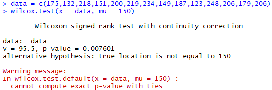

: population median weight gain = 150g

: population median weight gain 150

Since the p-value (0.008) is very small, we have strong evidence to reject the null hypothesis. Therefore we conclude that the population median is not 150g.

---

#### Wilcoxon Signed Rank Test

# Wilcoxon Signed Rank Test – Single Sample 

In **R** and **Jamovi** …


.pull-right[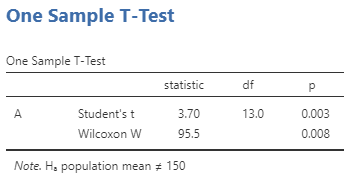]

.pull-left[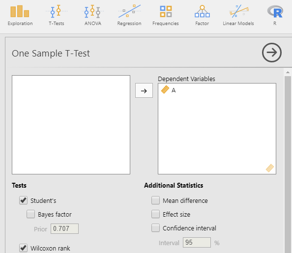]


Therefore, at the 5% level of significance, we reject the null and concluded there is enough evidence to suggest that the population median is statistically significantly different from 150 (p-value = 0.008)

---

#### Wilcoxon Signed Rank Test

# Wilcoxon Signed Rank Test – Paired Sample 

Consider the following example where the **time in minutes** to respond to a drug is measured on a sample of 8 patients for **two drugs**. Each patient is treated one at a time with **Drug A** and on another occasion with **Drug B**. 

Because the two observations are made on the **same sampling unit**, we have a **matched pairs** situation.

If  is true, then the expected signed rank is: 

Sum of the **+ve** ranks is 32.5,

sum of the **-ve** ranks is 3.5. 

3.5 is quite different to 18, 
therefore possibly a difference…

```{r tbl19, echo = FALSE}
tbl19 <- tibble::tribble(
~`Patient`, ~`Drug A`, ~`Drug B`, ~`Difference (B – A)`, ~`+ Signed Rank`, ~`- Signed Rank`,
"1 2 3 4 5 6 7 8","3.2 1.6 5.7 2.8 5.5 1.2 6.1 2.9","3.8 1.0 8.4 3.6 5.0 3.5 7.3 4.8",".6 -.6 2.7 .8 -.5 2.3 1.2 1.9","2.5 8 4 7 5 6","-2.5 -1"
)

kableExtra::kable_styling(knitr::kable(tbl19), font_size = 18)
```

---

#### Wilcoxon Signed Rank Test

# Wilcoxon Signed Rank Test – Paired Samples

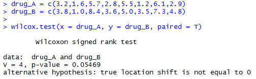

: There is no difference in the response times for **Drug A** and **Drug B**

: There is a difference in the response times for **Drug A** and **Drug B**

Given the **p-value** (0.054), there is weak evidence of a difference. However, at the 5% significance level we would not reject the null hypothesis and would conclude that we are unable to identify a difference in the response times between the two drugs. 

Despite the difference in the test statistic and what was expected under the null, there was just not enough data to provide enough **power** to reject the null. 

---

#### Wilcoxon Signed Rank Test

#  Wilcoxon Signed Rank Test – Paired Samples

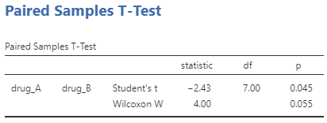

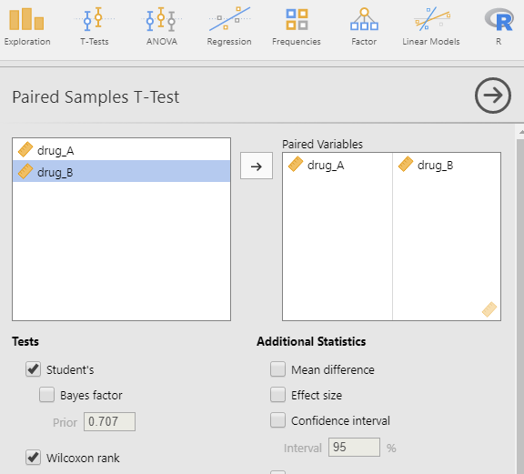

**P-value**, decision and conclusion the same as was found in **R**.  

Note the **p-value** of the parametric paired t-test. 

As mentioned, in **parametric** tests we have some more assumptions and this results in more **power** to reject the null. 

---

# Mann-Whitney U Test 

## (also called the Wilcoxon Rank Sum Test)

## Applicable in place of an independent samples t-test

---

# Mann-Whitney U Test

### *(also called the Wilcoxon Rank Sum Test)* 

This test is often thought of as the **distribution-free** analogue of the **two-sample t-test** for independent samples.

However, it tests a **slightly broader** null hypothesis.

***Hypotheses***

  : The two independent samples come from *identical* population distributions.

  :  The two independent samples do NOT come from identical population distributions.

We gain freedom from assumptions, at the costs of specificity...

---

#### Mann-Whitney U Test

# Blood Glucose Levels & Diabetes

**Blood glucose levels** (mg/dL) have been measured in **two groups of children**

- A ***control*** group consisting of children whose parents are **not diabetic**
- A group of children whose parents are **diabeti*c**

Is there a difference in the blood glucose levels (BGL) of the two groups


```{r tbl24, echo = FALSE}
tbl24 <- tibble::tribble(
~`Control`, ~`Rank`, ~`Diabetic`, ~`Rank`,
"6 9 8 13 7 n = 5","1 4 3 9 2 ","14 16 17 10 11 12 10 14 18 n = 9","10.5 12 13 5.5 7 8 5.5 10.5 14 "
)

kableExtra::kable_styling(knitr::kable(tbl24), font_size = 18)
```

: Population distribution of BGL (mg/dL) of children of diabetic parents is        identical to the population distribution of BGL of children of non-diabetic     parents. 

: Population distributions not same.

**Combine** the data first…

… then assign each observation a rank.

---

#### Mann-Whitney U Test

# Blood Glucose Levels & Diabetes

: Population distribution of BGL (mg/dL) of children of diabetic parents is identical to the population distribution of BGL of children of non-diabetic parents. 

: Population distributions not same.
```{r tbl25, echo = FALSE}
tbl25 <- tibble::tribble(
~`Control`, ~`Rank`, ~`Diabetic`, ~`Rank`,
"6 9 8 13 7 n = 5","1 4 3 9 2 ","14 16 17 10 11 12 10 14 18 n = 9","10.5 12 13 5.5 7 8 5.5 10.5 14 "
)

kableExtra::kable_styling(knitr::kable(tbl25), font_size = 18)
```
***Test statistic***: 

Sum of the ranks of the smaller group (n = 5): 

Test statistic = **(1 + 4 + 3 + 9 + 2)** = 19

If  is true, the expected value of the rank sum is:  

The test statistic of 37.5 is fairly different to 19, but we need to use the null distribution to calculate the **p-value**. 

---

#### Mann-Whitney U Test

# Blood Glucose Levels & Diabetes

: Population distribution of BGL (mg/dL) of children of diabetic parents is identical to the population distribution of BGL of children of non-diabetic parents. 

: Population distributions not same.

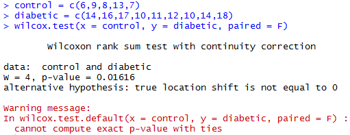

Given the small **p-value (0.016)** we have strong evidence to reject the null hypothesis and conclude that there is a difference in the population distributions between the control and diabetic group. 

---

#### Mann-Whitney U Test

# Blood Glucose Levels & Diabetes

.pull-right[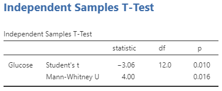]

.pull-left[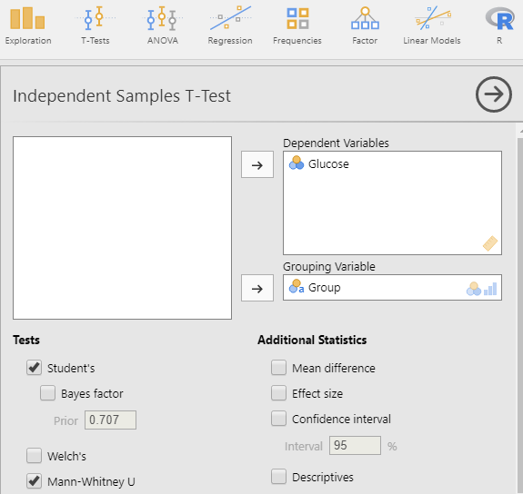]

Same **p-value** (0.016) and hence conclusion as with **R**. 

Note that while this is tested in the same section as the independent samples t-test, the null and alternative hypotheses are not the same.

---

# Kruskal-Wallis Test 

## Applicable in place of a one-way ANOVA

---

#### Kruskal-Wallis Test

# Kruskal -Wallis Test

The ***Kruskal*** ***-Wallis*** ***Test*** is a direct generalisation of the  **Mann-Whitney** **U Test**  **(** **Wilcoxon** **Rank Sum** **Test)**  to the  case in which we have *three or more* independent groups.

As such, it is the **distribution-free** version of **One-Way ANOVA.** 

Hypotheses:

 : All samples come from identical population distributions.

 : Not all samples come from identical population distributions.

The test is based on a comparison of **ranks** in the different groups

*William* *Kruskal*(1919 – 2005)

*W. Allen Wallis*(1912 – 1998)

.pull-left[]

.pull-right[]

---

#### Kruskal-Wallis Test

# Problem Solving: Depressant, Stimulant & Placebo

The data here represent the numbers of **arithmetic problems** (out of 85) solved in 1 hour by participants given a **depressant** drug, a **stimulant** drug or a  **placebo** .

**Hypotheses**

: 	The three population distributions for the numbers of puzzles solved for participants given each of the depressant, stimulant or placebo are identical.

: 	The three population distributions for the numbers of puzzles solved for participants given each of the depressant, stimulant or placebo are not identical.

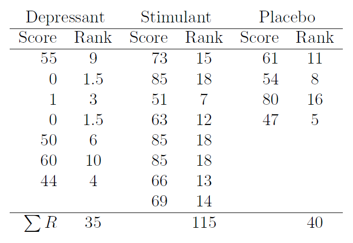

---

#### Kruskal-Wallis Test:

# Problem Solving: Depressant, Stimulant & Placebo

There is a clear pattern here.

It appears that the number of problems solved by participants given the **depressant** has a distribution located to the left…

… when compared with the distribution of those given the **stimulant** (which is located to the right).

*Group* : **D** = Depressant, **S**  = Stimulant, **P** = Placebo

```{r tbl31, echo = FALSE}
tbl31 <- tibble::tribble(
~`Score`, ~`0`, ~`0`, ~`1`, ~`44`, ~`47`, ~`50`, ~`51`, ~`54`, ~`55`, ~`60`, ~`61`, ~`63`, ~`66`, ~`69`, ~`73`, ~`80`, ~`85`, ~`85`, ~`85`,
"Rank","1.5","1.5","3","4","5","6","7","8","9","10","11","12","13","14","15","16","18","18","18",
"Group","D","D","D","D","P","D","S","P","D","D","P","S","S","S","S","P","S","S","S"
)

kableExtra::kable_styling(knitr::kable(tbl31), font_size = 18)
```


---

#### Kruskal-Wallis Test:

# Problem Solving: Depressant, Stimulant & Placebo 

The **non-parametric** version of the ANOVA test, conducted using the Kruskal
Wallis test, has test statistic as follows:

Here:

Therefore the test statistic is:

which follows a chi-squared distribution with degrees of freedom.


--- 

#### Kruskal-Wallis Test

# Problem Solving: Depressant, Stimulant & Placebo 

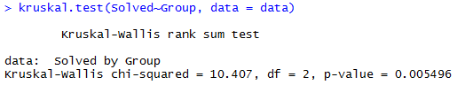

Given the low **p-value** we reject the null at the 5% significance level. Therefore we will conclude that there is a statistically significant difference in the population distribution of scores for at least one of the three administered drugs **(p=0.005** **).**

The low p-value might have been expected given how obvious the difference in the distribution of **D** and **S** results.

---

#### Kruskal-Wallis Test

# Problem Solving: Depressant, Stimulant & Placebo 

Same **p-value** and conclusion as with **R** .

Much like the **parametric** one-way ANOVA, when we reject the null-hypothesis, we can investigate where the differences are. We do this here using Dwass , Steel, Critchlow, Fligner test. This provides provides  family-wise **type I error** **rate** protection.

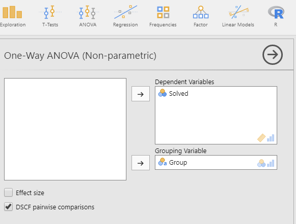
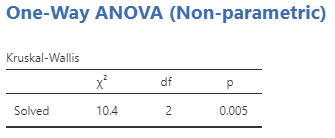
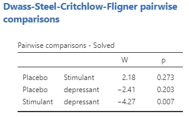

---

#### Kruskal-Wallis Test

# Problem Solving: Depressant, Stimulant & Placebo 

These are the same pairwise comparison **p-value** as calculated in Jamovi .

Therefore, at the 5% significance level, the only comparison where we are able to identify a difference is between the **Depressants** and **Stimulants** **** groups . These are the two groups that did appear to be different.


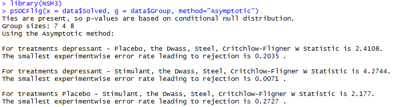

---

# Friedman’s Test 

## Applicable in place of a two-way ANOVA without replication

---

#### Friedman Test

# Friedman Test

The **Kruskal** **-Wallis** test is used for testing **independent**   samples . It may be viewed as a **non-parametric**  analogue of a one-way ANOVA test .

Sometimes the samples we are considering are dependent.  When this is the case, we can use ***Friedman’s test*** .

**Friedman’s test** is a very useful **non-parametric**  test when:
+ different subjects are exposed to a number of treatments
+ and blocks on a source of variation (for example, between individuals )

Such a test may therefore be viewed as a **non-parametric**  analogue of two-way ANOVA without replication applied to the randomised complete block design.

*Milton Friedman*
*(1912 – 2006* *)*

Awarded the Nobel Prize in Economics in 1976


---

#### Friedman Test

# Lecture styles

A randomly selected sample of 17 lecturers asked to deliver the same lecture to 3 different audiences

- One with **no visual** **aids**
- One with a **few slides** to illustrate the major points
- One using slides or flip charts to **illustrate every point**

At the end of each lecture, audience members are asked to **rate** the lecture on a 75 point scale.

Lecture styles
The primary aim of this study is to determine whether ***the number of visual aids used has an affect on the quality of the lecture*** .

However, since the skills of each lecturer are a source of variation, we can ***block*** on the ***lecturer*** .

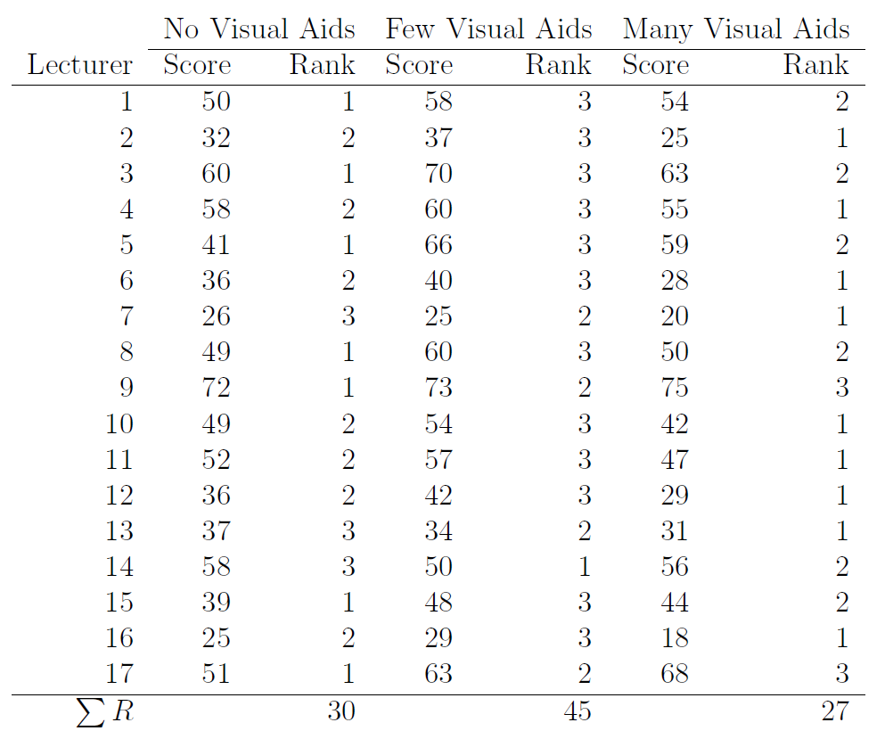

---

#### Friedman Test

# Lecture styles

: The number of **visual aids**   used does NOT affect the  rated quality of a lecture.

: The number of **visual aids** **** used DOES affect the rated  quality of a lecture.

*Test Statistic*:

There are  **treatments** (no visual aids, few visual aids, many visual aids)

There are  **lecturers** (remember, lecturer is a blocking variable )

*Test Statistic*:

This follows a chi-squared distribution with  d.f. 


---

#### Friedman Test

# Lecture styles

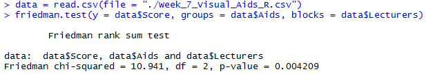

Given the small **p-value** (p = 0.004), we will reject the null hypothesis and conclude that the number of **visual aids** used DOES affect  the rated quality of a lecture.

Note that in **R** , we want the data in ***long form*** .

Where as in **Jamovi** , the data should be in ***wide form*** .

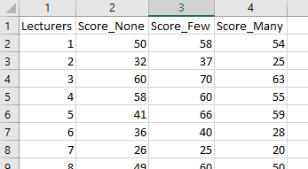
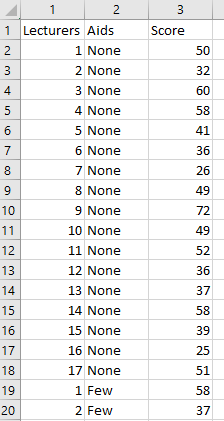

---

#### Friedman Test

# Lecture styles

Using the wide format data file in **Jamovi** …

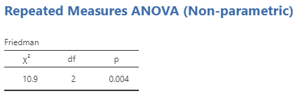]

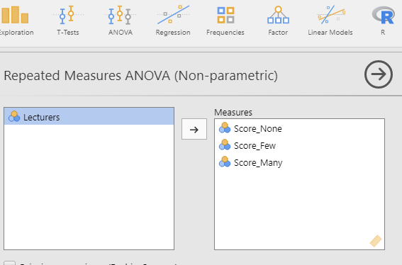]

Same **p-value** (p = 0.004) as in **R** : we will reject the null hypothesis and conclude that the number of **visual aids** used DOES affect the rated quality of a lecture.

---

# Non-parametric Correlation

# Spearman’s rank 

# Kendall’s tau

## *Applicable in place of Pearson’s correlation*
---

### Correlation 

# Correlation(& scatter plots!)

- Scatter plots are useful in assessing relationships between two quantitative variables.
 - Form: Is it linear, non-linear?
	+ Direction: positive or negative?
	+ Strength: how close do observations  follow straight line? Close or scattered  far apart?
	
- Strength of linear associations: **population correlation (** **** **).**
	- Measures **direction** and **strength**  of **linear**  association,
- To formally test whether there is a statistically significant linear association between the two variables we consider, for all correlation coefficients, the null and alternative hypotheses:

  : r = 0

  : r ≠ 0


---

#### Correlation

# Pearson’s Correlation Coefficient

+ For two continuous variables, X and Y, their sample correlation is measured by

+ To perform a hypothesis test using Pearson’s Correlation Coefficient, we have to assume variables X and Y are normally distributed.

+ When this assumption is not met, **non-parametric** versions of the correlation can be considered and are based on the ranks of the data (rather than the raw data values ).

# Two types of Nonparametric Correlation

+ **Spearman’s** **Rank Correlation Coefficient** ( ): uses the Pearson correlation coefficient  formula but uses the ranks instead of the actual data values. 

+ **Kendall’s** **tau** : Correlation Coefficient is also based on ranks but is based on the number of inversions of the rankings .

---

#### Correlation

# Expenditure on Tobacco & Alcohol

The data below gives the **average weekly household spending** on ***tobacco*** and ***alcoholic beverages*** for 11 regions of Great Britain.

For **non-parametric** correlations, the ranks are required and, for each variable, are also given (from lowest expenditure to highest

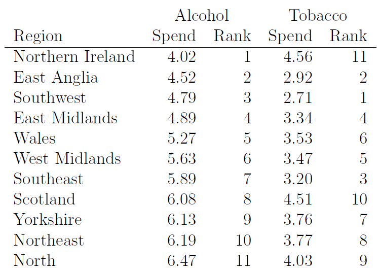

---

#### Correlation

# Expenditure on Tobacco & Alcohol

If we are able to assume that both variable ***tobacco*** and ***alcohol*** are normally distributed, we can use Pearson’s correlation. 

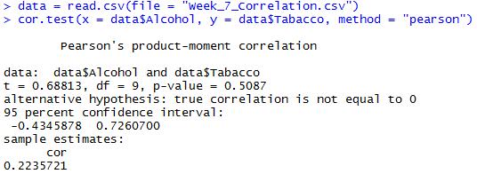

Given the large **p-value**(p = 0.51), we do not have enough evidence to identify a statistically significant linear relationship. 

---

#### Correlation

# Expenditure on Tobacco & Alcohol

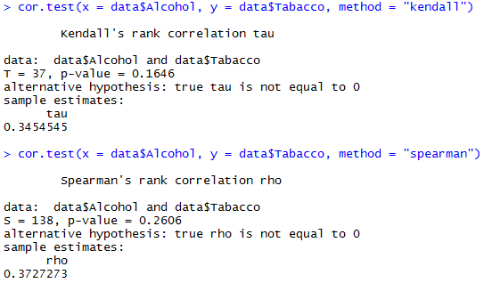

Given the large **p-values** (p = 0.164, p = 0.2606), we are unable to identify a statistically significant linear relationship at the 5% significance level using **Kendall’s tau** and **Spearman’s Rank Correlation Coefficient** tests respectively. 

---

#### Correlation

# Expenditure on Tobacco & Alcohol

.pull-left[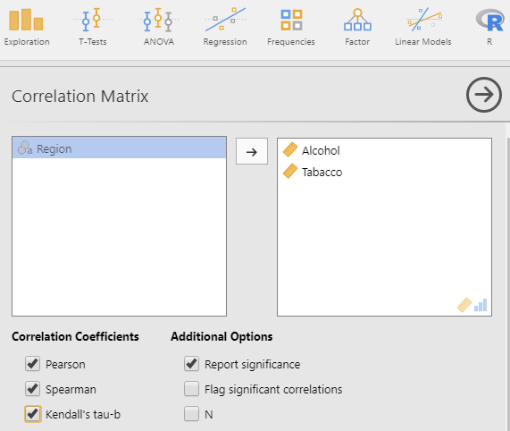]

.pull-right[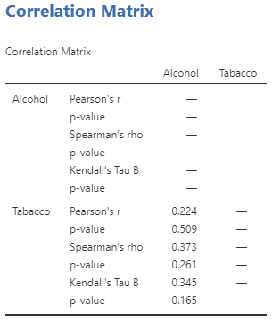]

Same **p-values** (p = 0.164, p = 0.2606) as in **R**. 
