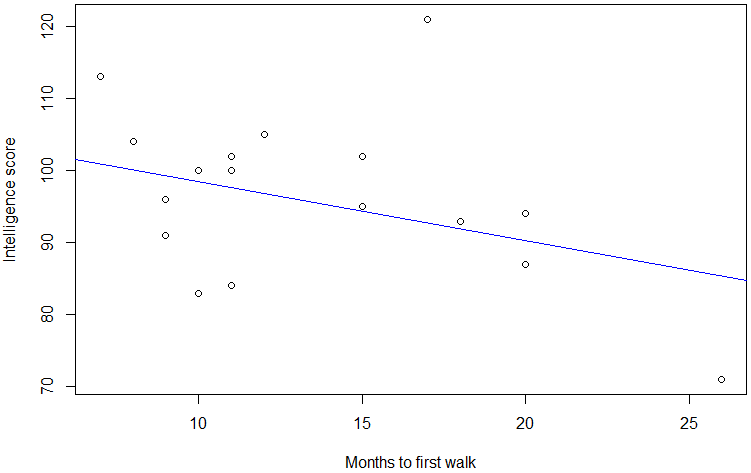
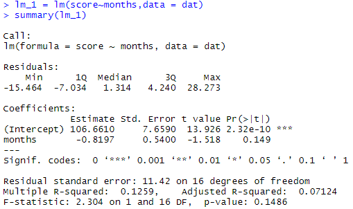

# Revision

+ Last week we looked at non-parametric methods.

+ Useful when the parametric assumptions have failed and when sample sizes are small.

```{r tbl2, echo = FALSE}
tbl2 <- tibble::tribble(
~`Setting`, ~`Parametric test`, ~`Non-parametric test`,
"One sample","One-sample t-test","Sign Test or Wilcoxon Signed Rank Test",
"Matched Pairs","One-sample t-test (of differences) Paired Samples","Sign Test or Wilcoxon Signed Rank Test",
"Two independent samples","Two-sample t-test","Mann-Whitney U test (Wilcoxon Rank Sum)",
"Several independent samples","One-way ANOVA","Kruskal -Wallis test",
"Several Related samples","Repeated measures ANOVA","Friedman’s test",
"Correlation","Pearson’s correlation","Spearman’s or Kendall’s correlation coefficient"
)

kableExtra::kable_styling(knitr::kable(tbl2), font_size = 18)
```

---

#  Quiz 

+ Week 9 there is a quiz during the **lecture time** .
+ The quiz will be available on **Blackboard from 12:30PM to 1:30PM** . First half hour should give you time to get ready and set up your computer.
+ Will be comprised of **six multiple choice** (1 mark each) questions and **two short answer** (5 and 12 marks) questions.
+ Multiple choice questions are randomly selected from a pool of questions.
+ Short answer also randomly selected.
	+ These have data files in the question. You will need to be able to **download the data file** , analyse it and write your answers in your own document which will need to be **uploaded to Blackboard** for marking. The upload will be the same process as the assignment.
	+ Best to upload a PDF.
+ **Practice Quiz**  available. Check this and practice downloading and using the data file to answer short answer questions. Practice uploading as well if you wish.

---

# Correlation

---

#### Simple Linear Regregression

# Linear Relationships - Scatter plot 

+ Graphical tool to explore relationship between two **quantitative** variables.

+ For tests of association (correlation), it doesn’t matter which of the two variables is plotted on horizontal (X) and vertical (Y) axes

+ For regression analysis,
	+ horizontal (X) axis: ‘explanatory’ or ‘ **predictor** ’ or ‘independent’ variable
	+ vertical (Y) axis: ‘outcome’ or ‘ **response** ’ or ‘dependent’ variable
	
*Scatterplot of* ***age*** *(in months) of child when starting to walk and* ***intelligence test*** *(at age 4)*

Each dot/point represents the information of an individual child.

e.g. Barry: age = 17 months, intel = 121

Each pair of variable measurements must come from the same person (or unit).

From the scatterplot, we are interested in how an increase, or decrease, in the **predictor variable** is related to the **response variable** .

**This is Barry!**


---

#### Simple Linear Regression

# Linear Relationships 


As *Age* increases, *Height* increases (*positive* relationship)


As *Drinks* increases, *Dexterity* decreases (negative association)

# Non-Linear Relationships


---

#### Simple Linear Regression

# Describing the Relationship 

- What is the form – Is the relationship **linear** or non-linear -  *(Quadratic / Exponential / Logarithmic)?*

When **linear** (and for some non-linear)...
- What is the direction? - **Positive / Negative relationship**
- What is the strength  - **Weak / Moderate / Strong**

# Quantifying the Relationship – Correlation Coefficient

**Correlation** measures the closeness of points to straight line. 

It only makes sense when we have a **linear relationship**, so always **plot your data!**

---

### Correlation

# Pearson’s correlation coefficient

- For two continuous variables, X and Y, their sample correlation 
      is measured by

- Assumes variables X and Y are normally distributed
- When this assumption is not met, **nonparametric version** of the correlation can be considered and are based on the ranks of the data (rather than the raw data values)


#  Two types of Nonparametric Correlation

*Recall Week 7*

- **Spearman’s Rank** Correlation Coefficient (rs): uses the Pearson correlation coefficient  formula but uses the ranks instead of the actual data values.

- **Kendall’s** tau: Correlation Coefficient is also based on ranks but is based on the number of inversions of the rankings. 

---

#### Simple Linear Regression

# Correlation


r ≈  0.95 - Very strong, positive, linear

r ≈ 0.70 - Fairly strong, positive, linear
*If  0.3 < r < 0.5 weak positive linear*

r ≈  0 - No linear relationship

r ≈  -0.7 - Fairly strong, negative, linear
*If  -0.5 < r < -0.3  weak negative linear*

r ≈  -0.95 - Very strong, negative, linear

r ≈  0 **Does there appear to be a relationship? Is it strong? Why is r ≈  0?**
---

#### Simple Linear Regression

# Statistical Significance and Practical Importance

- The size of r does not automatically make it statistically significant (or not)

- You could have a situation where:
 - r = 0.8 but that **it is** not statistically significant; or 
 - r = -0.003 that **is** statistically significant 
 
- The **sample size** will affect your power, and therefore your ability to find something statistically significant.

#Some Comments About Correlation

- In correlation there is no need to specify the **response and explanatory variables**.

- We simply find the **strength and direction** of **linear** relationship between two quantitative variables.

 -**Correlation does not imply causation**.
 


---

#### Simple Linear Regression

#  Population Correlation 

+ *(rho)* is the **TRUE POPULATION**  correlation coefficient.

+  **always** lies between -1 and 1, but we don’t know it’s value.

+ Larger **magnitude** (closer to -1 or +1) implies stronger ***linear*** ****** relationship.

+ To formally test whether there is a **statistically significant linear   association** between the two variables we consider:


  *(Can also test one sided)*

We estimate  based on our sample. From our sample we calculate the SAMPLE correlation coefficient, ***r*** ***.***
+ is estimated by *r* (like is estimated by s , is estimated by )

+ *r* ***always*** lies between -1 and 1.

---

#### Simple Linear Regression

# Correlation – Some fun…

- **Game** : The following link is for a game where you have to guess what the correlation coefficient is - http://guessthecorrelation.com/ 

]
- **Simpsons** :
Watch the following clip - https://www.youtube.com/watch?v=xSVqLHghLpw 
 
 Lisa correctly points out that Homer has committed a post hoc fallacy - https://en.wikipedia.org/wiki/Post_hoc_ergo_propter_hoc 

]
- **Big Bang Theory** : Watch the following clip - https://youtu.be/vRJUvFG8gbE?t=17s

 Sheldon brilliantly points out to his mother that her logic is *post hoc ergo propter hoc* .

- **Spurious Correlations** : The following link has some things that are correlated which there is no causation - https://www.tylervigen.com/spurious-correlations 

- **Correlation does not imply causation!!!**

[http://guessthecorrelation.com/](https://www.tylervigen.com/spurious-correlations)
[https://www.youtube.com/watch?v=xSVqLHghLpw](https://youtu.be/vRJUvFG8gbE?t=17s)
[https://en.wikipedia.org/wiki/Post_hoc_ergo_propter_hoc](https://en.wikipedia.org/wiki/Post_hoc_ergo_propter_hoc)
[https://youtu.be/vRJUvFG8gbE?t=17s](https://www.youtube.com/watch?v=xSVqLHghLpw)
[https://www.tylervigen.com/spurious-correlations](http://guessthecorrelation.com/)

---

# Regression Analysis

## *Background, the parameters, prediction, estimation*
---

#### Simple Linear Regression
#  Regression Analysis 

+ Used to **quantify** a relationship under the assumption that one variable ( **X** ) actually ***CAUSES*** a result in **Y** .

+ Regression is about predicting the **average** of **one variable** based upon the value of **another variable** .

+ For ***simple*** linear regression we have ***one***  **predictor variable** .

**Response (dependent, outcome) variable**
+ variable whose behaviour we want to *explain or predict*.

+ usually denoted Y.

**Predictor (independent, explanatory) variable**

+ variable *used to explain or predict* behaviour of  the response.

+ usually denoted X.

---

# Regression Analysis

When we have only **one** predictor *raised to the first power* we call it ***simple linear regression*** . The model is:

 where

 *The value of these parameters is unknown!*

This is the true relationship between our **predictor X** and our **response Y** .

Just as with 𝜌 and r, we estimate by with a sample estimate . Similarly, is estimated with .

From our sample we can **estimate** the population model. The estimated model is sometimes called the **fitted model** :

---

# Example:  

Does the age at which a child begins to walk (as defined) predict later score on an intelligence test (at age 4)? 

```{r tbl16, echo = FALSE}
tbl16 <- tibble::tribble(
~`Child`, ~`Age (month)`, ~`Score`, ~`Child`, ~`Age (month)`, ~`Score`,
"1","15","95","10","20","94",
"2","26","71","11","7","113",
"3","10","83","12","9","96",
"4","9","91","13","10","83",
"5","15","102","14","11","84",
"6","20","87","15","11","102",
"7","18","93","16","10","100",
"8","11","100","17","12","105",
"9","8","104","18","17","121"
)

kableExtra::kable_styling(knitr::kable(tbl16), font_size = 18)
```

---

# Visualising the Data


Scatter plot of the relationship between **age in months** of commencing to walk and later **score on an intelligence test** (age 4).

Nature of the relationship?

Outliers?

---

# Visualising the Data: R

[]
[]

---

#Visualising the Data: Jamovi 

The *scatr* module needs to be installed. Click the	
      

button and find the package to install it. 


---

# Parameter Estimation

The most common form of parameter estimation for Simple Linear Regression is called **least squares estimation**. 

This is a method that seeks to minimise the sum of the squared residuals.

Consider this simple scenario:

- The vertical distances are
residuals. 

- Changing the red line 
corresponds to changing
 and (????).
- We want to find  and  ??
such that  is minimised. 


---

# Parameter Estimation

- This minimisation is done using matrix calculus.  
- The equation for the parameter estimates that minimise the **sum of squares** is:  where  is the design matrix.
- For SLR, the design matrix is . 
- We do not need to perform this calculation,
**R** and **Jamovi** can easily perform this for us.
Later STAT courses will go into more detail. 
- In Big Data, this calculation of  
is computationally expensive. 
- Methods for speeding up this calculation 
when n is large forms part of current 
research in the Statistics discipline at UoN.


---

# Estimation: Jamovi


]

]


- The parameter estimates we determined manually equal those from Jamovi. 
 - and , therefore the fitted model is:

---

# Estimation: R



- Same estimates as Jamovi, therefore the fitted model is:


Or

Predicted Score = 106.66 – 0.820 x (Age First Walked)

---

# How to Interpret $b_1$ in   = $b_0$ + $b_1$X

Consider the simple example:

** Y = 2 + 5 X**

$b_0$ = 2 

$b_1$ = 5


+ When X = 0,   Y = 2 + 5(0)  =  2

+ When X = 1, Y = 2 + 5(1)  = 7

+ When X = 2, Y = 2 + 5(2)  = 12

+ When X = 3, Y = 2 + 5(3)  = 17


**Question** . . . . **By how much is X changing?**X is changing by 1

**Question** . . . . **By how much is Y changing?** Y is changing by 5

So, for a **unit change** in X, Y changes on average, by ' $b_1$ '

---

#  Interpretation of $b_0$ and $b_1$ 

** $b_0$ , the sample estimate of the *intercept parameter***

*Interpretation* :

The predicted value of the response variable when the value of the predictor is 0 (even if this doesn’t make sense in the context)

** $b_1$ , the sample estimate of the *slope parameter***

*Interpretation* :

For a unit increase in  X, the value of Y ‘increases’ by b 1 , on average.

The amount of change (increase/decrease), on average, in the value of the response variable for a unit increase in the value of the predictor.

---

#  Interpretation of $b_0$ and $b_1$ 

Children test score data:

**Interpretation** of the intercept term?

For a child that is born able to walk, we expect that their test score will be 106.66 on average. Not a particularly realistic scenario.

**Interpretation** of the coefficient of the **predictor?**

For every additional month it takes for a child to first walk, a child’s score on the test will decrease by 0.82 points, on average.

**Prediction**

What would you expect the intelligence score to be for a child that first walks at age 22.5 months old?

Predicted score = 106.66 - 0.82 × 22.5 = 88.21

.pull-left[]

.pull-right[]

---

# Extrapolation: Be careful
If the value of the explanatory variable that you want to use to make a prediction is outside the range of the data you have, the predicted value of the response may not be reasonable. 

**Why?**

Because the trend of the line is not known beyond the scope of the model, i.e., beyond the data set on which the model was based.

**For example:**

The prediction of a child’s score who started walking at month 40 is unreasonable because we do not have data for that age to confirm the relationship is still linear.

Similarly extrapolating the equation by substituting the value 0 (a child who can walk at birth) is mathematically possible and would suggest an expected score of 106.66, but there is no data for such values. It makes no sense in this case.

---

#Extrapolation: Simple Example

- Data simulated from a true model that is non-linear. 

- Note the exp(-0.3x) 

- But we only see data where x>3:

- Plot of the data with the linear fit. A reasonable fit…


---

# Extrapolation: Simple Example

- Making a prediction for x = 1 would be an example of extrapolation.

- Lets look at the actual plot of all the data:  


- Our prediction for x = 1 would be about 4, when it should be closer to 10. 

---

# Regression Analysis

## Inference: Hypothesis Testing

## Residual Analysis

---

#  Hypothesis Testing 

Based on our sample, we can test if we believe that

The **null and alternative** is:

The **test** **statistic** is:

The **null distribution** is a *t* -distribution with (n-2) d.f.

**Decision and conclusion** :

As before consider size of p-value and compare with a given level of significance.

---

#  But what is this testing? 


If is true what does this say about the relationship (equation):

would simplify to…

The value for the response does NOT depend upon the value of X.

That is, there is NO linear relationship between my outcome (Y) and the predictor (X).

That is what this hypothesis test is testing!

---

#  Testing Linearity: R and Jamovi 


Test statistic: -1.52

Degrees of freedom: n-2 = 18-2 = 16

P-value is 0.149.

Since the p-value is greater than 0.05, we do not have enough evidence to identify a linear relationship between the intelligence score achieved and the month at which a child first walks.

.pull-left[]

.pull-right[]

---

#  Assessing a Model 

What are the **assumptions** of the model?
+ That the linear model is a fair representation of the behavior of the variables (assessed from scatterplot and experience/research initially – but we need some statistical values to support)

+ That the residuals are
	+ Independent
	+ Normally distributed
	+ Constant scatter (standard deviation) – constant across all values of the predictor
	+ No outliers
	
+ If the linear model is inappropriate some of the assumptions will be violated.

---

# Assessing a Mode

- Create the **residual plot**: a scatter plot of the residuals against the explanatory variable. 

 If the model perfect describes the phenomenon and the assumptions are not violated, then what would we expect to see?
- All residuals will be zero. This is unlikely, but would indicate a perfect fit.
- We would be content to see that all residuals are independently **scattered randomly** (no pattern) and **normally** (within a band (constant)) about zero.

- The **residual plot** shows the same relationship as the original data plotted. The **residual plot** can however make it much more obvious that there is an **undesirable pattern** in the 
data. 

---

# Good models?


background-image: url('assets/img/image38.emf')


---
class: inverse
background-image: url('assets/img/image40.wmf')
background-size: cover

---
class: inverse
background-image: url('assets/img/image44.jpeg')
background-size: cover

---
class: inverse
background-image: url('assets/img/image43.wmf')
background-size: cover

---
class: inverse
background-image: url('assets/img/image42.wmf')
background-size: cover


---

- What if the residual plot violates the required assumptions? 

- What might this imply?

Any of a number of things . . . 

 - Perhaps the relationship is NOT linear?
 
 - Perhaps no relationship exists?
 
 - Perhaps the data have been entered or recorded incorrectly
 (particularly if observe outliers)?
 
 - Perhaps there are other predictors which should be included in a model (later in the course…)
 
---

# Regression Analysis

## ANOVA Approach to Regression 

---

# The ANOVA Approach to Regression Analysis 

+ Based on partitioning **sums of squares** and df associated with the response variable Y

+ Suppose we ignored the predictor, X…

We can consider the variation of the data around its mean,

Measures the **total** variation in the response values, Y. **SSTO** .

---
class: inverse
background-image: url('assets/img/image47.wmf')
background-size: cover

---
class: inverse
background-image: url('assets/img/image46.wmf')
background-size: cover

---
class: inverse
background-image: url('assets/img/image45.wmf')
background-size: cover

---

#  The ANOVA Approach to Regression Analysis 

+ Suppose now we **DO NOT** ignore the predictor, X, and utilise it in “explaining” part of the “variation in the data values about their **mean** ”.

+ The **mean** here is the **predicted value** from the model for a value of X.

+ We can consider the variation of the data around its **mean** ,

Measures the variation left over after the model is applied. The larger the difference between $SS_T$ and $SS_E$ , the greater is the effect of the regression relation in accounting for the variation in the $Y_i$  obsns . **SSE** .

---
class: inverse
background-image: url('assets/img/image47.wmf')
background-size: cover

---
class: inverse
background-image: url('assets/img/image46.wmf')
background-size: cover

---
class: inverse
background-image: url('assets/img/image48.wmf')
background-size: cover

---
class: inverse
background-image: url('assets/img/image45.wmf')
background-size: cover


---

#  The ANOVA Approach to Regression Analysis 

+ What accounts for the difference between SSTO (sum of squares total) and SSE (sum of squares error)? 

 Recall the other type of sum of squares – SSM (sum of squares model or treatment).
+ In regression this gets called sum of squares regression.

**SSR**
---
class: inverse
background-image: url('assets/img/image47.wmf')
background-size: cover

---
class: inverse
background-image: url('assets/img/image46.wmf')
background-size: cover

---
class: inverse
background-image: url('assets/img/image48.wmf')
background-size: cover

---
class: inverse
background-image: url('assets/img/image45.wmf')
background-size: cover


---

##Total Deviation = 

   **Deviation of *fitted predicted* regression value from mean +**
   
   **Deviation of *observed value* from predicted regression value**
   
   $SS_T$ = $SS_R$ + $SS_E$
   
---
class: inverse
background-image: url('assets/img/image49.wmf')
background-size: cover

---
class: inverse
background-image: url('assets/img/image53.wmf')
background-size: cover

---
class: inverse
background-image: url('assets/img/image50.wmf')
background-size: cover

---
class: inverse
background-image: url('assets/img/image52.wmf')
background-size: cover

---
class: inverse
background-image: url('assets/img/image46.wmf')
background-size: cover

---
class: inverse
background-image: url('assets/img/image48.wmf')
background-size: cover

---
class: inverse
background-image: url('assets/img/image45.wmf')
background-size: cover

---
class: inverse
background-image: url('assets/img/image51.wmf')
background-size: cover


---

**Consider *TOTAL deviation* as Sum of *Treatment* and *Error Deviations***

---
#  Assessing the Regression Model 


So can assess whether a potential predictor variable has a **statistically significant effect** on the response variable via **ANOVA** .

Just as assessed in one-way ANOVA whether potential predictor had statistically significant effect on the response -> can use F test

```{r tbl45, echo = FALSE}
tbl45 <- tibble::tribble(
~`Model`, ~`df`, ~`SS`, ~`MS`, ~`F`,
"Regression","1","SS R"," "," ",
"Residual","n – 2","SS E"," "," ",
"Total","n – 1","SS T"," "," "
)

kableExtra::kable_styling(knitr::kable(tbl45), font_size = 18)
```
---

#Example: Walking and Intelligence

If we consider again the age first walking and intelligence data, the simple linear regression model was:

Or

Predicted Score = 106.66 – 0.820 x (Age First Walked)


It appears as though there is not enough evidence to suggest that age when first walking is a statistically significant predictor of intelligence score (p = 0.149).

---

# Assessing the Regression Model

**Coefficient of Determination: $R^2$ **

+ Describes **proportion of total variance of Y that is explained by the least squares regression line** .

+ Ranges from 0 to 1: normally as percentage 0 to 100 %.

+ Higher the value of $R^2$  , the better the least squares regression function is in explaining the variation in the data .

Consider again our example:
+ In **R** , the summary() command produces the $R^2$  value.

Interpretation: 12.6% of the variation in intelligence is explained by the linear model based on age first walked as the predictor. This suggest the model does not do a good job of explaining the variation in the response.

]

]

---

# Regression Analysis

## Intervals: Confidence and Prediction Intervals

---

#  Confidence Interval for  

**A 95% confidence interval (CI) for is**

+ Why may we be interested in computing such a confidence interval?

+ What sort of hypothesis might we be interested in testing?

*Interpreting the interval (generic):*

We are 95% confident that the true population mean change in Y for a unit change in X lies between ‘lower limit’ and ‘upper limit’.

Able to test for a linear relationship as we did with a hypothesis test.

Remember this is an interval about !

---

#  Prediction Intervals 

+ When we substitute a particular value for the explanatory variable into the **fitted regression equation,** we obtain a value of .

+ The value of can be viewed in two ways:
	+ Estimation of the **mean response** when we have values of  the predictor of . That is, for values of the predictor equal to , we expect the response to take values on average.
	
	+ As a  **prediction of the value**  of the corresponding response . That is, if we have a new value of the predictor variable of , predict what you think the value of the response will be.

---

#  Prediction Intervals 

+ The **margins of error** (or ***uncertainty*** ) for these two things is different:

	+ A prediction interval for a **single** response should be wider than a confidence interval for estimating the **mean response** or average response.
	
+ Think about where we have some data that roughly follows a **normal distribution** with known population standard deviation. An interval for the population **mean** would be:

+ If we were to create an interval that we expected some proportion of the data to sit in, it would be:

Here is set based on the level of confidence.


---

#  Prediction Interval for the Mean 


+ In the context of the example we have looked at, an **interval for the mean** is an interval about what we expect the **average** intelligence to be for a child that walks at month .

+ For any specific value, *,* the mean (expected value) of the response from the sample is

+ A confidence interval for the **mean** , , given a predictor of is:


and is simply the sample _______variance of______

---

#  Prediction Interval for the Mean 


This is a measure of the standard deviation of the residuals. The amount of scatter or uncertainly around the line.

This term takes into account how much data we have. As n becomes large, this term gets smaller, meaning more certainty.

This term looks are where our predictor value is relative to the data we have. Values further from the mean of x should attract additional uncertainty.

---

#  Prediction Interval for a New Observation 

Another major goal of regression analysis is the calculation of a prediction interval for a **new observation Y**, for a given value of X,  

A mother is more interested in estimating intelligence score **for her child** who begins to walk at age **13 months** than what happens on average.

The individual point estimate (mean or individual) is exactly the same.

The **interval** estimates will differ. The uncertainty associated with an **individual** score is greater than the uncertainty associated with a **mean** score. This is reflected in the SE.

---

# Prediction Interval for a New Observation

- A confidence interval for the predicted value,  is:

		 and is simply the sample    variance of    
			 
---

#  Prediction Interval for a New Observation 

The only new term is this 1. This effectively means that take into account our uncertainly of the residuals. The standard error above is the same standard error for the mean…. PLUS our uncertainty around the residuals.

The standard error above take into account the uncertainty of the true value of the mean, as well as the uncertainly surrounding the natural variation around the model.
