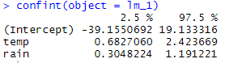

#  STAT2000 - Applied Statistics and Research MethodsLecture 9 – 2020 

---

# Multiple Regression 

---

#  Multiple Regression 

+ Regressing the dependent (response) variable Y on **more than one** independent variable X simultaneously

	+ Often single independent variable provides **insufficient explanation** of the behavior of dependent variable
	
	+ Often **predictions** of response variable based on a model with single independent variable **too imprecise to be useful**

Main purposes of multiple regression analysis:

1. To estimate and fit a model to explain variation in Y in terms of the predictors $X_1$ ,...., $X_p$.

2. To establish an equation that enables **better predictions** of the dependent variable Y than would be possible by any single variable X.

---

#  Multiple Linear Regression Model 

+ Assume predictor variables and relationship between

the response variable Y and these independent variables is **linear** .
+ Model data as:

  
+ are responses

+ independent (explanatory, predictor) observations for each

+ regression parameters (total parameters in model)

+ error terms.

---

#  Multiple Linear Regression Model 

+ Recall the Simple Linear Regression (SLR) model:

  
+ For SLR, the interpretation of is: represents the amount the mean response changes for a **unit change in**

+ In multiple regression ( **without interaction terms** ) our **interpretation** of the **slope coefficients** : represents the amount the mean response changes for a **unit change in** , ***when the remaining variables are held constant.***

---

#  Predictors and Parameters 

In SLR, we have ONE **predictor variable** , but how many **parameters** do we have?

We have TWO:  and .

For ***multiple linear regression*** , we have ***p*** predictors, therefore we have ***p+1*** parameters: and ,…,  .

***Important*** *:* Depending on the textbook you are reading or software you are using, they may refer to the model as having ***p***  ***parameters*** and ***p–1*** predictor variables.

**Important** to be able to read the definitions and understand the model!

---

#  Two Continuous Predictor Variables 

+ Simplest case: **two** explanatory variables X 1 and X 2 .

+ Regression function:

  is now referred to as our **regression (or response) plane** .

Remember in SLR, we referred to the regression function as a **regression line** .

---

The straight line
 becomes a plane
with the addition of 
the additional var 
(additional dimension)

The simple linear regression model
allows for one independent variable, X

 Y = $\beta_0$+ $\beta_1$  $X$ + $\epsilon$
	     
The multiple linear regression model
allows for more than one independent variable.

Y = $\beta_0$+ $\beta_1$  $X_1$ + $\beta_2$  $X_2$ + $\epsilon$
	     
---

The straight line
 becomes a plane
with the addition of 
the additional var 
(additional dimension)

The simple linear regression model
allows for one independent variable, X

 Y = $\beta_0$+ $\beta_1$  $X$ + $\epsilon$
---
The straight line becomes a plane with the addition of the additional var (additional dimension)

The simple linear regression model
allows for one independent variable, X

 Y = $\beta_0$+ $\beta_1$  $X$ + $\epsilon$

---

#  Two Continuous Predictor Variables (ctd.) 

**Interpreting Parameters:**

+ The value  of $\beta_0$ is expected value of *Y* when $X_1$ = 0 **and** $X_2$ = 0.

+ This parameter is **meaningless/unreliable** if data values of $X_1$ = 0 and $X_2$  = 0 are not included in the scope of our model.

+ Value of $\beta_2$ is expected increase in *Y* per unit increase in $X_1$ , **when** $X_2$ **is held constant** .

+ Value of $\beta_2$ is expected increase in *Y* per unit increase in $X_2$ , **when** $X_1$ **is held constant** .

---

# Two Continuous Predictor Variables (ctd.)

- $\beta_0$, $\beta_1$ and $\beta_2$ are **unknown population parameters**. 
 
- Estimate values by taking **random sample** from population and fitting a linear regression model to sample data.
 
- Denote estimate of regression plane by 

	(estimates of $\beta_0$, $\beta_1$ and $\beta_2$  represented by $b_0$, $b_1$ and $b_2$)
	
---

# Parameter Estimation and Model Fitting 

---

# Parameter Estimation

- Estimate of the  **regression plane** through  **method of least squares**, i.e., calculate **residuals**:

 for each observation  in our data set and fit the plane which **minimises the sum of these squared residuals**:

 In practice, software performs the calculation  where  is the p+1 tall vector of estimates and  is the design matrix, 

---

#  Example: Corn Yield  

 A study was conducted in 15 regions in Australia to try to determine the relationship between **corn yield** (measured in bushels) and the two explanatory variables: mean season **temperature** ( $oC$ ); and amount of **rainfall** in a season (measured in mm).

The data collected on corn yield (Y), as well as the temperature ( $X_1$ ) and the amount of rainfall ( $X_2$ ) follows.

---

- Model fitted in the same way we have seen for other linear models.

- From SLR we now have an additional predictor and an additional parameter to estimate.

## Average Yield = -10.01 + 1.55 temp + 0.75 rainfall

---

]

]

## Average Yield = -10.01 + 1.55 temp + 0.75 rainfall

---

## Predicted Yield = -10.01 + 1.55 temp + 0.75 rainfall

**Interpretation of**  :

$b_1$ : We expect corn yield to increase by 1.55 bushels when the season temperature increases by 1 degree Celsius, **provided that seasonal rainfall remains constant**.

** $b_2$ ** :  We expect corn yield to increase by 0.75 bushels when the  seasonal rainfall increases by 1 mm, **provided that the mean season temperature remains constant**

** $b_0$ ** :  scope of our model does not contain observations for a region with a mean season temperature of 0 degrees Celsius and no seasonal rainfall, nor near these values, so not reasonable to interpret. But represents what we would predict the yield to be when rainfall and temperature were zero.

---

#  Population Mathematical Model for this Example 
 
## $Yield_i$ = $\beta_0$ + $\beta_1$ $temp_i$ + $\beta_2$ $rainfall_i$ + $\epsilon_i$ 
 
 where represents....
 
 $\beta_i$ represents...( see slide 3)
 
 **OR**

where ... $Y_i$ represents..... and $X_i$ represents... and ... etc

#Fitted** **/ Estimated Model or Equation

##Averge Yield+ -10.01 + 1.55 temp + 0.75 rainfall

Understand the distinction beween the two.

---

# Assessing the Model

---

#  Appropriateness of the Model 

+ Plot of residuals:

	+ against **fitted values** 
	
		+ useful for assessing appropriateness of regression function, as well as providing information about outliers.
		
	+ against **each independent variable** 
		+ to assess adequacy of regression function with respect to that independent variable.
		
+ **Normal quantile plots, goodness of fit (Shapiro-Wilk)** of the residuals can be used to check the assumption that our error terms are normally distributed.

+ If the data are collected in time sequence, a **time series plot of the residuals** can be used to check the assumption that the error terms are independent.

+ Constancy of population error variance can also be checked from our **residual plots** .

---

#  Residual Plots: Jamovi 

+ Testing normality:

	+ Can use **Shapiro Wilk** test to formally test for lack of normality
	
	+ Or use **QQ plot** .
	
+ Given the large p-value (p=0.752), there is not enough evidence to suggest the residuals are non-normal.

---

#  Residual Plots: Jamovi 

+ Plotting residuals against each predictor:

	+ We do not want to see any patterns here and even scatter about zero.
	
+ For the **rain predictor** , does the variance reduce as *rain* gets larger?

+ Perhaps, but remember that if *rain* is **normally distributed** , we expect to see less larger values of the predictor.

+ Less values there make it harder to **properly identify a relationship** .

+ When the sample size is fairly small, we don’t want to read to much into what might look like a pattern.

---

#  Residual Plots: Jamovi 

+ Looking at the residuals against the fitted values and the response values:
	+ Again: We do not want to see any patterns here and even scatter about zero.
	
+ These plots **should look similar** if the regression model does a good job because the response values should be similar to the fitted values.

+ These plots are a little different which suggests the fit is not all that good.

+ There may be a **linear relationship** in the residuals against yield plot, indicating that there may be some **linear relationship unexplained** by the model. This indicates there may be another predictor required.

+ **Corrected this slide in the following slide.**

---

#  Residual Plots: Jamovi 

+ Looking at the residuals against the fitted values:

	+ Again: We do not want to see any patterns here and an even scatter about zero.
	
+ The plot of the residuals against the response variable will be similar to the plot against the fitted values, however will be **slanted over** and appear to have a linear relationship.

+ The amount that it is pushed across depends on the size of variance of the error process . Relatively larger variances of the error process will slant the plot over more.

+ This is perfectly normal and acceptable.

---

#  Conclusions: Example 

+ Plots of the residuals against the fitted values do not suggest any randomness problems and so indicates that perhaps the linear regression model is appropriate for this data.

+ There are no obvious outliers nor obvious indications that the population error variance are not constant.

+ The normal quantile plot of the residuals suggests that the assumption of normally distributed error terms is not violated. (The Shapiro-Wilk test formally verifies)

---

# Using Regression to Make Predictions

- Predict number of yield of bushels in a region with a mean season temperature of 22.6 deg Celsius and a seasonal rainfall of 35.2 mm: ** $X_1$  = 22.6** and ** $X_2$ = 35.2 **

- To predict value of Y, substitute values of $X_1$ and $X_2$ into the equation:

- We predict that a region with a mean season temperature of 22.6 deg Celsius and a seasonal rainfall of 35.2 mm will yield 51.42 bushels of corn, on average.
  
 **Warning**: Should only use regression to make predictions for value of Y when values of $X_1$ and $X_2$ within the scope of our data.

---

# Inference

---

#  Hypothesis Tests for the Parameters 

We can also perform hypothesis tests to formally test whether or not we should have included a particular explanatory variable $X_k$ in model (k = 1, … p).

$H_0$ : ( $X_k$ is NOT linearly related to the outcome) 

$H_A$ : ( $X_k$ is linearly related to the outcome)

*Test statistic* :

*Can also test for population parameter values other than zero*.

This follows a student’s t-distribution with df = n – p - 1 if the null is true. The degrees of freedom is the n less the number of parameters in the model.

---

# Corn Yield Example (Revisited)

We can check the ANOVA table to see if **temperature** is a significant predictor of crop yield using the F test. 

We can also test if **temperature** is linearly related to crop yield as follows.

$H_0$:  = 0    (in our defined model)

$H_A$:  ≠ 0

Test statistic:  

Since the p-value is very small (0.002), there is very strong evidence against H0. Therefore conclude that a statistically significant linear relationship exists between average corn yield and mean season temperature.

---

# Corn Yield Example (Revisited)

Using the ANOVA table to see if **rainfall** is a significant predictor of crop yield using the F test: 

$H_0$: Rainfall does not have an effect on crop yield

$H_A$: Rainfall has an effect on crop yield

Test statistic:  

Since the p-value is very small (0.003), there is very strong evidence against H0. Therefore conclude that rainfall has a statistically significant effect on crop yield.

---

# Confidence Intervals for Parameters  

+ Can calculate CI for regression parameters from our sample estimated $b_1$ , $b_2$ ,.., $b_p$ (and $b_0$ ):

where j = 0,…,p and t* is value of student’s t distribution with C level of confidence and df = (n – p – 1)

In our example, this is the required distribution and t* = 2.18.

---

# Corn Yield Example (Revisited)

Since n = 15, p = 2, so for 95% CI: 

The 95% CI for :	
 					       

The 95% CI for :	
 					       

INTERPRETATION for second interval:
We are 95% confident that for a 1mm (unit) increase in rainfall, the expected true population mean yield of corn will increase by between 0.3 and 1.2 bushels, provided the mean season temperature is held constant.

We can also obtain prediction intervals as for SLR

---

# Corn Yield Example (Revisited)

---

# Models with Interaction

---

#  Interaction Effects 

We can incorporate an **interaction** term in the model as follows:

This is the model that most software will fit. We can fit a better model though:
+ First centre the variables (take their differences from their means) to use in the interaction, then multiply so the model is:

Therefore the model now is:

where

+ **Important**: * Interpretations of $\beta_1$ and $\beta_1$* : These are not the same as the model with no interactions terms.

---

# Interaction Effects – Two models 

Let’s look at some output from R for the two models:

**lm_2** :

lm_3:

**lm_2 Results**

The results here are a little odd.

Looking at the ANOVA table we would conclude that none of the predictors are useful for predicting corn yield. 

Similarly we would not find any  predictors linearly related to corn yield. 

The parameter estimates are also very different now. 

---

# Interaction Effects – Two models 

Let’s look at some output from R for the two models:

lm_2:

**lm_3** :

**lm_3 Results**

Looking at the ANOVA table we can now conclude that temperature and rain are good predictors for corn yield.

Similarly we now find that temperature and rain are linearly related to cord yield.

The parameter estimates are more in line with the model without interaction now.

---

#Interaction Effects – Parameter Interpretation 

Model:

For a **unit increase in $X_1$** , how much does the** expected value of Y change** ?

Consider a particular value of $X_1$ , say $x_1$ , and of $X_2$ , say  $x _2$ .

Then the **expected value of Y** would be

Then Consider the value ** $x_1$+ 1 ** (a unit increase). Then the **expected value of Y** would be

---

# Interaction Effects –  Parameter Interpretation 

Now calculating the difference to see wha t the **increase in** is:

Therefore, when there is interaction present, a **unit increase in** results in a **change in** that depends not only one but the **interaction coefficient**  and the value of the other variables that share an interaction. In this case, .

*A conditional interpretation* : Given an average value of , for a **unit increase in** we expect to increase by .

---

# Interaction Effects

+ One way to **graphically** check whether an interaction model is required for the data is to fit a model without any interaction terms and obtain the residuals for this model.

+ These residuals can be plotted against any interaction terms ***not yet*** included in the regression model.

+ Any evidence of a **pattern or trend** in any of these residual plots suggests corresponding interaction term **should be included** in regression model.

---

# Corn Yield Example (Revisited)

No obvious pattern in this plot of residuals against interaction term between temperature and rainfall ( $X_1$ $X_2$). Suggests interaction term not required to model this data.

---

#  Hypothesis Tests for Interaction Terms 

+ With two predictor variables, can also formally test

 whether interaction term required to model data.

by testing:

$H_0$ : $\beta_3$ = 0

$H_A$ :  $\beta_3$ ≠ 0

In **Jamovi** we need to create centered variables.

---

#  Hypothesis Tests for Interaction Terms 

Looking at the p-value (p=0.227), we are unable to identify a statistically significant linear interaction between **temperature** and **rain** .

We could have also created separate centered variables, and added each of them as an interaction term in the **Model Builder** section of Jamovi .

---

# Multicollinearity and R Squared

---

#  Multicollinearity 

+ In multiple regression, we often find the independent variables correlated among themselves.

 => ***multicollinearity*** said to exist.
+ *Multicollinearity* does not, in general, inhibit our ability to obtain a model which gives a good fit to data.

+ Nor does it tend to affect inferences about expected value of dependent variable, provided inferences made within the region of observations.

---

#  Implications of Multicollinearity  

1. Estimated regression coefficients have large sampling variability, i.e., **vary widely from one sample to next** , when independent variables highly correlated =>imprecise information about true regression coefficients.
	
 ->affects the t-tests. Results of t-tests will infer that none of explanatory variables are linearly related when in fact all are.

2. Common interpretation of regression coefficients as measuring change in the expected value of Y when corresponding X increased by one unit, while all other independent variables held constant, is not fully applicable when multicollinearity exists.

 ->While may be conceptually possible to vary one independent variable and hold the others constant, it may not possible do so in practice for independent variables that are highly correlated.

---

#  Multicollinearity Check 

Checking whether multicollinearity exists between the independent variables:

 - examine scatter plots of all possible pairs of independent variables (often referred to as a **scatterplot** **matrix** ): a **pattern** in any of these plots indicates multicollinearity between independent variables in data set

 - examine pair-wise correlation coefficients between independent variables (often referred to as a **correlation matrix** ): if close to 1 or -1 then multicollinearity exists. 
 
Eg . For data set with 3 potential predictors ( $X_1$ , $X_2$, $X_3$) examine scatter plots and correlation of $X_1$ vs  $X_2$ , $X_1$ vs $X_3$ and $X_2$ vs $X_3$. 

---

# Corn Yield Example (Revisited)

- Determine, and test, the correlation between the independent variables

- It appears that there is no statistically significant association between the independent variables Temp and Rainfall

- No apparent multicollinearity exists

- More on multicollinearity next week!

---

#  Coefficient of Multiple Determination $R^2$ 

+ Last week we saw that the coefficient of determination is

+ Measures proportion of total variation in Y explained by the linear relationship model using the set of variables $X_1$ , …, $X_p$ .
+ 0 ≤ $R^2$ ≤ 1  

   $R^2$ = 0 consistent with all $b_k$  = 0 (k = 1, …, p ).

   $R^2$ = 1 when all Y observations fall directly on fitted regression surface.

**Problem:** 

Adding more independent variables to a model **can increase the $R^2$ ** but **never reduce it** .

$R^2$ can increase as you include a large number of X variables, even if these *variables are not particularly useful* in describing behavior of Y.

---

#Coefficient of Multiple Determination R2

- A modified measure that accounts for the number of independent variables in model. 

> Adjusted coefficient of multiple determination, 

- For multiple regression the **adjusted R-squared** is used.

---

# Corn Yield Example (Revisited).... 

### (Without interaction term)

.pull-left[]

.pull-right[]

increases only if MSE =  decreases. 

Adjusting for the additional predictors, 61.4% of the variation in corn yield can be explained by the regression model having mean temp and rainfall as predictors. 

Can use  to assess if adding a predictor is a helpful. 
