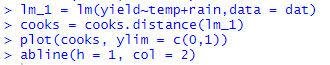
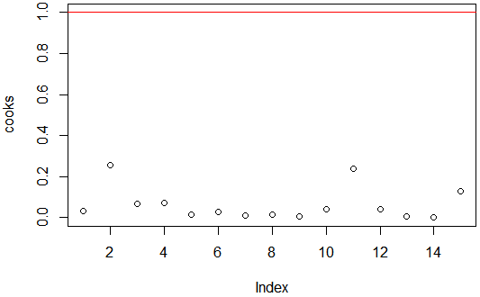

#  Revision – Last two weeks 

***Correlation***
- Concerned with the sign and magnitude of a linear relationship.

- We can describe the linear relationship using the
	+ Form - *Linear / Non-linear*
	+ Direction - *Positive / Negative relationship*
	+ Strength - *Weak / Moderate / Strong*
	
+ Test for a statistically significant population correlation
	+ $H_0$ : $\rho$  = 0
	+ $H_A$: $\rho$ ≠ 0
	
+ We estimate $\rho$ based on a sample and we get the SAMPLE correlation coefficient, r

+ r always lies between -1 and 1


---

#  Revision – Last two weeks 

***Simple Linear Regression***

+ Can be used when we assume there to be a causal relationship between two variables. One can be treated as a predictor, and the other the response variable.

+ We have a *population model* of the form:

 $Y_i = \beta_0 + \beta_1 X_i + \epsilon_i + \mu_i + \epsilon_i$
 where $\epsilon_i ∼ N(0, \sigma^2)$ 
 
+ The unknown parameters $\beta_0$ and $\beta_1$ are estimated from the information in our sample, resulting in our *fitted model*

 $Y_i + b_0 + b_1X_i$

+ $b_0$ represents predicted value of the response variable when the value of the predictor is 0

+ $b_1$ represents the increase in Y we expect to see if the value of X increases by one unit.

+ $b_1$ equals the **Rise / Run**


---

#  Revision – Last two weeks 

**Simple Linear Regression**
- We can use our fitted model to predict a value of our response variable for a given value of the predictor variable. Say our fitted model is:

 $\hat Y_i$ = 66.5 + 0.56 $X_i$
		
   
- If Y represents height in inches and X represents age in years. What is the predicted height for someone is 26 years old?

- Height :

  =  66.5 + 0.56*26

  = 66.5 + 15.56 = 81.06 inches

+ We can test for a linear relationship by looking at:
	+ $H_0$ : $β_1$ = 0
	+ $H_A$ : $β_1$ ≠ 0 
	
-  Test the model by assessing the residuals:
	+ Residuals normal
	+ No outliers
	+ Constant scatter
	+ No patterns


---

class: inverse
background-image: url('assets/img/image8.wmf')
background-size: cover

---
class: inverse
background-image: url('assets/img/image11.jpeg')
background-size: cover

---
class: inverse
background-image: url('assets/img/image10.jpeg')
background-size: cover

---
class: inverse
background-image: url('assets/img/image9.wmf')
background-size: cover


---
#  Revision – Last two weeks 

**Multiple Linear Regression**
+ Sometimes more than one predictor variable is suitable for modeling a particular response variable. When this is the case the population model for multiple linear regression (with no interaction) is:

  $Y_i = \beta_0 + \beta_1 X_{i,2} + \beta_2 X_{i,2}+ .........\beta_p  X_{i,p}+ \epsilon_i$  (i = 1,., n)
  
+ This is simply an extension of the simple linear regression model to include more predictors.

+ We can test if the *i* th predictor is linearly related to Y by testing:
 + $H_0$ : $β_i$ = 0
 + $H_A$ : $β_i$ ≠ 0  where i can be 1, 2, …, p
 
+ We interpret $β_i$ as being the expected increase in Y for a unit
increase in $X_i$ assuming all other $X_j$ are constant. 

+ The estimates of $\beta_0,\beta_1,\beta_2,..\beta_p$
come from our sample. The estimates are denoted $b_0 , b_1 ,b_2 …, b_p$

+ These estimates are determined by minimising the sum of the squared residuals:   

 $\hat e^2_1 +\hat e^2_2 +....... +  \hat e^2_n$ ,   where $\hat e_i$ = $Y_i - \hat Y_i$           
.
.pull-left[]

.pull-right[]

---

#  Revision – Last two weeks

***Multiple Linear Regression***
- Just as with simple linear regression we can make **predictions** about the response variable using particular values of the predictor variables.

- *Example* : Predict the yield in bushels for a farm with a mean season temperature of 22.6 deg Celsius and a seasonal rainfall of 35.2 mm, if the fitted model is

  Average yield = -10.01 + 1.55 temp + 0.75 rainfall
        
     $\hat y$ = -10.01 + 1.55 x 22.6 + 0.75x 35.2

    = 51.42 bushels

+ We test the model by assessing the residuals:
	+ Residuals normal
	+ No outliers
	+ Constant scatter
	+ No patterns 
	
+ Another thing to consider is **multicollinearity:**  

	+ We may have two predictor variables that are both linearly related to the response.
	
	+ When they are modeled together they may be found to be not linearly related to the response.
	
+ This is because the two predictors variables are highly correlated   and using both doesn’t add to the models ability to explain the response, Y.
---
class: inverse
background-image: url('assets/img/image17.png')
background-size: cover

---
class: inverse
background-image: url('assets/img/image16.wmf')
background-size: cover

---
class: inverse
background-image: url('assets/img/image15.wmf')
background-size: cover

---

# Influential Points & Multicollinearity

---

#  Influential Points & Multicollinearity 

*Cook’s Distance*

+ Consider the effect (or influence) **of an individual point** on the regression model

+ Based on these distances, we **can assess how different estimates in our model ( $b_0, b_1, ....$ ) would be if an observation that was deemed influential was excluded** from the analysis

> $$D_i = \sum^n_{j=1} (\hat Y_j - \hat Y_{j(i)})^2 \over (p+1)MS_{error}$$

> p= number of predictor viariables

> $\hat Y _j$= fitted/predicted value of the *i*th data point
 
 > $\hat Y _j(i)$ = fitted values AFTER removing *i*th data point
 

+ The *i* th point is informally assessed as **influential** to the model **if $D_i$> 1** .

+ More formally, one would typically assess whether the *i* th point is statistically significantly influential if ** $D_i$ exceeds the $50^{th}$ th** **percentile of F (p+1, n – p – 1)**

---
class: inverse
background-image: url('assets/img/image20.wmf')
background-size: cover

---
class: inverse
background-image: url('assets/img/image19.wmf')
background-size: cover

---
class: inverse
background-image: url('assets/img/image18.wmf')
background-size: cover

---

#  Cooks Distance -Corn Yield



+ Data points 2 and 11 have the highest Cook’s distance. Informally we can look to see if these are less than 1.

+ In Jamovi :




+ Let’s see what happens when we remove these data points.

---

#Cook’s Distance – Corn Yield


]

]


+ The Adjusted R Squared has improved.

+ The Residual Standard Error has also reduced.

+ In practice, we would want a good reason to exclude these data points. The removing the variation these points provide will bias our analysis. If the points are valid points, the variation they provide is required to get a true picture of “what is going on”.

---

# Influential Points & Multicollinearity

**Variance Inflation Factors (VIF)**

+ A good way of detecting the presence of Multicollinearity

> The VIF of the *k* th predictor variable is

> $VIF_k$  = $1 \over 1-R^2_k$

>where $R^2_k$ is the R 2 when X k regressed against **the other** p-1 predictors such that

> $X_k = \beta_0 + \beta_1X_1+....+ \beta_{k-1}X_{k-1}+\beta_{k+1}X_{k+1} + ....\beta_pX_p + \epsilon$

+ If $X_k$ is not related to other  predictor variables, then $R^2_k$ = 0 and so its $VIF_k$ = 1

+ VIF increases as $R^2_k$ approaches 1

+ **Multicollinearity** **exists when** **VIF** **k** **> 10** (conservatively > 5)

---


- VIF is less than 5, therefore we can safely conclude that multicollinearity does not existy. 

---

# ANOVA as Regression 

---

#  ANOVA as Regression 

ANOVA: comparing means of different populations
+ relationship between a quantitative variable and 1 or more categorical variables.

+ model of the variation of a quantitative Y, in terms of 1 or more categorical X’s.

ANOVA can also be considered as a special case of regression.

***One-way ANOVA with* *3 levels***

Group A   
Group B  
Group C

Can we use a regression model of the form

>  ** $Y_i = \beta_0 + \beta_1X_i + \epsilon_i$ **

where $X_i$ represents the factor which can assume the values 1, 2 and 3 for Groups A, B and C?

---

#  ANOVA as Regression 

.pull-right[]

.pull-left[]


1                2                3

1                2                3

+ Here C appears to be different to A and B. Lets assign values of 1, 2, and 3 to A, B, and C. We would probably find a significant positive linear relationship.

+ Lets now relabel the variables. The names are only letters, and then again apply the values 1, 2, and 3 to A, B, and C. Here the line of best fit would be a flat line and not relationship.

+ The names of the variables are lables , they do not represent a quatity . So to arbitrarily assign them a quantity shouldn’t work. Need to be a little trickier here…

---

We can consider coding the categorical variable (factor) that consists of 3 levels by using two numerical variables $X_1$ and $X_2$ in the following way:

- $X_1$ and $X_2$ are each like a light switch: ON or OFF positions.

- $X_1$is ON (1) when representing Group A and OFF (0) otherwise

- $X_2$ is ON (1) when representing Group B and OFF (0) otherwise

- Do we need a third variable ( $X_3$ )?

NO: when BOTH are OFF it represents neither Groups A or B, it represents Group C  

```{r tbl16, echo = FALSE}
tbl16 <- tibble::tribble(
~`Group`, ~`X 1`, ~`X 2`,
"A","0","0",
"B","1","0",
"C","0","1"
)

kableExtra::kable_styling(knitr::kable(tbl16), font_size = 18)
```

Regression model for Y in terms of numerical variables $X_1$ and $X_2$ 

$Y_i = \beta_0 + \beta_1X_1+\beta_2X_2+\epsilon$

We can code a categorical variable (factor) having 3 (‘a’) levels, using two (‘a-1’) numerical variables $X_1$ and $X_2$

---

# Example

### $Y_i = \beta_0 + \beta_1X_1+\beta_2X_2+\epsilon_i$

```{r tbl17, echo = FALSE}
tbl17 <- tibble::tribble(
~`Group`, ~`$X_1$`, ~`$X_2$`, ~`Group MEAN using Regression`, ~`Group MEAN using ANOVA`,
"A","0","0"," 0"," +  A ",
"B","1","0"," 0 +  1 "," +  B ",
"C","0","1"," 0 +  2 "," +  C "
)

kableExtra::kable_styling(knitr::kable(tbl17), font_size = 18)
```
For Group A this reduces to 

$Y_i = \beta_0 + \beta_1(0) + \beta_2(0) + \epsilon_l	= \beta_0 + \epsilon_i$

For Group B this reduces to 

$Y_i = \beta_0 + \beta_1(1) + \beta_2(0) + \epsilon_l	= \beta_0 + \beta_1 + \epsilon_i$


For Group c this reduces to 

$Y_i = \beta_0 + \beta_1(0) + \beta_2(1) + \epsilon_l	= \beta_0 + \beta_2 + \epsilon_i$

---

#  Example 

### Cicindela Circumpicta  Beetle
+ A researcher has collected some data on the head widths (in mm) of a species of tiger beetle ( Cicindela  circumpicta ) from three localities (Regions A, B, and C).

+ Is there a difference in mean head width of this type of tiger beetle for beetles from different regions?

#### $Y_i = \beta_0 + \beta_1X_1+\beta_2X_2+\epsilon_i$


```{r tbl18, echo = FALSE}
tbl18 <- tibble::tribble(
~`Region`, ~`X 1`, ~`X 2`,
"A","0","0",
"B","1","0",
"C","0","1"
)

kableExtra::kable_styling(knitr::kable(tbl18), font_size = 18)
```

.pull-left[]

.pull-right[]

---


- We can perform the ANOVA in Jamovi by using the Regression section as well. 

---


```{r tbl20, echo = FALSE}
tbl20 <- tibble::tribble(  
    
~`Region`, ~`X 1`, ~`X 2`,
"A","0","0",
"B","1","0",
"C","0","1"
)

kableExtra::kable_styling(knitr::kable(tbl20), font_size = 18)
```

#### $Y_i = \beta_0 + \beta_1X_1+\beta_2X_2+\epsilon_i$

- In R we get the same results as Jamovi. 

- Fitted/Estimated Regression: Width (mm) = 3.80 – 0.575 X1 -  1.225 X2
- Region A, substitute $X_1$ = 0, $X_2$ = 0 in: Width = 3.80 – 0.575 * 0 -  1.225 * 0 = 3.800
- Region B, substitute $X_1$ = 1,$X_2$ = 0 in: Width = 3.80 – 0.575 * 1 -  1.225 * 0 = 3.225
- Region C, substitute $X_1$ = 0,$X_2$ = 1 in: Width = 3.80 – 0.575 * 0 -  1.225 * 1 = 2.575

---

#  Analysis of Covariance (ANCOVA)	 

---

#  Analysis of Covariance (ANCOVA)

*SITUATION 1*
+ Consider a study where we are interested in assessing the effects of a factor, A, on a **quantitative** (*numerical*) outcome, Y.

+ We randomly assign individuals to treatment groups 1, 2, 3 for the factor.

We can perform regression as we’ve just seen

#### $Y_i = \beta_0 + \beta_1X_1+\beta_2X_2+\epsilon_i$

where $Y_i$ represents.... $\beta_0, \beta_1,\beta_2  rep...+\epsilon_i$ rep..... and

the factor is encoded using indicator variables $X_1$ and $X_2$ as shown in table…

---

#  ANCOVA

*SITUATION 1*  ctd

+ What if we have *additional information* about a **quantitative**  **predictor** , X?

+ Perhaps randomisation to the 3 groups didn’t take care of a quantitative predictor

	+ such as age: mean age of group1 > group2 and group3
	
+ This quantitative variable could be used to describe some of the error variation, we can use this information as a covariate, $X_3$ .

 > $Y_i = \beta_0 + \beta_1X_1+\beta_2X_2+ \beta_3X_3 + \epsilon_i$

where X 3 represents the **quantitative (** **numerical** **)** predictor variable X

---

#  ANCOVA

*SITUATION 2*

+ Consider a study where we are interested in whether a relationship exists between a **quantitative predictor** $X_1$ and a **quantitative outcome** , Y.

> $Y_i = \beta_0 + \beta_1X_1+ \epsilon_i$

+ What if we have additional ‘grouping information’, i.e., that variation in the relationship (between two quant vars ) can be explained by a **categorical predictor** (with 3 levels)? – this is our covariate info!

+ This could be used to describe some of the error variation, we can use this information as a covariate.
+ As before… 

> $Y_i = \beta_0 + \beta_1X_1+\beta_2X_2+ \beta_3X_3 + \epsilon_i$

+ categorical
+ numerical

---

#  ANCOVA

- When we have:
 - a *numerical (quantitative) response*; and 
 - a **single factor** with ‘a’ levels, 

 we would consider one-way ANOVA (or a t-test if  a=2)
 …..but beware (missing taking account of other factors)
- When we have:
 
 - a *numerical (quantitative) response*; and 
 - a **numerical (quantitative) predictor**,
 
 we would consider regression.
 
- When we have:

 - a *numerical (quantitative) response*; and 
 - a **single factor**; and 
 - a potential **numerical (quantitative) predictor**(covariate, confounder),
  
  we would consider ANCOVA

- SO, what is ANCOVA? ….it can be summarised as a regression equation when we have both **numerical** and **categorical** predictors….but think about HOW it is being used. 

---

#  ANCOVA

SITUATION 1

- Consider a study where we are interested in assessing the effects of a factor, **Drug**, on a quantitative outcome, **bacterial count post-med**.

- We randomly assign individuals to treatment groups **drug1, drug2, placebo** for the factor.

- What if we have additional information about a  quantitative predictor, X, **bacterial count pre-med** OR **incubation period** OR **age**.

 - This might explain a large amount of the variation in results.
 
 - Perhaps there are differences between the groups due to covariate (e.g., randomisation didn’t take care of age, so larger mean age in drug1 than drug2 group (and study didn’t block (which would have been preferable)))

---

#  ANCOVA

SITUATION 2

- Consider a study where we are interested in whether a relationship exists between a **quantitative predictor** (time in seconds spent processing each of 50 words) and a **quantitative outcome** (# words recalled), Y.


---

#  ANCOVA

-  What if we have additional ‘grouping information’, i.e., that variation in the relationship (between two quant vars) can be explained by a **categorical predictor** (e.g., **Gender**, Region, Nationality, Childhood environment)?

- This could be used to describe some of the error variation, we can use this information as a covariate.


- females
- males

---

# Example: Language Test (& IQ)

The effectiveness of two different methods of teaching a foreign language were compared.

A sample of 20 students were randomly assigned to one of two groups corresponding to the different instruction methods. 

A language test is given at the end of the instruction period. 

IQ scores taken before the language instruction are also available.

###*Does the teaching method affect language test scores?* 

Might consider conducting a one-way analysis of variance (or a t-test)…ignoring IQ scores


---

# Language Test (& IQ)

We could define this in the form

> $Y_i = \beta_0 + \beta_1X_1 + \epsilon_i$

where $Y_i$ represents score on language test $\beta_0 + \beta_1$ rep…   $\epsilon_i$rep… and . . .

. . . the factor teaching Method is encoded using indicator variable $X_1$ 

| $X_1$ |

> | Method 1|	     0

> | Method 2| 	     1


---


Expected Language Test Score
	= 78.70 + 2.70 $X_1$
	
	
 $X_1$ 

 | Method 1|	     0

 | Method 2| 	     1

Although the relationship is not statistically significant  (p-value = 0.486). 

That is, we cant identify a difference between the two teaching methods. 

---

# Language Test & IQ

- Consider the information re IQ scores.
 - not unreasonable to expect that IQ might also affect language test scores.

- *If mean IQ in Group 1 (exposed to Method 1) is different to Mean IQ in Group 2, then IQ scores may be what causes the differences…not the method* !

- Performing  a t-test or ANOVA without taking this into account?:
 - possibly misleading (if IQ has an effect and mean IQ scores are different between the comparison groups).

- Consider linear model including  IQ ( $X_2$ )

 $Y_i = \beta_0 + \beta_1X_1+\beta_2X_2+ \epsilon_i$

- Covariate IQ Score may explain some of the error variation

---

Linear model for language test score using teaching method AND IQ ( $X_2$ )


 >  ### $Y_i = \beta_0 + \beta_1X_1+\beta_2X_2+ \epsilon_i$
 
   where

   $X_1$ = Method (*categorical*)

   $X_2$ = IQ Score (*numerical*)

We could consider the full model which includes an **interaction** term

 > ### $Y_i = \beta_0 + \beta_1X_1+\beta_2X_2+ \beta_3X_1X_2+ \epsilon_i$
 
	
- Test interaction term

- Test individual predictors

---


 ### $Y_i = \beta_0 + \beta_1X_1+\beta_2X_2+ \beta_3X_1X_2+ \epsilon_i$
 
The interaction between Method and IQ Score does not have a statistically significant impact on Language test score (p-value = 0.210)

- Method not statistically significantly related to Language test scores (p = 0.149)

- IQ score is statistically significantly related to Language test score (p = 0.005)

---

# Impact of Drugs on Bacterial Count


- Study assessing  effects of a factor, **Drug**, on a quantitative (numerical) outcome, **bacterial count post-med**.

- Response (LBS) is a bacterial count after treatment (post-med).

- Randomly assign individuals to treatment groups **drug1, drug2, placebo** for the factor **Drug**.

- To account for natural variation in bacterial counts among patients, the bacterial count *before* the treatment (LBI) also measured for each patient.

---

# Impact of Drugs on Bacterial Count

- Run regular ANOVA not taking into account the LBI score. 

- Would find a difference in LBS scores for the three levels of “Drug” (p=0.03). Conclude that the drug level has an effect on LBS score.

- Now lets account for the bacterial count prior to the treatment.

> $Y_i = \beta_0 + \beta_1X_1+\beta_2X_2+ \beta_3X_3+ \beta_4X_1X_3+ \beta_5X_2X_3 +  \epsilon_i$

> **LBS** (bacterial count *after* treatment)(*numerical*)

> **LBI** ( baterial count *before* treatment)(*numerical*)

> $X_1$  and  $X_2$ indicator variables represent the 3 drug types.

> ### Interaction Terms   (Drug * LBI)

> NOTE: Not sensible to consider interaction of indicator variables with themselves – ie no $X_1X_2$


---

# Impact of Drugs on Bacterial Count


**Interaction: p-value = 0.561**

Suggests simpler model possible. (perhaps without the interaction)

---

# Impact of Drugs on Bacterial Count

### $Y_i = \beta_0 + \beta_1X_1+\beta_2X_2+ \beta_3LBI_i +  \epsilon_i$
(using simpler model since no Interaction present between Drug and LBI)

```{r tbl38, echo = FALSE}
tbl38 <- tibble::tribble(
~`Drug`, ~`X 1`, ~`X 2`,
"a","0","0",
"d","1","0",
"Placebo","0","1"
)

kableExtra::kable_styling(knitr::kable(tbl38), font_size = 18)
```


We are unable to identify a statistically significant effect due to drug (p=0.14). 

We are able to identify a significant effect due to LBI though (p<0.001).

---

- LBI statistically sig.
 - One-way ANOVA excluding LBI:
 
     - There is variation in the LBS score that is due to LBI. Not including LBI in our model may mean we incorrectly attribute differences in LBS to the drug. 

 - Random allocation of patients to drug treatments could by chance allocate more patients with naturally high bacterial counts to a particular treatment group. 

      - Ideally BLOCK on this first and randomise within blocks

     - **Placebo has higher mean LBI: such situations may lead to falsely id treatment effect; including LBI accounts for this source of variation **

     - In such a case it would have been inappropriate to have undertaken ANOVA (a t-test if 2 groups): perceived differences due to drug may have been due to diff in characteristics of the groups

     - Simple checks of means (of characteristics) within groups can identify need for ANCOVA.
     
---

#  Some additional points . . . 


Which should we use:

- 	Randomised design with ANCOVA used to reduce experimental errors

OR

- 	Randomised block design with blocks formed by means of the concomitant (blocking) variable?

1. If regression between Y and concomitant (blocking) variable is linear, about equally efficient

2. Randomised block designs are essentially free of assumptions about the nature of the relationship between blocking and response variables, ANCOVA assumes a definite form of relationship

3. “Block what you can, randomise what you cannot”.

