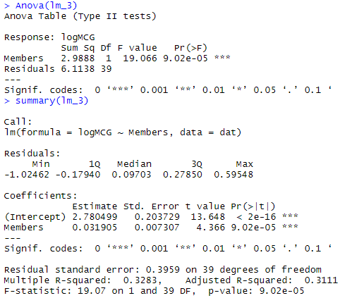

# Revision

---

# ANCOVA Revisited 

+ Study assessing effects of a factor, **Drug** , on a quantitative outcome, **bacterial count post - med** .

+ Randomly assign individuals to treatment groups ***drug1 (a)*** , ***drug2 (d)*** , ***placebo*** for the factor.

+ Response (LBS) is a *bacterial count* *after treatment* .

+ To account for natural variation in bacterial counts among patients, the *bacterial count* before the treatment (LBI) also measured for each patient.

---

# Impact of Drugs on Bacterial Count

- Run regular ANOVA not taking into account the LBI score. 

- Would find a difference in LBS scores for the three levels of **“Drug”** (p=0.03). Conclude that the drug level has an effect on LBS score.


- Now lets account for the bacterial count prior to the treatment. 
>$Y_i = \beta_0 + \beta_1X_1+\beta_2X_2+ \beta_3X_3+ \beta_4X_1X_3+ \beta_5X_2X_3 +  \epsilon_i$

>**LBS** (bacterial count *after* treatment)(*numerical*)

> **LBI** ( baterial count *before* treatment)(*numerical*)

> $X_1$  and  $X_2$ indicator variables represent the 3 drug types.

> ###Interaction Terms (** Drug * LBI** )

> NOTE: Not sensible to consider interaction of indicator variables with themselves – ie no $X_1X_2$

---

# Impact of Drugs on Bacterial Count


Interaction:p-value = 0.561

Suggests simpler model possible.(perhaps without the interaction)

---

# Impact of Drugs on Bacterial Count

$LBS_i = \beta_0 + \beta_1X_1+\beta_2X_2+ \beta_3LBI_i +\epsilon_i$

(using simpler model since no Interaction present between Drug and LBI)
 
```{r tbl6, echo = FALSE}
tbl6 <- tibble::tribble(
~`Drug`, ~`X 1`, ~`X 2`,
"a","0","0",
"d","1","0",
"Placebo","0","1"
)

kableExtra::kable_styling(knitr::kable(tbl6), font_size = 18)
```


- We are unable to identify a statistically significant effect due to drug (p=0.14). 

- We are able to identify a significant effect due to LBI though (p<0.001). 

- Remember we found Drug statistically significant using a one-way ANOVA. 

- Also an improvement in the adjusted R Squared (not shown) removing the interaction term.

---

# Model Selection

---

# Model Selection 

+ The following example demonstrates the importance of carefully considering variables that impact upon the predictor variable

+ In many studies, not all variables are statistically significant predictors

+ You therefore need to carefully consider the model that **best represents** the relationship between the predictor and response variables while making sure the statistical **assumptions are not violated**

+ We wish to maintain the ***simplest model*** that best represents the relationship.  (Principal of Parsimony).

---

# Model selection

+ In this course you have seen a variety of **ANOVA/Regression** models that cater for a wide range of different situations

+ The practical aspects of building a model means the difference between:
	+ good and bad predictions
	+ understanding the relationship between variables and not.
	
+ Here we will look at the art of model building…

---

# Model Building: MCG Attendance 

*Excerpt of data*

+ Numerous factors impact the number of people who attend an AFL match at the **Melbourne Cricket Ground** on a Saturday (represented above by the variable *MCG* in ‘000 of people)

+ Source: www.statsci.org/data/oz/afl.html

+ All the 41 regular **Saturday games** at the MCG ( **no finals** ) between 1993 and 1994 are represented.


[www.statsci.org/data/oz/afl.html](http://www.statsci.org/data/oz/afl.html)

---


- Temperature
 - **Forecast** maximum temperature (in Celsius) on the day of the match

- Members
 - The **sum of the memberships** of the two clubs whose teams were playing the match in question

- Top50
 - Number of **players in the top 50** in the AFL who happened to be playing in the match in question

- Date
 - Date of the match in the format dd/mm/yy

- Home (Away)
 - The name of the home (away) team

- Other
 - Sum of the **attendances** (in ‘000) at **other AFL matches in Melbourne** and Geelong
 
---

# Summaries 

+ We want to better understand how some/all of the considered variables (in the 1993/94 study) play a role in the attendance of Saturday MCG matches

+ We can also use the model to make predictions about crowd sizes. Who might want to know this?

+ Summary statistics of outcome and potential predictors help with error-checking, considering range/spread of data before building a model to determine variables which statistically significantly impact on the attendances at the MCG

---

### Model Building-MCG Attendance( Sumaries)


**Variation in the  response variable**.


---

#### Model Building-MCG Attendance( Sumaries):

**One day much hotter than the rest. Is this going to cause problems?**


---

#### Model BUilding-MCG Attendance( Sumaries):


**For Top50 > 7, small counts. Combine these groups?**

---

#### Model BUilding-MCG Attendance( Sumaries):

**Small counts: need to aggregate?**


**Many levels: Is there a smart way to consolidate them?**


---

#### Model BUilding-MCG Attendance( Sumaries):


Relatively **strong correlation** between MCG and: **Members**; ** Top50**

Other interesting points:

- More “big name” (top 50) players playing at the MCG is negatively correlated to crowd figures at other grounds in Melbourne. 

- Membership numbers are positively correlated with having top 50 players.

---

# MCG and Members


The var **Members** is a statistically significant predictor (p<0.001) in this model.

That is: combined membership of the teams playing is a statistically significant factor for determining the number of people that attend a Saturday AFL match in the period of study (p<0.001).

**31.2%** of the variation in MCG is accounted for by the presence of **Members** in the model.

We will consider the adjusted R2 when comparing models

---

# SLR: Members – Fitted model


Fitted model:

Expected MCG = **9.622+1.207** Members

Residuals appear:

- Random
- Centred around zero
- Constant variance?? 

---

# Members & Top50


3.1% of the variation in MCG is accounted for by the presence of **Members** and **Top50**. 

With the presence of two predictor variables, R Squared has increased (0.31 to 0.33). Change is Adjusted R Squared is **negligible** (0.294 to 0.296). 


The number of top50-ranked players on-field doesn’t appear to be a statistically significant predictor for the number of people that attend a Saturday AFL match in the period of study in the model ** (p=0.30)**.

Multicollinearity? 	Assumptions met?

VIF > 5, therefore no multicollinearity. 

---


**Expected MCG = *1.51+1.073* Members + *1.947* Top50**


Residuals appear: Random; Centred around zero; 
	Variance constant though??

---

# Which Model? 


**Which  (if any) model is good?** Lets look again at the residual plots
+ *MCG* , *Members* & *Top50*

+ *MCG* and *Members*


**Neither** - Both plots suggest non-constant variance. The variation of the residuals for low numbers of members is smaller than the variation for large numbers of members.

Look at including a more suitable variable and/or transform the data.

---

# Logarithmic Transformation 

+ We have seen in this course that using the **logarithm** as a means of transformation is a natural remedial measure to address a **non-constant variance** and sometimes **non-normality**

+ The following output shows the logarithm transformation applied to MCG (our response variable) for both models:

 Log (MCG) = . . . . .

---

# Log(MCG) and Members

.pull-right[]

.pull-left[]

- **Members** is statistically significant in the regression model (with a log transformation)

- Estimated Log(MCG) = 2.78 + 0.032 **Members**

- The **Adjusted R Squared** has improved slightly when compared with the simple linear regression model prior to transformation (from 0.294 to 0.311)

- Importantly, the variation of the residuals appears more random

---

# Log(MCG), Members & Top5

.pull-right[]

.pull-left[]

**Top50** is not statistically significant in the regression model (with a log transformation)

- Estimated Log(MCG) = 2.54 + 0.028Members + 0.058 **Top50**

- The Adjusted R Squared has improved slightly when compared with the linear regression model including the two predictor variables (from 0.296 to 0.320)

- The variation of the residuals appear random

---

# Another Variable? 

+ Taking the logarithm transformation has improved the quality of the model (in terms of the R 2 and the residual plot)

+ Let’s have a better look at the residual plot:


---

# Another Variable? 

+ Appears that attendance is overestimated for games where the away teams is from another state.
+ Let **Istate** , for “Interstate”, be the variable with a value of

 - **No** for a Victorian ‘away’ team (both Vic), and

 - **Yes** for a team visiting the MCG from outside Victoria


+ *MCG* (and *Log(MCG)* ) and *Members* are numeric; and *Istate* is categorical (No, Yes), therefore we can model using **ANCOVA** .

---

# Log(MCG), Members & Istate

- **Istate** is a statistically significant variable for predicting attendance at the MCG in the model (p<0.001)

- The **adjusted R squared** has improved greatly compared with the model comprising of Log (MCG) and Members only (from 0.311 to 0.691)


Log(MCG) = **2.885+0.033** Members**-0.732** Istate

---


- Red = No  (two Victorian teams playing) 

- Blue = Yes (non-Victorian team playing)

What do we notice from this residual plot?

---

# Interaction

It appears:

+ High MCG attendance is dominated by two Victorian teams (Red) playing against each other

+ The number of members able to attend would vary due to whether or not “local” teams playing

+ So it makes sense to consider the **interaction** between Membership and Istate


---

# Log(MCG), Members, Istate + Interaction
.pull-right[]

.pull-left[]

Estimated Log(MCG) = **2.389** + **0.025**Members +** 0.211**Istate + 
**0.019**MembersxIstate

- Test the **interaction**: statistically sig  **(p=0.047)**

- The **adjusted R squared** has improved compared with the previous model comprising of Log(MCG), Members & Istate (from 0.691 to 0.715)

- The variation of the residuals appears random

---

# Further Checking of Assumptionså 


The Shapiro-Wilk Test suggests that the residuals of the model:

 Estimated Log(MCG) = 2.39 + 0.025Members + 0.211Istate + 0.019MembersxIstate

are consistent with coming from a normal distribution.

---

#  Practical Issues 

+ Attendance figures reported to nearest person.

	+ Are they truly that accurate?
	
	+ Would rounding to the nearest thousand make any difference?
	
+ Club memberships are reported to the nearest person.
	+ This assumes no change over the period (1993 and 1994).
	
	+ Does not take into account increases/decreases in membership
numbers. So what do these numbers really mean?

+ Why has *Others* (attendance at other games) been recorded? Could this be included in our model selection procedure? Perhaps it could be a good covariate.

+ *Temp* has been recorded but it’s the **forecast** maximum temperature, not the **actual** temperature. Why?

