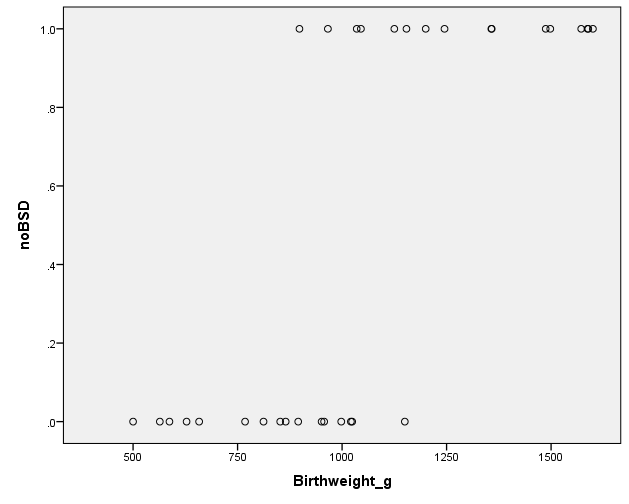

# Logarithms

---

#  Basic understanding of logarithms 
 
+ Logarithms:

	+ express numbers as **powers** of a **base** . 
	
	+ two most commonly used **bases are 10 and e** (the natural root) which is **e = 2.718**.
	
+ Consider ** $10^2$ = 100 **
	+ **10** is the **base** ; power: **2** is the **exponent**
	
	+ If we know that 100 = ** $10^2$ ** , we know that:  ** $log_{10}100 =2$ **
	
+ So if $base^{exponent}$ = total , then: $log_{base}total$ =   **exponent**

+ Generally: If ** $b^n$ ** =x , then * $log_bx$ * = ***n***

+ Eg : If $log_{10}3$ = .4771,    $10^{0.4771}$ =3 

---

# The natural logarithm 

+ Log base e is the **natural logarithm** .
	+ written as **ln** rather than  $log_e$ .
	
+ For natural logarithms if x = $e_y$ *,* then $log_e x$ = y
	+ E.g.,  If 4 = $e^1.386$ then ln  4 = 1.386
	
	+ The expression - ln  4 is asking: e to the power of *what* is equal to 4?
	
+ For logistic regression: use ‘natural log’

	+ calculators & software can be used to calculate logarithms:
		+ **“ln** ” key for base **e**
		
		+ “log” key for base  10
		
+ BUT NOTE THAT WE SAY LOG OF THE ODDS, NOT LN OF THE ODDS later in logistic regression

---

#  Logistic Regression 

---

#  Logistic Regression 

+ What is a logistic regression model appropriate for?

+ Applicable when we have:

	+ **categorical** response variable with only **two outcomes** 
	.
	+ **numerical** explanatory variable
	
+ The response variable is required to have only **two outcomes:** 

	+ success or not success,
	
	+ disease or not disease,
	
	+ yes or no.

---

#  Logistic Regression 

+ Suppose we have **Birthweight** (grams) as a predictor for the **absence** of a type of lung disease - Bronchopulmonary Dysplasia ( **BPD** ).

+ The response ( **BPD** ) takes values of zero and one representing presence and absence of the disease respectively.

+ Consider the scatter plot of **BPD** against **Birthweight.**

+ Would a linear equation be appropriate: , where ** is the probability (between 0 and 1)?

+ What would be our estimate of the probability be using the red fitted line for a birthweight of 1,400g?

+ ?



---

#  Logistic Regression 

- Suppose we have Birthweight (grams) as a predictor for the absence of a type of lung disease - Bronchopulmonary Dysplasia ( BPD ).

- The response ( BPD ) takes values of zero and one representing presence and absence of the disease respectively. 

+ So a linear equation to model the probability is not appropriate:
	+ The probability of success can be greater than 1!
	+ The probability of failure can be negative!
	
+ Perhaps a sigmoidal (s-shaped) curve better represents what we expect the probability to be.

+ This should be bounded above and below.


---

#  Logistic Regression – Rationale  

+ So it appears that modeling the probability directly is **not going to work** :

+ Let’s look at another candidate:

	+ This guarantees that the probabilities will be positive, but they can still be greater than one.
	
+ What about…

	+ Probabilities will be positive, and also less than one!
	
	+ The right hand side of the equation is known as the logistic function.
	
+ So now we have a reasonable model for the **probability of success** 
---

#  Odds 

+ **Odds** are another way of representing the “ *likeliness* ” of some outcome.

+ They are the ratio of the probability of an event taking place to the probability of it **not** taking place:

+ Lets look at what the odds are for different values of
	+ = 0.5 
	+ = 0.1 
	+ = 0.9 
	
+ So events with 50% chance of odds of 1, events with low probability have low odds, and events with high probability have high odds

---

# Logistic Regression – Rationale  

+ Now let’s look at what the odds will be using our model of the probability,:

+ So the odds using our formula for probability can be expressed as .

+ We can now take the natural logarithm of both sides:

---

#  Logistic Regression – Rationale  

+ Now we have an expression which we model with the straight line . This is written as

+ Instead of modelling the two outcomes directly ( *as per regression* ), we model the  **probability (** ***p*** **)**  indirectly through the “ **log of the odds** ” and look at how this changes with changes in the **explanatory variable (** ***x*** **)** .

+ For STAT2000, we limit to: **single numerical**  *x* variable and the dichotomous **response**  variable – These are extended in *STAT3030 – Generalised Linear Models.*

---

# Interpreting parameters 

+ As we are not modeling ***p*** directly, interpreting the parameters is a bit more complex.

+ For unit change in , the parameter represents the change in the **log of the odds of success.**

	+ A **positive** value means that an increase in *increases* the log odds and therefore increases the probability of success.
	
	+ A **negative** value means that an increase in  *decreases* log of the odds and therefore decreases the probability of success.

---

# Interpreting parameters 

+ We can write:

+ Therefore for a unit increase in , we expect the odds to become:

+ This shows that for a unit increase in we expect the **odds** to
increase by a factor of 

+ That is, for a unit increase in , the **odds** are **multiplied** by **.**

---

# Converting to Probability 

+ If we rearrange the above by taking the exponential of both sides and then making the subject of the formula we arrive at the following expression for the probability of success:

+ Once we have our estimated values of and based on our sample, we could use the above formula for estimating .

---

# Statistical Inference: Hypothesis test 


+ Statistical inference for parameters within logistic regression is similar to simple linear regression.

+ We want to test if there is *a relationship between*  and the **log of the odds** (and thus ultimately probability of the outcome).

+ The test statistic is and follows a distribution with 1 degree of freedom…. Or…

+ The test statistic is and follows a standard normal distribution.

---

# Example: G Forces 


+ Military pilots sometimes pass out when their brains are deprived of oxygen due to G-Forces during violent manoeuvres. Data were obtained by producing similar symptoms to volunteers by exposing their lower body to negative air pressure.

+ The response variable has only **2 possible outcomes** (yes/no) and the **explanatory variable (age)**  is numerical.

```{r tbl17, echo = FALSE}
tbl17 <- tibble::tribble(
~`Subject`, ~`Age (x)`, ~`Passed out (y)`,
"JW","39","No",
"JM","42","Yes",
"DT","20","No",
"LK","37","Yes",
"JK","20","Yes",
"MK","21","No",
"FP","41","Yes",
"DG","51","Yes"
)

kableExtra::kable_styling(knitr::kable(tbl17), font_size = 18)
```

---

# G Forces - R 


+ We now use the glm () function rather than the lm () function.

+ There are several types of GLM’s, so to perform logistic regression we need to use: family = “binomial” to specify logistic regression.

+ We find the parameter estimates as we would with a linear model.


---

# Interpreting Coefficients 


+ Fitted model is:

+ How would we interpret the value 0.11?

	+ For ea ch additional year of **age** , the **log of the odds** of a person passing out increases by 0.106.
	
+ Further, how are the ***odds*** changing?
	+ We could estimate that for each additional year of **age**  the ***odds*** of passing out increase by a factor of .
	
  + i.e., the odds will be 1.112 **times** as great for each additional year of age
 + i.e., the odds that a subject will pass out increases by 11.2% for each additional year of age

---

# Statistical Inference: Hypothesis test 

+ Fitted model is:

+ We want to test if there is a relationship between **age** and **passing out** .

+ This is done through the log of the odds using the logistic regression model.

+ The p-value is 0.188.

+ Therefore we are unable to identify a statistically significant relationship between age and passing out.


---

# Confidence Interval 

+ Fitted model is:

+ Using a confidence interval to test if there is a relationship between **age** and **passing out** is done with the following null and alternative

+ The 95% confidence interval from R is (-0.033, 0.303).

+ Since 0 is contained in the confidence interval, this suggests **age** isn’t a statistically significant predictor.


.pull-left[]

.pull-right[]

---

#  Goodness of fit 


+ In cases where the **predictor is statistically significant** we would be interested in assessing the **goodness of the fit** of the model

	+ Much like in linear regression we may test the residuals or consider R-squared.
	
+ **Note** : in this example we were unable to find a statistically significant relationship. Thus we needn’t explore the goodness of fit.

+ However, the following is exhibiting what may be considered for models when the predictor variable is statistically significant

---

# Goodness of fit – Classification Table 

+ We can use a **classification table** to compare what actually happened to what we would predict using the model.

+ In this example, if we predict a **probability of greater than 50%** , we will predict that the individual will pass out.

+ We have to code the table from scratch. There is an inbuilt function in an R package but it has a bug and doesn’t work properly.

+ Overall, 75% of cases have been accurately classified as either passed out or not passed out in the model.

+ **Note: There were only 8 cases and this sample size would contribute to not identifying a statistically significant relationship. So too would the variation (or overlap) in Ages across the two groups.**


---

# Goodness of fit – R-squared equivalent 


+ There are several pseudo R-squared measures for logistic regression. Following two are most common:

 + The **Nagelkerke** **** estimate is constrained between 0 and 1 so can be evaluated as indicating model fit; with a better model displaying a value closer to 1.
 
 + The larger the **Cox & Snell** estimate, the better the model; but it can be greater than 1.
 
+ The two *R²* estimates:

	+ are analogous to *R²* in linear regression, *but…*
	
	+ … are **not** representative of the amount of variation in the response accounted for by the predictor.
	
+ High R-squared values are rare in models containing categorical variables.


---

# G Forces - Jamovi 


---

# G Forces - Jamovi 

-  Fitted model: ln𝑝1−𝑝=−2.93+0.106

- The large p-value (0.188) indicates the data provide insufficient evidence to reject the null. Therefore, there is not a statistically significant relationship (p=0.188) between age and passing out.

- Classification table: (2+4)/8 = 75% correct classification. 

- Pseudo R-squared values are low, however these are more useful for comparing models 


